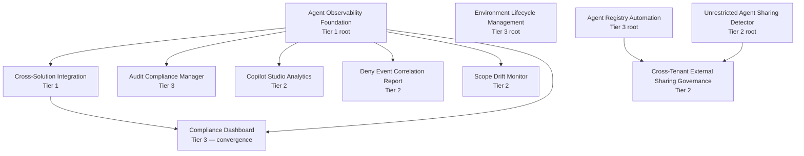

# Deployment Guide

> **Version:** v0.1 — Verified information only. Sections marked TODO require product team input.

This guide maps common customer questions to specific solutions and provides deployment sequencing based on documented solution dependencies.

## Use-Case Mapping

When a customer asks one of these questions, deploy the corresponding solutions:

| Customer Need | Solutions to Deploy | Notes |
|---------------|-------------------|-------|
| "How do we control who agents are shared with?" | [Unrestricted Agent Sharing Detector](./unrestricted-agent-sharing-detector/), [Agent Sharing Access Restriction Detector](./agent-sharing-access-restriction-detector/), [Agent Access Governance Monitor](./agent-access-monitor/) | UASD handles org-wide/public sharing violations with automated remediation; ASARD enforces zone-based sharing policies with approval workflows; AAM monitors overly permissive access configurations |
| "How do we monitor agent execution and platform changes?" | [Agent Observability Foundation](./agent-observability-foundation/), [Message Center Monitor](./message-center-monitor/), [Scope Drift Monitor](./scope-drift-monitor/) | AOF provides foundational telemetry; MCM tracks M365 platform changes; SDM detects data access beyond declared scope |
| "How do we track agent performance and feedback?" | [Hallucination Tracker](./hallucination-tracker/), [Agent Observability Foundation](./agent-observability-foundation/), [Copilot Studio Analytics](./copilot-studio-analytics/) | HT aggregates hallucination feedback patterns; AOF provides operational metrics; CSA provides business impact analytics |
| "How do we enforce conditional access for AI workloads?" | [Conditional Access Automation](./conditional-access-automation/), [Session Security Configurator](./session-security-configurator/) | CAA deploys and monitors CA policies; SSC validates session security per zone |
| "How do we handle regulatory compliance evidence?" | [Compliance Dashboard](./compliance-dashboard/), [Cross-Solution Integration](./cross-solution-integration/), [Audit Compliance Manager](./audit-compliance-manager/) | CD provides aggregated reporting across the 78-control baseline with Exchange coverage; CSI wires Tier 2 solutions into the dashboard; ACM validates configurations and remediates gaps |
| "How do we manage environment provisioning governance?" | [Environment Lifecycle Management](./environment-lifecycle-management/), [Pipeline Governance Cleanup](./pipeline-governance-cleanup/) | ELM provisions environments with zone classification; PGC enforces ALM governance |
| "How do we control file uploads and content moderation?" | [File Upload Security Configurator](./file-upload-security/), [MIME Type Restrictions](./mime-type-restrictions/), [Content Moderation Governance Monitor](./content-moderation-monitor/) | FUS validates file upload settings; MIME enforces type restrictions; CMM monitors content moderation per zone |

## Solution Layers

Solutions fall into three deployment layers. Deploy foundational solutions first, then add monitoring and governance solutions as needed.

### Layer 1: Foundational Infrastructure

These solutions provide shared infrastructure that other solutions depend on:

| Solution | Role | Version |
|----------|------|---------|
| [Environment Lifecycle Management](./environment-lifecycle-management/) | Zone-based environment provisioning and classification | v1.1.2 |
| [Agent Observability Foundation](./agent-observability-foundation/) | Foundational telemetry and monitoring infrastructure | v1.1.0 |

### Layer 2: Tier 2 Governance Solutions

These solutions operate independently but can be wired into the Compliance Dashboard via [Cross-Solution Integration](./cross-solution-integration/):

| Solution | Controls | Integration |
|----------|----------|-------------|
| [Audit Compliance Manager](./audit-compliance-manager/) | 1.7 | Dashboard Assessment |
| [Session Security Configurator](./session-security-configurator/) | 1.23, 1.11 | Dashboard Assessment |
| [Agent Access Governance Monitor](./agent-access-monitor/) | 3.8 | Dashboard Assessment |
| [Content Moderation Governance Monitor](./content-moderation-monitor/) | 1.8 | Dashboard Assessment |
| [File Upload Security Configurator](./file-upload-security/) | 1.14 | Dashboard Assessment |
| [Conditional Access Automation](./conditional-access-automation/) | 1.11, 1.23, 1.18 | Dashboard Assessment |

### Layer 3: Standalone Solutions

All other solutions operate independently and can be deployed in any order based on customer needs. See the [Solutions Index](https://judeper.github.io/FSI-AgentGov/reference/solutions-index/) for detailed descriptions and control mappings.

## Compliance Dashboard Integration

To stand up unified compliance reporting:

1. Deploy **Layer 1** solutions (ELM for zone classification)
2. Deploy the **Tier 2** solutions your customer needs (Layer 2)
3. Deploy **Compliance Dashboard** with `fsi_controlmaster` table populated
4. Deploy **Cross-Solution Integration** to wire Tier 2 results into the dashboard
5. Run `Sync-SolutionAssessments.ps1` for initial assessment sync
6. Deploy `CD-SolutionFeedCollector` flow for daily automated feeds

See [Cross-Solution Integration README](./cross-solution-integration/README.md) for prerequisites and setup.

## Full Dependency Tree

The diagram below is generated from the `dependencies:` field in each solution's `manifest.yaml`. Solutions not shown have no declared inter-solution dependencies and can be deployed standalone.



<!-- Plain-text fallback for non-Mermaid renderers -->

```text
Layer 1 — roots (no dependencies)
├── Agent Observability Foundation (AOF, Tier 1)
│   ├── Cross-Solution Integration (CSI, Tier 1)
│   │   └── Compliance Dashboard (CD, Tier 3) — also depends on AOF
│   ├── Audit Compliance Manager (Tier 3)
│   ├── Copilot Studio Analytics (Tier 2)
│   ├── Deny Event Correlation Report (Tier 2)
│   └── Scope Drift Monitor (Tier 2)
├── Environment Lifecycle Management (ELM, Tier 3) — foundational, no declared dependencies
├── Agent Registry Automation (ARA, Tier 3)
│   └── Cross-Tenant External Sharing Governance (CTESG, Tier 2) — also depends on UASD
└── Unrestricted Agent Sharing Detector (UASD, Tier 2)
    └── Cross-Tenant External Sharing Governance (CTESG, Tier 2)

Standalone (no inter-solution dependencies declared):
  action-confirmation-auditor, agent-365-lifecycle-governance,
  agent-access-monitor, agent-communication-restriction-detector,
  agent-knowledge-source-scanner, agent-sharing-access-restriction-detector,
  coi-testing, conditional-access-automation, content-moderation-monitor,
  credential-oversharing-detector, dr-testing-framework, file-upload-security,
  finra-supervision-workflow, generative-ai-config-auditor, hallucination-tracker,
  hitl-workflow-governance, inactivity-timeout-enforcement, message-center-monitor,
  mime-type-restrictions, model-risk-management-automation,
  pipeline-governance-cleanup, rag-source-validator, segregation-detector,
  session-security-configurator
```

> **Note:** Compliance Dashboard is the convergence node — it depends on both AOF (telemetry foundation) and CSI (Tier 2 integration layer). Deploy AOF → CSI → CD in that order to stand up unified reporting.

## Zone Deployment Roadmap

The table below maps each solution to the governance zones where it applies. Zone metadata is sourced from each solution's `manifest.yaml`. Where a manifest has no zone field, the row is marked `TODO:` and listed in the [Manifests Missing Zone Metadata](#manifests-missing-zone-metadata) section below.

<!-- TODO: All 35 manifest.yaml files currently lack a zones/zonesApplicable/applicableZones field.
     Until product team adds zone metadata to manifests, every row in this table is marked TODO.
     See "Manifests Missing Zone Metadata" section below for the full list. -->

### Tier 1 (Foundational)

| Solution | Zone 1 (Personal) | Zone 2 (Team) | Zone 3 (Enterprise) | Tier | Notes |
|----------|-------------------|---------------|---------------------|------|-------|
| Agent Observability Foundation | TODO: | TODO: | TODO: | 1 | Root telemetry — needed by 6 dependents |
| Cross-Solution Integration | TODO: | TODO: | TODO: | 1 | Wires Tier 2 results into Compliance Dashboard |

### Tier 2 (Governance)

| Solution | Zone 1 (Personal) | Zone 2 (Team) | Zone 3 (Enterprise) | Tier | Notes |
|----------|-------------------|---------------|---------------------|------|-------|
| Action Confirmation Auditor | TODO: | TODO: | TODO: | 2 | Standalone |
| Agent Access Governance Monitor | TODO: | TODO: | TODO: | 2 | Standalone |
| Agent Communication Restriction Detector | TODO: | TODO: | TODO: | 2 | Standalone |
| Agent Knowledge Source Scanner | TODO: | TODO: | TODO: | 2 | Standalone |
| Agent Sharing Access Restriction Detector | TODO: | TODO: | TODO: | 2 | Standalone |
| Conditional Access Automation | TODO: | TODO: | TODO: | 2 | Standalone |
| Conflict of Interest Testing | TODO: | TODO: | TODO: | 2 | Standalone |
| Content Moderation Monitor | TODO: | TODO: | TODO: | 2 | Standalone |
| Copilot Studio Analytics | TODO: | TODO: | TODO: | 2 | Depends on AOF |
| Credential Oversharing Detector | TODO: | TODO: | TODO: | 2 | Standalone |
| Cross-Tenant External Sharing Governance | TODO: | TODO: | TODO: | 2 | Depends on ARA + UASD |
| Deny Event Correlation Report | TODO: | TODO: | TODO: | 2 | Depends on AOF |
| DR Testing Framework | TODO: | TODO: | TODO: | 2 | Standalone |
| File Upload Security | TODO: | TODO: | TODO: | 2 | Standalone |
| FINRA Supervision Workflow | TODO: | TODO: | TODO: | 2 | Standalone |
| Generative AI Config Auditor | TODO: | TODO: | TODO: | 2 | Standalone |
| Hallucination Feedback Tracker | TODO: | TODO: | TODO: | 2 | Standalone |
| HITL Workflow Governance | TODO: | TODO: | TODO: | 2 | Standalone |
| Inactivity Timeout Enforcement | TODO: | TODO: | TODO: | 2 | Standalone |
| Message Center Monitor | TODO: | TODO: | TODO: | 2 | Standalone |
| MIME Type Restrictions for File Uploads | TODO: | TODO: | TODO: | 2 | Standalone |
| Model Risk Management Automation | TODO: | TODO: | TODO: | 2 | Standalone |
| Pipeline Governance Cleanup | TODO: | TODO: | TODO: | 2 | Standalone |
| RAG Source Validator | TODO: | TODO: | TODO: | 2 | Standalone |
| Scope Drift Monitor | TODO: | TODO: | TODO: | 2 | Depends on AOF |
| Segregation of Duties Detector | TODO: | TODO: | TODO: | 2 | Standalone |
| Session Security Configurator | TODO: | TODO: | TODO: | 2 | Standalone |
| Unrestricted Agent Sharing Detector | TODO: | TODO: | TODO: | 2 | Standalone |

### Tier 3 (Enterprise)

| Solution | Zone 1 (Personal) | Zone 2 (Team) | Zone 3 (Enterprise) | Tier | Notes |
|----------|-------------------|---------------|---------------------|------|-------|
| Agent 365 Lifecycle Governance | TODO: | TODO: | TODO: | 3 | Standalone |
| Agent Registry Automation | TODO: | TODO: | TODO: | 3 | Required by CTESG |
| Audit Compliance Manager | TODO: | TODO: | TODO: | 3 | Depends on AOF |
| Compliance Dashboard | TODO: | TODO: | TODO: | 3 | Depends on AOF + CSI (convergence node) |
| Environment Lifecycle Management | TODO: | TODO: | TODO: | 3 | Foundational; no declared dependencies |

### Manifests Missing Zone Metadata

All 35 solution manifests currently lack a `zones` / `zonesApplicable` / `applicableZones` field. Add the field to each manifest below, then regenerate this section:

- `action-confirmation-auditor/manifest.yaml`
- `agent-365-lifecycle-governance/manifest.yaml`
- `agent-access-monitor/manifest.yaml`
- `agent-communication-restriction-detector/manifest.yaml`
- `agent-knowledge-source-scanner/manifest.yaml`
- `agent-observability-foundation/manifest.yaml`
- `agent-registry-automation/manifest.yaml`
- `agent-sharing-access-restriction-detector/manifest.yaml`
- `audit-compliance-manager/manifest.yaml`
- `coi-testing/manifest.yaml`
- `compliance-dashboard/manifest.yaml`
- `conditional-access-automation/manifest.yaml`
- `content-moderation-monitor/manifest.yaml`
- `copilot-studio-analytics/manifest.yaml`
- `credential-oversharing-detector/manifest.yaml`
- `cross-solution-integration/manifest.yaml`
- `cross-tenant-external-sharing-governance/manifest.yaml`
- `deny-event-correlation-report/manifest.yaml`
- `dr-testing-framework/manifest.yaml`
- `environment-lifecycle-management/manifest.yaml`
- `file-upload-security/manifest.yaml`
- `finra-supervision-workflow/manifest.yaml`
- `generative-ai-config-auditor/manifest.yaml`
- `hallucination-tracker/manifest.yaml`
- `hitl-workflow-governance/manifest.yaml`
- `inactivity-timeout-enforcement/manifest.yaml`
- `message-center-monitor/manifest.yaml`
- `mime-type-restrictions/manifest.yaml`
- `model-risk-management-automation/manifest.yaml`
- `pipeline-governance-cleanup/manifest.yaml`
- `rag-source-validator/manifest.yaml`
- `scope-drift-monitor/manifest.yaml`
- `segregation-detector/manifest.yaml`
- `session-security-configurator/manifest.yaml`
- `unrestricted-agent-sharing-detector/manifest.yaml`

## Related Documentation

- [Solutions Index](https://judeper.github.io/FSI-AgentGov/reference/solutions-index/) — Detailed descriptions and framework alignment
- [Solutions Coverage Gaps](https://judeper.github.io/FSI-AgentGov/reference/solutions-coverage-gaps/) — Coverage analysis across the 78-control baseline
- [FSI Agent Governance Framework](https://github.com/judeper/FSI-AgentGov) — Full framework documentation
