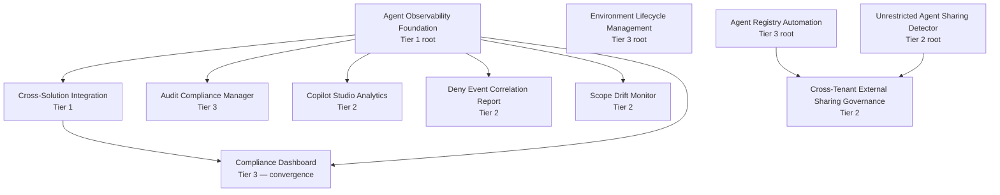

# Deployment Guide

> **Version:** v1.0 — Reference-implementation deployment paths for FSI-AgentGov-Solutions. Versions and zone applicability are regenerated from each solution's `manifest.yaml` by `scripts/build-manifest.py`. Edit manifests; do not edit the generated tables by hand.

This guide maps common customer questions to specific solutions and provides deployment sequencing based on documented solution dependencies and the Personal/Team/Enterprise zone model.

## Positioning

These are **reference implementations**, not turnkey deployable Power Platform solutions. They consist of documentation, scripts (PowerShell, Python, KQL), schemas, and per-solution Dataverse table definitions — they do **not** ship as packaged Dataverse `.zip` solutions. Adopters tailor each implementation to their tenant, identity model, and governance posture before deploying.

## Use-Case Mapping

When a customer asks one of these questions, deploy the corresponding solutions:

| Customer Need | Solutions to Deploy | Notes |
|---------------|-------------------|-------|
| "How do we control who agents are shared with?" | [Unrestricted Agent Sharing Detector](./unrestricted-agent-sharing-detector/), [Agent Sharing Access Restriction Detector](./agent-sharing-access-restriction-detector/), [Agent Access Governance Monitor](./agent-access-monitor/) | UASD detects org-wide/public sharing violations with automated remediation; ASARD enforces zone-based sharing policies with approval workflows; AAM monitors overly permissive access configurations |
| "How do we monitor agent execution and platform changes?" | [Agent Observability Foundation](./agent-observability-foundation/), [Message Center Monitor](./message-center-monitor/), [Scope Drift Monitor](./scope-drift-monitor/) | AOF provides foundational telemetry; MCM tracks M365 platform changes; SDM detects data access beyond declared scope |
| "How do we track agent performance and feedback?" | [Hallucination Tracker](./hallucination-tracker/), [Agent Observability Foundation](./agent-observability-foundation/), [Copilot Studio Analytics](./copilot-studio-analytics/) | HT aggregates hallucination feedback patterns; AOF provides operational metrics; CSA provides business impact analytics |
| "How do we enforce conditional access for AI workloads?" | [Conditional Access Automation](./conditional-access-automation/), [Session Security Configurator](./session-security-configurator/) | CAA deploys and monitors CA policies; SSC validates session security per zone |
| "How do we handle regulatory compliance evidence?" | [Compliance Dashboard](./compliance-dashboard/), [Cross-Solution Integration](./cross-solution-integration/), [Audit Compliance Manager](./audit-compliance-manager/) | CD provides aggregated reporting across the 78-control baseline with Exchange coverage; CSI wires Tier 2 solutions into the dashboard; ACM validates configurations and supports remediation |
| "How do we manage environment provisioning governance?" | [Environment Lifecycle Management](./environment-lifecycle-management/), [Pipeline Governance Cleanup](./pipeline-governance-cleanup/) | ELM provisions environments with zone classification; PGC enforces ALM governance |
| "How do we control file uploads and content moderation?" | [File Upload Security Configurator](./file-upload-security/), [MIME Type Restrictions](./mime-type-restrictions/), [Content Moderation Governance Monitor](./content-moderation-monitor/) | FUS validates file upload settings; MIME enforces type restrictions (defense-in-depth via Dataverse plugin); CMM monitors content moderation per zone |

## Pilot Path (recommended starting deployment)

For organizations beginning their FSI agent governance program, deploy in this order to land a working pilot in three increments:

1. **Foundational telemetry** — Deploy [Environment Lifecycle Management](./environment-lifecycle-management/) (zone classification) and [Agent Observability Foundation](./agent-observability-foundation/) (telemetry). These produce no policy enforcement on their own but provide the data plane every other solution depends on.
2. **First detection signal** — Pick **one** Tier 2 solution that maps to the customer's most acute concern. Recommended starting points:
   - Sharing risk → [Unrestricted Agent Sharing Detector](./unrestricted-agent-sharing-detector/)
   - Supervisory exposure → [Action Confirmation Auditor](./action-confirmation-auditor/)
   - Knowledge oversharing → [Agent Knowledge Source Scanner](./agent-knowledge-source-scanner/)
3. **Compliance reporting** — Deploy [Cross-Solution Integration](./cross-solution-integration/) and [Compliance Dashboard](./compliance-dashboard/) to roll the Tier 2 signal into a single report.

This pilot exercises the three architectural layers (telemetry → detection → reporting) without committing to the full 35-solution surface.

## Licensing Footprint

The reference implementations require these licenses or service plans across the catalog. Individual solutions enumerate their specific subset in their READMEs.

| License / Service | Required For |
|-------------------|--------------|
| Microsoft 365 E5 (or E3 + Compliance / Security add-ons) | Purview audit, DLP, Communication Compliance, Insider Risk Management |
| Microsoft Entra ID P2 | Conditional Access, Identity Governance access reviews, PIM |
| Power Platform per-app or per-user (Premium) | Dataverse tables, custom connectors, Power Automate premium connectors |
| Power Platform Managed Environments | Environment Lifecycle Management, Pipeline Governance Cleanup, sharing limits |
| Copilot Studio license per maker | Action Confirmation Auditor, HITL Workflow Governance, COI Testing, agents in scope |
| Azure subscription | Application Insights / Log Analytics for AOF, Azure Functions / Logic Apps for orchestration |
| Microsoft 365 Copilot license per supervised user | Copilot-specific solutions (analytics, supervision workflows) |

Adopters should validate their tenant SKUs against each solution's prerequisites before scheduling a pilot.

## Solution Layers

Solutions fall into three deployment layers. Deploy foundational solutions first, then add monitoring and governance solutions as needed.

<!-- BEGIN:DEPLOY_LAYERS -->
<!-- Generated by scripts/build-manifest.py — do not edit by hand. -->

### Layer 1: Foundational Infrastructure

These solutions provide shared infrastructure that other solutions depend on:

| Solution | Role | Version |
|----------|------|---------|
| [Agent Intake](./agent-intake/) | Pre-build maker intake (Express + Standard + Full paths) with sponsor 1-click approval, parallel reviewer quorum, MRM handoff, and Entra Agent ID minting | v1.0.0-preview |
| [Agent Observability Foundation](./agent-observability-foundation/) | FSI-compliant telemetry infrastructure for Microsoft Copilot Studio agents with long-term audit retention, operational workbooks, and proactive alerting. | v1.2.2 |

### Layer 2: Tier 2 Governance Solutions

These solutions operate independently but can be wired into the Compliance Dashboard via [Cross-Solution Integration](./cross-solution-integration/):

| Solution | Version | Controls |
|----------|---------|----------|
| [Agent Access Governance Monitor](./agent-access-monitor/) | v1.1.2 | 3.8 |
| [Audit Compliance Manager](./audit-compliance-manager/) | v1.0.5 | 1.7 |
| [Conditional Access Automation](./conditional-access-automation/) | v2.0.2 | 1.11, 1.23, 1.18 |
| [Content Moderation Monitor](./content-moderation-monitor/) | v1.1.2 | 1.27, 1.8 |
| [File Upload Security](./file-upload-security/) | v1.1.1 | 1.14, 1.8, 1.4 |
| [Session Security Configurator](./session-security-configurator/) | v1.3.0 | 1.23, 1.11 |

### Layer 3: Tier 3 / Standalone Solutions

All other solutions operate independently and can be deployed in any order based on customer needs.

| Solution | Tier | Version | Zones |
|----------|------|---------|-------|
| [Action Confirmation Auditor](./action-confirmation-auditor/) | 2 | v1.2.1 | personal, team, enterprise |
| [Agent 365 Lifecycle Governance](./agent-365-lifecycle-governance/) | 2 | v1.1.5 | enterprise |
| [Agent Communication Restriction Detector](./agent-communication-restriction-detector/) | 2 | v1.2.1 | team, enterprise |
| [Agent Knowledge Source Scanner](./agent-knowledge-source-scanner/) | 2 | v1.1.2 | personal, team, enterprise |
| [Agent Registry Automation](./agent-registry-automation/) | 2 | v2.1.1 | personal, team, enterprise |
| [Agent Sharing Access Restriction Detector](./agent-sharing-access-restriction-detector/) | 2 | v2.0.2 | team, enterprise |
| [Conflict of Interest Testing](./coi-testing/) | 2 | v1.1.2 | team, enterprise |
| [Compliance Dashboard](./compliance-dashboard/) | 2 | v1.0.5 | enterprise |
| [Copilot Studio Analytics](./copilot-studio-analytics/) | 2 | v2.0.2 | personal, team, enterprise |
| [Credential Oversharing Detector](./credential-oversharing-detector/) | 2 | v2.1.0 | personal, team, enterprise |
| [Cross-Solution Integration](./cross-solution-integration/) | 2 | v2.0.3 | personal, team, enterprise |
| [Cross-Tenant External Sharing Governance](./cross-tenant-external-sharing-governance/) | 2 | v1.1.0 | enterprise |
| [Deny Event Correlation Report](./deny-event-correlation-report/) | 2 | v2.0.3 | team, enterprise |
| [DR Testing Framework](./dr-testing-framework/) | 2 | v2.0.1 | enterprise |
| [Environment Lifecycle Management](./environment-lifecycle-management/) | 2 | v1.2.2 | personal, team, enterprise |
| [FINRA Supervision Workflow](./finra-supervision-workflow/) | 2 | v1.1.1 | enterprise |
| [Generative AI Config Auditor](./generative-ai-config-auditor/) | 2 | v1.2.1 | team, enterprise |
| [Hallucination Feedback Tracker](./hallucination-tracker/) | 2 | v1.2.0 | personal, team, enterprise |
| [HITL Workflow Governance](./hitl-workflow-governance/) | 2 | v1.1.2 | personal, team, enterprise |
| [Inactivity Timeout Enforcement](./inactivity-timeout-enforcement/) | 2 | v1.1.1 | team, enterprise |
| [Message Center Monitor](./message-center-monitor/) | 2 | v2.5.1 | enterprise |
| [MIME Type Restrictions for File Uploads](./mime-type-restrictions/) | 2 | v1.2.1 | personal, team, enterprise |
| [Model Risk Management Automation](./model-risk-management-automation/) | 2 | v1.0.4 | enterprise |
| [Pipeline Governance Cleanup](./pipeline-governance-cleanup/) | 2 | v1.2.1 | team, enterprise |
| [RAG Source Validator](./rag-source-validator/) | 2 | v1.3.0 | personal, team, enterprise |
| [Scope Drift Monitor](./scope-drift-monitor/) | 2 | v1.2.1 | personal, team, enterprise |
| [Segregation of Duties Detector](./segregation-detector/) | 2 | v1.2.0 | team, enterprise |
| [Unrestricted Agent Sharing Detector](./unrestricted-agent-sharing-detector/) | 2 | v2.0.1 | team, enterprise |

<!-- END:DEPLOY_LAYERS -->

## Compliance Dashboard Integration

To stand up unified compliance reporting:

1. Deploy **Layer 1** solutions (ELM for zone classification)
2. Deploy the **Tier 2** solutions your customer needs (Layer 2)
3. Deploy **Compliance Dashboard** with `fsi_controlmaster` table populated
4. Deploy **Cross-Solution Integration** to wire Tier 2 results into the dashboard
5. Run `Sync-SolutionAssessments.ps1` for initial assessment sync
6. Deploy `CD-SolutionFeedCollector` flow for daily automated feeds

See [Cross-Solution Integration README](./cross-solution-integration/README.md) for prerequisites and setup.

## Full Dependency Tree

The diagram below is generated from the `dependencies:` field in each solution's `manifest.yaml`. Solutions not shown have no declared inter-solution dependencies and can be deployed standalone.

> **Note:** Compliance Dashboard is the convergence node — it depends on both AOF (telemetry foundation) and CSI (Tier 2 integration layer). Deploy AOF → CSI → CD in that order to stand up unified reporting.

## Zone Deployment Roadmap

The table below maps each solution to the governance zones (Personal / Team / Enterprise) where it applies. Zone metadata is sourced from each solution's `manifest.yaml` and is regenerated on every `build-manifest.py` invocation.

> **Status:** Zones were initially backfilled by `scripts/_backfill-zones.py` based on inference from each solution's domain, tier, and controls. Product-team review is required before treating these as authoritative — see the sentinel comment in each `manifest.yaml`.

<!-- BEGIN:ZONE_ROADMAP -->
<!-- Generated by scripts/build-manifest.py — do not edit by hand. -->

### Tier 1 (Foundational)

| Solution | Personal | Team | Enterprise | Data class |
|----------|----------|------|------------|------------|
| [Agent Intake](./agent-intake/) | ✅ | ✅ | ✅ | confidential |
| [Agent Observability Foundation](./agent-observability-foundation/) | ✅ | ✅ | ✅ | internal |

### Tier 2 (Governance)

| Solution | Personal | Team | Enterprise | Data class |
|----------|----------|------|------------|------------|
| [Action Confirmation Auditor](./action-confirmation-auditor/) | ✅ | ✅ | ✅ | internal |
| [Agent 365 Lifecycle Governance](./agent-365-lifecycle-governance/) | — | — | ✅ | confidential |
| [Agent Access Governance Monitor](./agent-access-monitor/) | — | ✅ | ✅ | confidential |
| [Agent Communication Restriction Detector](./agent-communication-restriction-detector/) | — | ✅ | ✅ | internal |
| [Agent Knowledge Source Scanner](./agent-knowledge-source-scanner/) | ✅ | ✅ | ✅ | confidential |
| [Agent Registry Automation](./agent-registry-automation/) | ✅ | ✅ | ✅ | internal |
| [Agent Sharing Access Restriction Detector](./agent-sharing-access-restriction-detector/) | — | ✅ | ✅ | confidential |
| [Audit Compliance Manager](./audit-compliance-manager/) | — | ✅ | ✅ | confidential |
| [Compliance Dashboard](./compliance-dashboard/) | — | — | ✅ | restricted |
| [Conditional Access Automation](./conditional-access-automation/) | — | ✅ | ✅ | confidential |
| [Conflict of Interest Testing](./coi-testing/) | — | ✅ | ✅ | confidential |
| [Content Moderation Monitor](./content-moderation-monitor/) | ✅ | ✅ | ✅ | internal |
| [Copilot Studio Analytics](./copilot-studio-analytics/) | ✅ | ✅ | ✅ | internal |
| [Credential Oversharing Detector](./credential-oversharing-detector/) | ✅ | ✅ | ✅ | confidential |
| [Cross-Solution Integration](./cross-solution-integration/) | ✅ | ✅ | ✅ | internal |
| [Cross-Tenant External Sharing Governance](./cross-tenant-external-sharing-governance/) | — | — | ✅ | confidential |
| [Deny Event Correlation Report](./deny-event-correlation-report/) | — | ✅ | ✅ | confidential |
| [DR Testing Framework](./dr-testing-framework/) | — | — | ✅ | confidential |
| [Environment Lifecycle Management](./environment-lifecycle-management/) | ✅ | ✅ | ✅ | internal |
| [File Upload Security](./file-upload-security/) | ✅ | ✅ | ✅ | internal |
| [FINRA Supervision Workflow](./finra-supervision-workflow/) | — | — | ✅ | restricted |
| [Generative AI Config Auditor](./generative-ai-config-auditor/) | — | ✅ | ✅ | internal |
| [Hallucination Feedback Tracker](./hallucination-tracker/) | ✅ | ✅ | ✅ | confidential |
| [HITL Workflow Governance](./hitl-workflow-governance/) | ✅ | ✅ | ✅ | confidential |
| [Inactivity Timeout Enforcement](./inactivity-timeout-enforcement/) | — | ✅ | ✅ | internal |
| [Message Center Monitor](./message-center-monitor/) | — | — | ✅ | internal |
| [MIME Type Restrictions for File Uploads](./mime-type-restrictions/) | ✅ | ✅ | ✅ | internal |
| [Model Risk Management Automation](./model-risk-management-automation/) | — | — | ✅ | restricted |
| [Pipeline Governance Cleanup](./pipeline-governance-cleanup/) | — | ✅ | ✅ | internal |
| [RAG Source Validator](./rag-source-validator/) | ✅ | ✅ | ✅ | confidential |
| [Scope Drift Monitor](./scope-drift-monitor/) | ✅ | ✅ | ✅ | confidential |
| [Segregation of Duties Detector](./segregation-detector/) | — | ✅ | ✅ | confidential |
| [Session Security Configurator](./session-security-configurator/) | — | ✅ | ✅ | internal |
| [Unrestricted Agent Sharing Detector](./unrestricted-agent-sharing-detector/) | — | ✅ | ✅ | confidential |

<!-- END:ZONE_ROADMAP -->

## Related Documentation

- [Solutions Index](https://judeper.github.io/FSI-AgentGov/reference/solutions-index/) — Detailed descriptions and framework alignment
- [Solutions Coverage Gaps](https://judeper.github.io/FSI-AgentGov/reference/solutions-coverage-gaps/) — Coverage analysis across the 78-control baseline
- [FSI Agent Governance Framework](https://github.com/judeper/FSI-AgentGov) — Full framework documentation
- [SECURITY.md](https://github.com/judeper/FSI-AgentGov-Solutions/blob/main/SECURITY.md) — Vulnerability disclosure and supported versions
- [THREAT-MODEL.md](https://github.com/judeper/FSI-AgentGov-Solutions/blob/main/THREAT-MODEL.md) — Cross-solution threat model and trust boundaries

