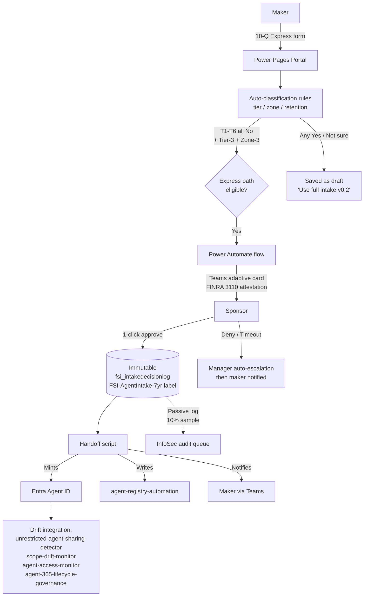

# Agent Intake

> **Status:** Preview (v0.1.0-preview) — Express path only. Standard and Full paths in roadmap (v0.2 and v0.3).

A pre-build user intake workflow for AI agent requests. Captures business case, classifies risk, routes for sponsor approval, and hands off to `agent-registry-automation` once approved.

## Why this solution exists

When a user wants a new Copilot Studio agent, Agent Builder agent, declarative agent, custom-engine agent, or Azure AI Foundry agent, somebody has to make decisions:

- Is this agent low-risk enough to auto-approve, or does it need security/compliance/MRM review?
- What zone, environment, retention class, and Entra Agent ID does it get?
- Is there a sponsor accountable for it (FINRA Rule 3110)?
- What are the supervisory records (FINRA 4511, SEC 17a-4) of the decision?

Without a structured intake, those decisions happen in chat threads, in tickets that never close, or not at all — and agents ship without records of who approved what. This solution closes that loop with a workflow proportional to risk: low-risk requests take three minutes and one sponsor click; high-risk requests get full review.

## What v0.1.0-preview ships (Express path only)

The MVP supports the **Express path** — for low-risk requests where the answers to all six trigger questions are "No" and the resulting tier/zone classification is the lowest. For these requests:

- Maker fills out **~10 questions** in a Power Pages portal (~3 minutes)
- System auto-classifies tier, zone, retention, and recommended environment
- Sponsor receives a **Teams adaptive card** with attestation language and approves with **one click**
- On approval the request is **auto-approved** with an immutable decision-pack record retained 7 years
- Handoff script provisions the **Microsoft Entra Agent ID** and creates the entry in `agent-registry-automation`
- InfoSec gets a passive notification logged for **10% sample audit** (manual sampling in v0.1; dashboard in v0.2)

Higher-risk requests (Standard and Full paths) are flagged for the maker as "this request needs the full intake; it is not yet supported by this version" — in v0.2/v0.3 those routes will activate. For v0.1 customers may continue to use their existing high-risk workflow.

## Architecture



ASCII fallback:

```
┌────────────────────────────────────────────────────────────────────┐
│                       Agent Intake (v0.1)                          │
├────────────────────────────────────────────────────────────────────┤
│                                                                    │
│   Power Pages Portal (10 Q Express form)                           │
│           │                                                        │
│           ▼                                                        │
│   Auto-classification rules ── computes tier / zone / retention    │
│           │                                                        │
│           ▼                                                        │
│   ┌── Express path eligibility (T1-T6 all "No" + Tier-3 + Zone-3)? │
│   │       Yes → continue                                           │
│   │       No  → "Use full intake (v0.2)" message; saved as draft   │
│   │                                                                │
│   ▼                                                                │
│   Power Automate flow → Teams adaptive card to Sponsor             │
│           │                                                        │
│           ▼                                                        │
│   Sponsor 1-click approval (FINRA 3110 attestation)                │
│           │                                                        │
│           ├─── Approved ──► Immutable fsi_intakedecisionlog row    │
│           │                 stamped with FSI-AgentIntake-7yr label │
│           │                       │                                │
│           │                       ▼                                │
│           │                 Handoff script (Python)                │
│           │                  • mints Entra Agent ID                │
│           │                  • writes to agent-registry-automation │
│           │                  • notifies maker via Teams            │
│           │                                                        │
│           └─── Denied / Timeout ──► Manager auto-escalation,       │
│                                     then maker notified            │
│                                                                    │
└────────────────────────────────────────────────────────────────────┘
                          │
                          ▼
        Drift integration with 4 existing solutions:
         • unrestricted-agent-sharing-detector (cross-checks at runtime)
         • scope-drift-monitor (detects intake-vs-actual drift)
         • agent-access-monitor (validates approved access set)
         • agent-365-lifecycle-governance (links sponsor + Entra Agent ID)
```

## Control mapping

| Control | Description | Coverage |
|---------|-------------|----------|
| **1.2** | Agent Registry and Integrated Apps Management | Primary — Express MVP creates the registry entry on approval |
| **1.7** | Comprehensive Audit Logging | Primary — immutable `fsi_intakedecisionlog` per intake decision |
| **2.1** | Managed Environments | Secondary — auto-detects target environment per zone |
| **2.13** | Documentation and Record Keeping | Primary — 9-entity Dataverse schema captures full decision pack |
| **3.1** | Maker Onboarding and Training | Secondary — intake portal is the onboarding surface |

## Zone applicability

| Zone | Express path coverage in v0.1 |
|------|-------------------------------|
| Personal (Zone 3) | ✅ Full coverage — auto-approve with sponsor sign-off |
| Team (Zone 2) | ⚠️ v0.1 captures the request; routes to draft state with "Standard path coming v0.2" message |
| Enterprise (Zone 1) | ⚠️ v0.1 captures the request; routes to draft state with "Full path coming v0.3" message |

## Regulatory alignment

| Regulation | How this solution helps |
|------------|------------------------|
| FINRA Rule 3110 (Supervision) | Required for documented supervisory approval; sponsor 1-click attestation captured with timestamp, IP, and rendered card content |
| FINRA Rule 4511 (Books and Records) | Supports books-and-records expectation — every intake decision retained as `fsi_intakedecisionlog` |
| SEC Rule 17a-3 / 17a-4 (Records) | Helps meet 7-year retention via Purview retention label `FSI-AgentIntake-7yr` (Records Admin one-time setup) |
| OCC Bulletin 2026-13 (April 17, 2026) | Aids in firm-policy governance for AI agents (the bulletin explicitly excludes generative/agentic AI from formal MRM scope but reserves firm-level governance) |
| Fed SR 11-7 | Supports model-risk tiering (Tier 3 in MVP; Tier 1/2 routed to v0.3 Full path) |
| GLBA 501(b) | Helps meet safeguards expectation by capturing data-source declaration and routing connector inventory through DLP simulation at intake |
| CFTC Rule 1.31 | Aids in 7-year records retention via the same FSI-AgentIntake-7yr Purview label |

> Note on language: this solution **supports compliance with** the cited rules; it does not by itself ensure or guarantee compliance, which depends on customer-specific implementation, policy interpretation, and audit evidence.

## Prerequisites

| Role | Why |
|------|-----|
| Power Platform Admin | Deploy Dataverse schema; configure Power Pages portal; provision flows |
| Microsoft 365 Records Management Admin | One-time creation of `FSI-AgentIntake-7yr` Purview retention label |
| Microsoft Entra Global Admin or Application Administrator | Admin consent for `AgentIdentity.ReadWrite.All` (Entra Agent ID GA May 1, 2026) |
| Microsoft 365 Admin | Teams adaptive card delivery channel; Graph `/me/manager` lookup |
| Sponsor (line-of-business approver) | Per intake — receives the Teams card and attests |

## Deploy

See `docs/pilot-deployment-runbook.md` for the full step-by-step. High level:

1. **Schema** — `python scripts/create_fsi_intake_dataverse_schema.py --interactive --environment-url <url>` (or use a service principal)
2. **Retention label** — `python scripts/setup_purview_retention_label.py` (one-time, by Records Admin)
3. **Entra Agent ID admin consent** — `python scripts/setup_entra_agent_id.py --check-consent`
4. **Power Pages portal** — follow `docs/portal-configuration.md` to build the 10-question Express form
5. **Power Automate flows** — follow `docs/flow-configuration.md` to build the routing + sponsor card + handoff flows (manual build per repo policy — no exported flow JSON)
6. **Validate** — `pwsh scripts/smoke_test.ps1`

## Documentation

| Path | Purpose |
|------|---------|
| `docs/dataverse-schema.md` | Auto-generated schema reference (do not edit; regenerate via `--output-docs`) |
| `docs/maker-quick-start.md` | 1-page maker-facing overview: the 10 questions and what happens after submit |
| `docs/sponsor-cheat-sheet.md` | 1-page sponsor-facing guide: the Teams card, FINRA 3110 attestation, SLA |
| `docs/onboarding-checklist.md` | Customer onboarding checklist (prereqs → setup → verify → go-live) |
| `docs/decisions.md` | Architecture Decision Record consolidating PO-locked decisions |
| `docs/portal-configuration.md` | Power Pages Express form build instructions |
| `docs/flow-configuration.md` | Power Automate flow build instructions (no exported JSON) |
| `docs/auto-detect-playbook.md` | API endpoints used for auto-fill (Graph, PPAC) |
| `docs/drift-detection-integration.md` | How this solution wires into the 4 existing drift detectors |
| `docs/pilot-deployment-runbook.md` | Full deployment runbook with rollback |
| `templates/sponsor-approval-card.json` | Teams adaptive card template (FINRA 3110 attestation language) |
| `templates/policy-lookup-tables.yaml` | Customer-overridable policy defaults |
| `research/` | Phase A research, evaluation, design v1, API spike, resolved opens |

## Related solutions

| Solution | Relationship |
|----------|--------------|
| `agent-registry-automation` | **Downstream** — receives the approved intake handoff and creates the registry entry |
| `agent-365-lifecycle-governance` | Downstream — owns the sponsor-revocation and 90-day inactivity flows |
| `unrestricted-agent-sharing-detector` | Drift integration — confirms post-deployment sharing matches the intake declaration |
| `scope-drift-monitor` | Drift integration — confirms post-deployment data scope matches |
| `agent-access-monitor` | Drift integration — validates the approved access set |

## Roadmap

- **v0.2** — Standard path (Tier-2/Zone-2 ~20 questions, InfoSec 10% sample dashboard, M365 declarative agent surface)
- **v0.3** — Full path (Tier-1/Zone-1 ~35 questions, parallel reviewer dashboard, MRM/Compliance/Privacy/Legal routing)
- **v0.4** — Sovereign cloud adaptation guide (GCC / GCC-High / DoD)
- **v1.0** — GA after pilot-firm validation feedback incorporated

## Changelog

See `CHANGELOG.md`.
