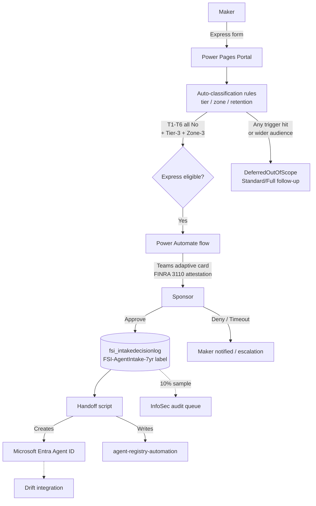

# Agent Intake

> **Status:** Preview (v1.0.0-preview) — Express, Standard, and Full paths all ship. Suitable for pilot validation; not for broad production rollout without customer governance sign-off.

A pre-build user intake workflow for AI agent requests. Captures business case, classifies risk into Express / Standard / Full paths, routes for sponsor or reviewer approval, and hands off to `agent-registry-automation` once approved.

## Why this solution exists

When a user wants a new Copilot Studio agent, Agent Builder agent, declarative agent, custom-engine agent, or Azure AI Foundry agent, somebody has to decide:

- Is this agent low-risk enough for Express approval, or does it need security/compliance/MRM review?
- What zone, environment, retention class, and Microsoft Entra Agent ID does it get?
- Is there a sponsor accountable for it (FINRA Rule 3110)?
- What are the supervisory records (FINRA 4511, SEC 17a-4) of the decision?

Without a structured intake, those decisions can happen in chat threads, in tickets that never close, or not at all. This solution closes that loop with a workflow proportional to risk: low-risk personal-agent requests take minutes and one sponsor click; higher-risk requests are captured and routed to follow-up review.

## Status and external next steps

This solution is **self-deployable preview** content at v1.0.0-preview. It is suitable for pilot validation, not broad production rollout without customer governance sign-off.

**What is shipped (v1.0.0-preview):**

| Layer | Status |
|---|---|
| Manifest, README, CHANGELOG, ADR | ✅ Shipped |
| 9-table Dataverse schema with three-path routing columns + auto-generated docs | ✅ Shipped |
| Express / Standard / Full question catalogs (10 / 22 / 35 questions) | ✅ Shipped |
| Power Pages multistep form with progressive disclosure | ✅ Shipped |
| Sponsor adaptive card + 12 documented Power Automate flows (build instructions only) | ✅ Shipped |
| Classification engine (Express + Standard + Full) and auto-detect scripts | ✅ Shipped |
| Model-driven reviewer queues app + ADR-011 packaging exception | ✅ Shipped |
| Handoff scripts (Microsoft Entra Agent ID blueprint, Purview retention, MRM bridge) | ✅ Shipped |
| `deploy.ps1` orchestrator with `-Teardown`, `-SeedTestData`, `-DryRun`; 5 deterministic fixtures; extended smoke test with `-PathScope` | ✅ Shipped |
| Pilot deployment runbook, onboarding docs, full enablement suite | ✅ Shipped |
| CI: 4 validators + 42 pytest cases | ✅ Shipped |
| Catalog registration + generated site artifacts | ✅ Shipped |

**External gates before scaling beyond pilot:**

1. Pilot-firm walkthrough of the PO-locked decisions in [`docs/decisions.md`](docs/decisions.md).
2. AI Governance Committee + InfoSec + Compliance + Legal + IT-architecture review.
3. Customer admin consent for Microsoft Graph permissions documented in [`docs/onboarding-checklist.md`](docs/onboarding-checklist.md).
4. Purview retention label (`FSI-AgentIntake-7yr`) created in the Purview portal or via Security & Compliance PowerShell; Graph beta create is preview/delegated-only guidance.
5. 30-day InfoSec sample-audit shows no undetected high-risk requests passed through Express.
6. Live-tenant verification of the Microsoft Entra Agent ID `fsiReviewerAttestations` open-type field (carried over as a v1.1 closure item).

## What v1.0.0-preview ships (Express, Standard, and Full paths)

The MVP supports three intake paths whose work effort is proportional to risk:

- **Express path** — for low-risk personal-agent requests where T1–T6 are all "No" and auto-classification lands at Tier 3 / Zone 3. Maker fills out the Power Pages form; system auto-classifies; sponsor receives a Teams adaptive card with FINRA 3110 attestation language and approves with one click; system auto-provisions the Microsoft Entra Agent ID and writes the registry entry; InfoSec gets a passive 10% sample-audit notification.
- **Standard path** — for mid-risk team-scope requests. Maker answers the 22-question Standard catalog (in addition to Express); the request is routed to a conditional reviewer who can approve, request changes, or escalate.
- **Full path** — for high-risk customer-facing or supervised-activity requests. Maker answers the 35-question Full catalog; the request enters a parallel-board reviewer queue with quorum tracking and (when applicable) an MRM handoff to `model-risk-management-automation`.

All three paths share the same immutable decision-log table (`fsi_intakedecisionlog`) with a 7-year retention label, the same drift-handoff payload schema for downstream monitoring, and the same Microsoft Entra Agent ID provisioning flow on approval.

## Architecture

## Control mapping

| Control | Description | Coverage |
|---------|-------------|----------|
| **1.2** | Agent Registry and Integrated Apps Management | Primary — Express MVP creates the registry entry on approval |
| **1.7** | Comprehensive Audit Logging | Primary — immutable `fsi_intakedecisionlog` per intake decision |
| **2.1** | Managed Environments | Secondary — auto-detects target environment per zone |
| **2.13** | Documentation and Record Keeping | Primary — 9-entity Dataverse schema captures decision-pack evidence |
| **3.1** | Maker Onboarding and Training | Secondary — intake portal is the onboarding surface |

## Zone applicability

| Zone | Intake path coverage in v1.0.0-preview |
|------|-----------------------------------------|
| Personal (Zone 3) | ✅ Express path — sponsor 1-click approval with FINRA 3110 attestation |
| Team (Zone 2) | ✅ Standard path — 22-question catalog routed to a conditional reviewer |
| Enterprise (Zone 1) | ✅ Full path — 35-question catalog, parallel reviewer quorum, and MRM handoff where applicable |

## Regulatory alignment

| Regulation | How this solution helps |
|------------|------------------------|
| FINRA Rule 3110 (Supervision) | Provides documented supervisory approval; sponsor attestation captured with timestamp and rendered card hash |
| FINRA Rule 4511 (Books and Records) | Supports books-and-records expectations through retained intake decision logs |
| SEC Rule 17a-3 / 17a-4 (Records) | Helps meet retention expectations via Purview retention label `FSI-AgentIntake-7yr` (Records Admin one-time setup) |
| OCC Bulletin 2026-13 (April 17, 2026) | Aids firm-policy governance for AI agents |
| Fed SR 11-7 | Supports internal model-risk tiering; Tier 1/2 route to fuller review |
| GLBA 501(b) | Helps meet safeguards expectations by capturing data-source declarations and DLP simulation at intake |
| CFTC Rule 1.31 | Aids in 7-year records retention via the same retention label |

> Caveat: this solution **supports compliance with** the cited rules; customer-specific policy, legal interpretation, operational controls, and evidence retention determine compliance outcomes.

## Prerequisites

| Role | Why |
|------|-----|
| Power Platform Admin | Deploy Dataverse schema; configure Power Pages portal; provision flows |
| Microsoft 365 Records Management Admin | One-time creation of `FSI-AgentIntake-7yr` Purview retention label |
| Microsoft Entra Agent ID Administrator / Cloud Application Administrator / Global Administrator | Consent `AgentIdentity.CreateAsManager` or `AgentIdentity.Create.All`, create/approve Agent Identity blueprint, and validate feature availability |
| Microsoft 365 Admin | Teams adaptive card delivery channel; Graph `/me/manager` lookup |
| Sponsor (line-of-business approver) | Per intake — receives the Teams card and attests |

## Deploy

See [`docs/pilot-deployment-runbook.md`](docs/pilot-deployment-runbook.md) for the full step-by-step. High level:

1. **Schema** — `python scripts/create_fsi_intake_dataverse_schema.py --auth-mode managed-identity --environment-url <url>` (or use `--interactive` for admin-workstation setup).
2. **Retention label** — `python scripts/setup_purview_retention_label.py --output ./.agent-intake-smoke/label-spec.json` (one-time, by Records Admin).
3. **Agent ID readiness** — `python scripts/setup_entra_agent_id.py --check-consent --token-source cli` and create/record an Agent Identity blueprint ID.
4. **Power Pages portal** — follow [`docs/portal-configuration.md`](docs/portal-configuration.md).
5. **Power Automate flows** — follow [`docs/flow-configuration.md`](docs/flow-configuration.md) (manual build per repo policy — no exported flow JSON).
6. **Validate** — `pwsh scripts/smoke_test.ps1`.

## Documentation

| Path | Purpose |
|------|---------|
| `docs/dataverse-schema.md` | Auto-generated schema reference (do not edit; regenerate via `--output-docs`) |
| `docs/maker-quick-start.md` | Maker-facing overview |
| `docs/sponsor-cheat-sheet.md` | Sponsor-facing guide |
| `docs/onboarding-checklist.md` | Customer onboarding checklist |
| `docs/decisions.md` | Architecture Decision Record |
| `docs/portal-configuration.md` | Power Pages Express form build instructions |
| `docs/flow-configuration.md` | Power Automate flow build instructions |
| `docs/auto-detect-playbook.md` | API endpoints used for auto-fill and checks |
| `docs/drift-detection-integration.md` | How this solution wires into drift detectors |
| `docs/pilot-deployment-runbook.md` | Full deployment runbook with rollback |
| `templates/sponsor-approval-card.json` | Teams adaptive card template |
| `templates/policy-lookup-tables.yaml` | Customer-overridable policy defaults |
| `research/` | Historical research artifacts; current implementation guidance is in `docs/` and `scripts/` |

### Enablement & demo

| Path | Audience | Purpose |
|------|----------|---------|
| `docs/enablement-overview.md` | All audiences | Entry point that links the enablement set by role |
| `docs/maker-guide.md` | Makers | Plain-English guide to Express, Standard, Full, denial, appeal, and post-approval expectations |
| `docs/sponsor-guide.md` | Sponsors | Teams-card walkthrough, sponsor accountability, denial handling, and audit-trail summary |
| `docs/reviewer-cheat-sheet.md` | Reviewer board | Quorum mechanics, per-role attestation guidance, SLA, escalation, and recusal rules |
| `docs/admin-onboarding-guide.md` | Customer admins | End-to-end deployment, policy hydration, flow build, smoke testing, operations, and troubleshooting |
| `docs/demo-script.md` | Demo operators | 20-25 minute customer architecture demo narrative with seeded scenarios and teardown |

## Related solutions

| Solution | Relationship |
|----------|--------------|
| `agent-registry-automation` | Downstream — receives the approved intake handoff and creates the registry entry |
| `agent-365-lifecycle-governance` | Downstream — owns sponsor-revocation and inactivity flows |
| `unrestricted-agent-sharing-detector` | Drift integration — confirms post-deployment sharing matches the intake declaration |
| `scope-drift-monitor` | Drift integration — confirms post-deployment data scope matches |
| `agent-access-monitor` | Drift integration — validates approved access |

## Roadmap

Express, Standard, and Full paths all ship in v1.0.0-preview. Forward-looking items:

- **v1.1** — Convert `fsi_appealofid` to a self-lookup; live-tenant verification of the Microsoft Entra Agent ID `fsiReviewerAttestations` open-type field; Power Pages multistep form-binding automation once PAC CLI supports it.
- **Post-v1.0** — M365 Copilot declarative agent surface (conversational intake); localization beyond en-US.
- **v1.0 (live)** — Promote from preview after pilot-firm validation feedback is incorporated.

## Changelog

See `CHANGELOG.md`.
