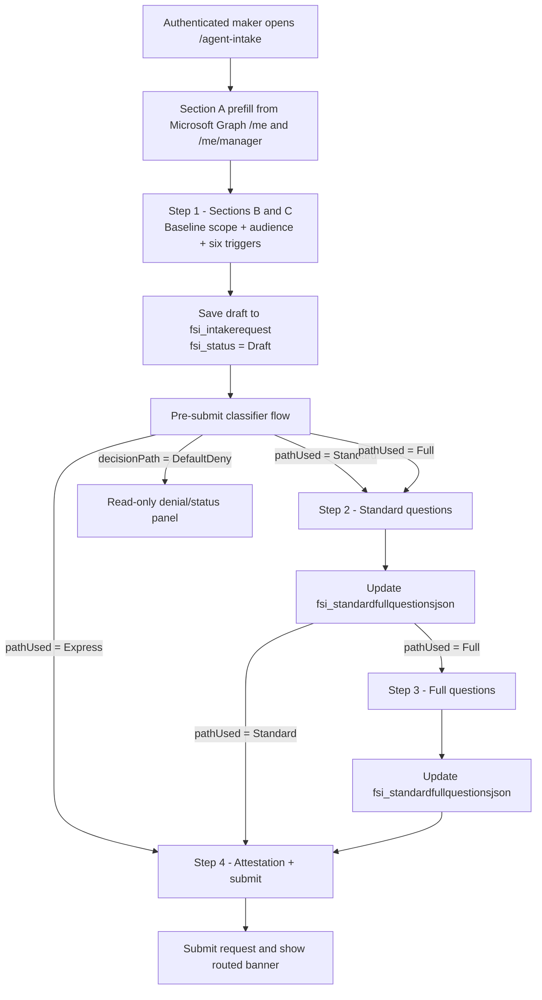

# Maker form progressive disclosure specification

## Recommended approach

Use a **Power Pages Multistep Form** with step-level gating for v1.0.0-preview.

- Use the **Multistep Form** to decide which path steps are shown.
- Use lightweight JavaScript or a content snippet only for:
  - banner updates after classification,
  - serializing Standard/Full answers into `fsi_standardfullquestionsjson`, and
  - client-side validation such as maker and sponsor not matching.
- Keep the authoritative routing logic in the pre-submit classifier flow, not in browser-only logic.

A single-page JavaScript experience is the fallback pattern, not the default. If field-level show/hide becomes brittle across tenants or templates, prefer the simpler step-level gate and display the whole Standard or Full step once the route is known.

## Step diagram



## Visibility model

| Section / field group | Express | Standard | Full | When shown |
|---|---|---|---|---|
| Section A — maker identity prefill (`fsi_makerupn`, `fsi_makerdisplayname`, `fsi_makerdepartment`, `fsi_makerjobtitle`, `fsi_makercountry`, `fsi_sponsorupn`) | Yes | Yes | Yes | Immediately on page load, then read-only after prefill completes |
| Section B — baseline scope (`fsi_agentdisplayname`, `fsi_businessoutcome`, `fsi_businessjustification`, `fsi_agenttype`) | Yes | Yes | Yes | Step 1 |
| Section C — audience + six trigger questions (`fsi_intendedaudience`, `fsi_t1initiatesfinancialtxn` ... `fsi_t6crossborderdata`) | Yes | Yes | Yes | Step 1 |
| `fsi_dataresidencycountry` | Conditional | Conditional | Conditional | Show only when `fsi_t6crossborderdata` is `Yes` or `Not sure` |
| Section D — Standard questions (`S1`–`S10`) | No | Yes | Yes | Step 2 after classifier writes `fsi_pathused = Standard` or `Full` |
| Section E — Full questions (`F1`–`F15`) | No | No | Yes | Step 3 after classifier writes `fsi_pathused = Full` |
| Section F — maker attestation (`fsi_makerattestation`) | Yes | Yes | Yes | Final step before submission |

Additional conditional visibility inside the Standard/Full steps:

| Conditional question | Trigger | Notes |
|---|---|---|
| `standard.s3HumanApprovalActions` | Only meaningful when the Step 1 scope indicates action-taking behavior. | If the whole Standard step is shown without finer gating, leave the question visible and let the maker choose “all actions require approval”. |
| `full.f5WritableSystems` | Show only when `full.f4WriteDeleteSystemOfRecordAccess = Yes`. | Hide otherwise and omit the key from the JSON payload. |
| `full.f6CustomerDisclosureLanguage` | Show only when the request is customer-facing. | If `fsi_t2customerfacing = No`, keep the field hidden. |
| `full.f8RelatedAgentIds` | Show only when `full.f7InterAgentDelegation = Yes`. | Store the linked agent IDs in the same JSON payload. |
| `full.f9VoiceChannelConsent` | Show only for voice-channel requests. | If the agent is not voice-based, default to `Not voice channel`. |

## Storage decision for Standard and Full

For v1.0.0-preview, the Standard and Full questions should be captured in the canonical memo field `fsi_standardfullquestionsjson`.

Why this is the recommended preview pattern:

- The Standard and Full catalogs are still evolving in parallel workstreams.
- A JSON payload allows customers to adjust wording, answer sets, or helper metadata without a Dataverse schema migration.
- A future v1.1 release can introduce strongly typed `fsi_s*` / `fsi_f*` columns once the catalog stabilizes.

Recommended payload shape:

```json
{
  "catalogVersion": "v1.0.0-preview",
  "pathUsed": "Standard",
  "standard": {
    "s1AdditionalSystems": ["ServiceNow"],
    "s2PremiumOrCustomConnectors": "No"
  },
  "full": {}
}
```

Do not render or allow edits for the router-computed fields `fsi_quorumrequired`, `fsi_parallelreviewersjson`, `fsi_mrmrequired`, or `fsi_mrmhandoffstatus` on the maker page.

## Pre-submit classifier flow contract

### Minimum contract

The form needs the classifier to return at least:

```json
{
  "pathUsed": "Standard",
  "decisionPath": "Standard"
}
```

### Recommended request payload

Send the current draft record after Step 1 is saved:

```json
{
  "requestId": "${fsi_requestid}",
  "recordId": "${fsi_intakerequestid}",
  "draft": {
    "fsi_agentdisplayname": "Policy lookup bot",
    "fsi_businessoutcome": "Policy access",
    "fsi_businessjustification": "Answers internal policy questions.",
    "fsi_agenttype": "Copilot Studio",
    "fsi_intendedaudience": "My department",
    "fsi_t1initiatesfinancialtxn": "No",
    "fsi_t2customerfacing": "No",
    "fsi_t3autonomousunmonitored": "Yes",
    "fsi_t4handlesnpi": "No",
    "fsi_t5handlesmnpi": "No",
    "fsi_t6crossborderdata": "No",
    "fsi_dataresidencycountry": ""
  }
}
```

### Recommended response payload

```json
{
  "pathUsed": "Full",
  "decisionPath": "Full",
  "pathUsedValue": 100000002,
  "routingBanner": "This request needs review by ${reviewerList}. Expected response within ${reviewerSlaBusinessDays} business days. MRM review will run in parallel for Tier-1 model risk assessment.",
  "reviewerList": ["InfoSec", "Privacy", "Compliance", "MRM", "Records", "Legal"],
  "reviewerSlaBusinessDays": 10,
  "standardfullquestionsjsonSeed": {
    "catalogVersion": "v1.0.0-preview",
    "pathUsed": "Full",
    "standard": {},
    "full": {}
  }
}
```

Implementation note:

- If the tenant can return a synchronous HTTP response to the page, use it to update the banner immediately.
- If direct response handling is not reliable, have the flow write `fsi_pathused`, `fsi_decisionpath`, and the seeded `fsi_standardfullquestionsjson` back to Dataverse, then refresh the step so the multistep form condition logic evaluates those persisted values.

## Multistep Form configuration steps

1. **Create four Dataverse forms** for `fsi_intakerequest`:
   - `Agent Intake - Step 1 Core`
   - `Agent Intake - Step 2 Standard Json Host`
   - `Agent Intake - Step 3 Full Json Host`
   - `Agent Intake - Step 4 Submit`
2. **Step 1 form contents**:
   - Include the current Express fields except `fsi_makerattestation`.
   - Keep the prefilled identity fields read-only.
   - Include hidden fields for `fsi_pathused`, `fsi_decisionpath`, and `fsi_standardfullquestionsjson` so the classifier can write back into the same record.
3. **Step 2 and Step 3 host forms**:
   - Include `fsi_standardfullquestionsjson` as a hidden memo field.
   - Add a read-only display of `fsi_pathused` if the admin wants troubleshooting visibility in lower environments.
   - Render the actual Standard/Full controls through a content snippet or custom HTML block instead of dedicated Dataverse fields.
4. **Step 4 submit form**:
   - Show a read-only route summary.
   - Include `fsi_makerattestation`.
   - Show the final banner text from the classifier response.
5. **Create the multistep form on the `/agent-intake` page**:
   - Step 1 creates a new record.
   - Steps 2, 3, and 4 update the existing record from Step 1.
   - Leave session tracking enabled so makers can resume a draft.
6. **Add Portal Management app condition steps** using logical names and option values:
   - `fsi_pathused == 100000000` → skip to Step 4 (Express).
   - `fsi_pathused == 100000001` → Step 2, then Step 4 (Standard).
   - `fsi_pathused == 100000002` → Step 2, then Step 3, then Step 4 (Full).
   - `fsi_decisionpath == "DefaultDeny"` → redirect to a read-only status or denial page.
7. **Trigger the classifier after Step 1**:
   - Preferred: on the Step 1 save/next action, invoke the classifier flow or a Dataverse custom API wrapper.
   - Fallback: run the classifier on draft-record create/update and refresh before the condition step executes.
8. **Keep maker/sponsor separation**:
   - Reject the next-step action if `fsi_makerupn` and `fsi_sponsorupn` match.
   - Provide a plain-language validation message before the maker reaches Step 4.

## JavaScript / content snippet pattern

Use a content snippet or web template fragment to host the Standard/Full controls and serialize them into the hidden memo field.

```html
<div data-agent-intake-banner class="alert alert-info"></div>

<section data-agent-intake-path="standard">
  <!-- Render the S1-S10 controls here. Each control should carry a stable data-question-key attribute. -->
</section>

<section data-agent-intake-path="full">
  <!-- Render the F1-F15 controls here. -->
</section>

<textarea id="fsi_standardfullquestionsjson" name="fsi_standardfullquestionsjson" hidden></textarea>

<script>
(function () {
  const jsonField = document.querySelector('[name="fsi_standardfullquestionsjson"]');
  const pathField = document.querySelector('[name="fsi_pathused"]');
  const decisionPathField = document.querySelector('[name="fsi_decisionpath"]');
  const banner = document.querySelector('[data-agent-intake-banner]');

  const bannerTemplates = {
    '100000000': 'Your sponsor will receive a Teams approval card. Expected response within 3 business days.',
    '100000001': 'This request needs review by ${reviewerList}. Expected response within ${reviewerSlaBusinessDays} business days.',
    '100000002': 'This request needs review by ${reviewerList}. Expected response within ${reviewerSlaBusinessDays} business days. MRM review will run in parallel for Tier-1 model risk assessment.'
  };

  function currentPathValue() {
    return pathField ? String(pathField.value || '').trim() : '';
  }

  function pathSections() {
    return {
      standard: document.querySelector('[data-agent-intake-path="standard"]'),
      full: document.querySelector('[data-agent-intake-path="full"]')
    };
  }

  function serializeSection(section) {
    if (!section) {
      return {};
    }

    const values = {};
    section.querySelectorAll('[data-question-key]').forEach((element) => {
      const key = element.getAttribute('data-question-key');
      if (!key) {
        return;
      }

      if (element.type === 'checkbox') {
        values[key] = Boolean(element.checked);
      } else if (element.multiple) {
        values[key] = Array.from(element.selectedOptions).map((option) => option.value);
      } else {
        values[key] = element.value;
      }
    });

    return values;
  }

  function syncJson() {
    if (!jsonField) {
      return;
    }

    const sections = pathSections();
    const payload = {
      catalogVersion: 'v1.0.0-preview',
      pathUsed: currentPathValue(),
      decisionPath: decisionPathField ? decisionPathField.value : '',
      standard: serializeSection(sections.standard),
      full: serializeSection(sections.full)
    };

    jsonField.value = JSON.stringify(payload);
  }

  function syncBanner() {
    if (!banner) {
      return;
    }

    banner.textContent = bannerTemplates[currentPathValue()] || '';
  }

  document.addEventListener('change', () => {
    syncJson();
    syncBanner();
  });

  document.addEventListener('input', syncJson);

  syncJson();
  syncBanner();
})();
</script>
```

Implementation notes:

- Prefer stable `data-question-key` attributes over generated DOM IDs.
- If the tenant template re-renders controls during validation, bind the handlers after each step load.
- Use the same token convention as the approval card for any templated banner text or sample renderings.

## Manual fallback when PAC CLI misses a step

The provisioning script can validate PAC CLI prerequisites, site visibility, and site content download/upload. The following steps still need manual completion when the CLI cannot do them reliably in the target tenant:

1. **Create the Power Pages site** if `pac pages list` does not return `agent-intake`.
2. **Create the `/agent-intake` page** in design studio and add the multistep form component.
3. **Configure table permissions** for `fsi_intakerequest`, `fsi_intakedatasource`, and `fsi_intakerisksignal` in the Security workspace or Portal Management app.
4. **Add the condition steps** in Portal Management app so `fsi_pathused` controls whether the Standard and Full steps appear.
5. **Add the content snippet / web template** that serializes the Standard and Full questions into `fsi_standardfullquestionsjson`.
6. **Configure Microsoft Graph pre-fill** or an equivalent server-side flow for the maker and sponsor fields.
7. **Bind the Step 1 save event to the classifier flow** so the route fields are written before the condition steps evaluate.

## Fallback if field-level show/hide is unstable

If the target site template does not support clean per-field show/hide for the custom controls:

- Keep **Step 1** unchanged.
- Show the **entire Standard step** whenever `fsi_pathused` is Standard or Full.
- Show the **entire Full step** only when `fsi_pathused` is Full.
- Use inline helper text instead of dynamic micro-hiding for subconditions.
- Continue serializing the answers into `fsi_standardfullquestionsjson` so downstream routing remains the same.

This fallback keeps the maker surface predictable while preserving the progressive-disclosure goal at the step level.
