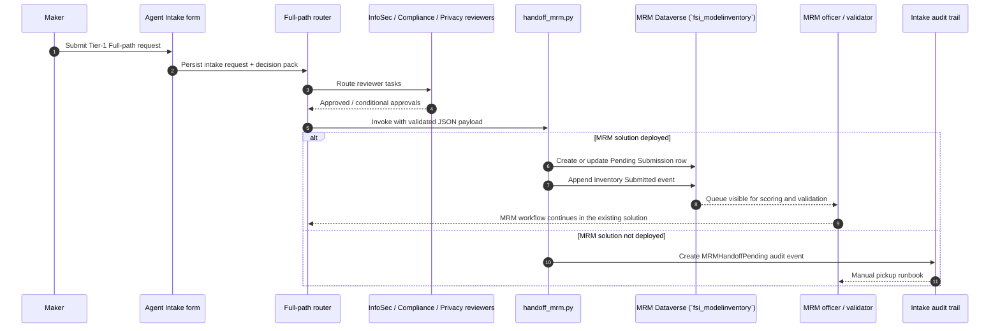

# MRM integration — wiring agent-intake to model-risk-management-automation

Tier-1 Full-path requests that raise material model-risk concerns should not stop at intake. This document records the handoff contract between `agent-intake` and `model-risk-management-automation`, the existing solution that owns MRM inventory, risk scoring, validation, and ongoing monitoring.

## Why this matters

OCC Bulletin 2026-13 (April 17, 2026) rescinded OCC Bulletin 2011-12 for generative and agentic AI as a formal Model Risk Management mandate, but retained firm-level governance expectations for AI deployment. Federal Reserve SR 11-7 remains operative for institutions under Federal Reserve supervision. Many firms still choose to apply SR 11-7-style rigor to Tier-1 agents with material decision-support or quantitative outputs.

This handoff supports that governance choice without duplicating the downstream MRM workflow. Intake captures the decision pack, sponsor attestation, and reviewer evidence; `model-risk-management-automation` continues to own the model inventory, scoring, validation, and monitoring steps.

See the [OCC 2026-13 framing note in `decisions.md`](./decisions.md#occ-2026-13-framing-note) for the intake-side policy rationale.

## When the handoff fires

The handoff is intended for requests that meet all of the following conditions:

- `fsi_pathused = Full`
- `fsi_risktier = Tier 1 (High)`
- `fsi_MrmRequired = true` (or the equivalent policy result in the routing flow)
- The request carries material model-risk evidence that the firm wants reviewed under its SR 11-7-style governance process

The current contract therefore fixes `pathUsed = Full`, `riskTier = Tier 1 (High)`, and `mrmRequired = true` in the JSON Schema.

## Handoff contract

### Published artifacts

- JSON Schema: [`../templates/mrm-handoff-payload-schema.json`](../templates/mrm-handoff-payload-schema.json)
- Worked example: [`../templates/mrm-handoff-payload-example.json`](../templates/mrm-handoff-payload-example.json)
- Queue adapter: [`../scripts/handoff_mrm.py`](../scripts/handoff_mrm.py)

### Destination discovered from the MRM solution

`model-risk-management-automation` v1.0.3 does **not** expose a dedicated intake queue table. The earliest durable record in its schema is `fsi_modelinventory`, with an alternate key on `fsi_agentid` + `fsi_environmentid`. The integration therefore treats `fsi_modelinventory` as the queue row and uses `fsi_mrmcomplianceevent` as the sidecar audit/idempotency marker.

| Destination | Purpose | Notes |
|---|---|---|
| `fsi_modelinventory` | Durable MRM queue row | Alternate key: `fsi_agentid`, `fsi_environmentid` |
| `fsi_mrmcomplianceevent` | Idempotency marker + payload envelope | `fsi_previousvalue = intake.requestId`; `fsi_newvalue = decisionPackHash` |
| `fsi_intakeauditevent` | Local fallback when MRM is absent | `fsi_eventtype = MRMHandoffPending` |

### Wire-to-destination mapping

| Wire field | Destination column | Notes |
|---|---|---|
| `agent.displayName` | `fsi_modelinventory.fsi_modelname` | Primary name attribute |
| `agent.platformAgentId` | `fsi_modelinventory.fsi_agentid` | Alternate-key part 1 |
| `agent.environmentId` | `fsi_modelinventory.fsi_environmentid` | Alternate-key part 2 |
| `maker.upn` | `fsi_modelinventory.fsi_ownerupn` | First line of defense |
| `maker.department` | `fsi_modelinventory.fsi_ownerdepartment` | Optional |
| `routing.mrmOfficerUpn` or reviewer role `MRM` | `fsi_modelinventory.fsi_mrmofficerupn` | Optional |
| `routing.auditorUpn` or reviewer role `Audit` | `fsi_modelinventory.fsi_auditorupn` | Optional |
| `model.providerName` + `model.vendorOrInternal` | `fsi_modelinventory.fsi_modelprovider` | Mapped to the MRM option set |
| `model.decisionOutputType` | `fsi_modelinventory.fsi_decisionoutputtype` | Required by the downstream scorer |
| `model.materiality` | `fsi_modelinventory.fsi_materiality` | Required by the downstream scorer |
| `data.declaredSources[]` | `fsi_modelinventory.fsi_datainputs` | Compact JSON snapshot |
| `intake.zone` | `fsi_modelinventory.fsi_governancezone` | Mapped to `fsi_acv_zone` |
| `intake.requestId` | `fsi_mrmcomplianceevent.fsi_previousvalue` | Query-friendly idempotency marker |
| `decisionPackHash` | `fsi_mrmcomplianceevent.fsi_newvalue` | Query-friendly idempotency marker |
| Full payload | `fsi_mrmcomplianceevent.fsi_eventdetails` | Full handoff envelope for reviewers |
| Full payload (fallback path) | `fsi_intakeauditevent.fsi_eventpayloadjson` | Manual pickup payload |

### Seed values set by the adapter

Because `fsi_modelinventory` is the first durable row in the MRM workflow, the adapter seeds only the minimum queue-state values and leaves scoring and validation ownership with the MRM solution:

- `fsi_mrmstatus = Pending Submission`
- `fsi_validationstatus = Submitted`
- `fsi_mrmtier = Tier 1 - Full MRM`
- `fsi_validationcadence = Annual`
- `fsi_currentriskrating = High` (provisional placeholder until the downstream scorer recalculates it)

This is an integration bridge, not a second scoring engine.

### Worked example

See the full example file for all fields. The excerpt below shows the contract shape that `handoff_mrm.py` validates and maps:

```json
{
  "$schema": "https://judeper.github.io/FSI-AgentGov-Solutions/schemas/mrm-handoff-payload-v1.json",
  "payloadVersion": "1.0.0",
  "intake": {
    "requestId": "9bd0c41c-1cc4-45c5-acde-f2a97c5d9b87",
    "submittedOnUtc": "2026-05-14T16:12:43Z",
    "pathUsed": "Full",
    "riskTier": "Tier 1 (High)",
    "zone": "Zone 1 (Enterprise)",
    "mrmRequired": true
  },
  "agent": {
    "displayName": "Credit Adverse Action Review Copilot",
    "platformAgentId": "3c2fd0ea-78e0-4d42-9c28-2d2ff9ed9f8e",
    "environmentId": "f1f2d9be-8dc4-4d19-9bb0-4d4c5c1215be",
    "intendedAudience": "Anyone in the firm",
    "businessOutcome": "Decision support for adverse-action notice quality review"
  },
  "maker": {
    "upn": "maria.chen@contoso.com",
    "displayName": "Maria Chen"
  },
  "model": {
    "providerName": "OpenAI",
    "providerModelId": "gpt-4.1",
    "decisionOutputType": "Decision Support",
    "materiality": "High"
  },
  "decisionPackHash": "6f3b2d83413e6b6c2cb6e9cf992b444c7f3f7b34de0f0fcd3e4cab17a6f89a6d",
  "retentionLabel": "FSI-AgentIntake-7yr",
  "policyVersion": "1.0.0-preview"
}
```

## Sequence diagram



## Failure modes

| Condition | Script behavior | Exit code | Operator action |
|---|---|---|---|
| Payload fails JSON Schema validation | Stops before any Dataverse write | `1` | Fix the payload generator or example file |
| `fsi_modelinventory` not deployed | Writes local `fsi_intakeauditevent` fallback | `2` | Deploy the MRM solution or use the manual runbook below |
| Same `requestId` + same `decisionPackHash` already recorded in MRM | Skips duplicate write | `0` | None |
| Queue row created but `fsi_mrmcomplianceevent` sidecar fails | Keeps the queue row; returns success with warning | `0` | Re-run if you need the sidecar marker restored |
| Local fallback table unavailable | Stops with error | `1` | Repair the intake deployment before retrying |

## Manual fallback runbook

Use this path when `handoff_mrm.py` returns exit code `2`.

1. Query `fsi_intakeauditevents` for the request ID and `fsi_eventtype = 'MRMHandoffPending'`.
2. Copy `fsi_eventpayloadjson`; it contains the validated payload plus the fallback reason.
3. If `model-risk-management-automation` is deployed later, re-run `handoff_mrm.py` with the same payload file.
4. If your firm keeps a separate MRM queue, forward the same payload to that queue and capture the external ticket ID in the intake evidence trail.
5. Retain the local audit event. This supports compliance with FINRA Rule 4511(a), SEC Rule 17a-4, and CFTC Rule 1.31 even when the downstream MRM solution is not yet available.

## Customer override

The default adapter assumes the routing policy resolves `policy-lookup-tables.yaml > mrm > handoff_target` to the built-in Dataverse destination. The foundation-schema workstream adds that policy block; this workstream only defines the payload and the default Dataverse transport.

Firms with their own MRM tooling should keep the same JSON Schema and replace only the final transport step:

- `handoff_target = dataverse:model-risk-management-automation` → call `handoff_mrm.py`
- `handoff_target = custom:<your-queue>` → send the same validated payload to your internal API, message bus, or case-management queue

The point of the contract is transport swap, not field redesign.

## What this integration does not do

- It does **not** create new MRM tables; it reuses the existing MRM schema.
- It does **not** recalculate the 7-factor MRM score inside intake.
- It does **not** replace the MRM submission portal or validation workbench.
- It does **not** claim that a single handoff satisfies OCC Bulletin 2026-13, Federal Reserve SR 11-7, FINRA Rule 3110, or any other regulation in isolation. Organizations should verify the surrounding governance process, reviewer routing, and record retention settings in their own environment.
