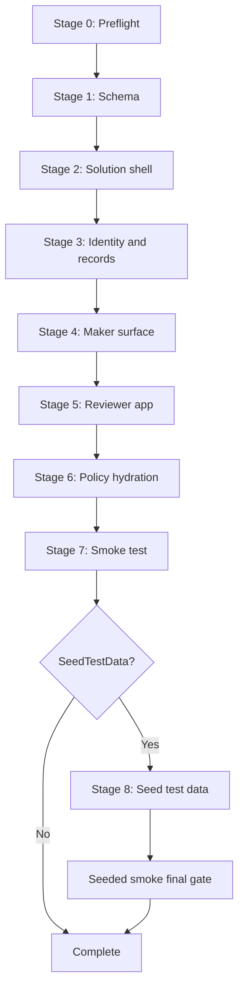

# Orchestrator architecture

## 1. Purpose

`deploy.ps1` is the single entry point for rebuilding the `agent-intake` solution from a clean tenant into a validated lab or first customer deployment. It coordinates the schema, solution shell, identity and records setup, maker surface checks, reviewer app provisioning, policy hydration, smoke testing, and optional seeded test data in one repeatable workflow.

The orchestrator is intentionally idempotent. Re-running it after a partial failure helps the operator resume from the current state instead of tearing down and starting over.

## 2. Stages

### Stage 0 - Preflight

- Validates PowerShell, Python, PAC CLI, Azure CLI, and the required PowerShell modules.
- Verifies Python packages needed by the child scripts.
- Establishes Azure CLI authentication based on `-AuthMode`.
- Creates or selects the PAC auth profile for the target environment.
- Confirms the Dataverse endpoint is reachable by calling `WhoAmI`.

### Stage 1 - Schema

- Runs `create_fsi_intake_dataverse_schema.py` against the target environment.
- Refreshes `docs/dataverse-schema.md` from the same schema source.
- Verifies all nine tables, key columns, and the global option sets before continuing.

### Stage 2 - Solution shell

- Runs `provision_solution_shell.ps1`.
- Verifies the unmanaged solution shell, environment variable definitions, and standard connection references.
- Accepts the Graph custom-connector API ID through `AGENT_INTAKE_GRAPH_CUSTOM_CONNECTOR_API_ID` when the customer already knows it.

### Stage 3 - Identity and records

- Runs `setup_purview_retention_label.py`, which uses the PowerShell wrapper on Windows.
- Runs `setup_agent_identity_blueprint.py` and `setup_entra_agent_id.py --check-consent`.
- Treats Purview delegated read limits and tenant feature-gating for Agent ID as warnings when the child scripts fall back cleanly.

### Stage 4 - Maker surface

- Runs `provision_power_pages.ps1`.
- Validates whether PAC CLI can see the `agent-intake` site.
- Emits `MANUAL STEP REQUIRED:` guidance when PAC CLI reaches a classic Power Pages gap that still needs the maker portal.

### Stage 5 - Reviewer app

- Runs `provision_reviewer_app.ps1`.
- Verifies the reviewer solution, app module, and reviewer security roles.

### Stage 6 - Policy hydration

- Reads `templates/policy-lookup-tables.yaml`.
- Writes the current values for the `fsi_intake_*` environment variables.
- Uses environment overrides when available and otherwise falls back to derived values or documented placeholders.

### Stage 7 - Smoke test

- Runs `smoke_test.ps1` unless `-SkipSmoke` is specified.
- Fails the deploy if a required smoke check fails.

### Stage 8 - Seed test data

- Runs `seed-test-data.ps1 -RunClassifierInline` when `-SeedTestData` is specified.
- Validates that all five deterministic request rows exist.
- Re-runs `smoke_test.ps1 -IncludeSeededDataChecks` as the final gate unless `-SkipSmoke` was specified.

## 3. Idempotency model

Each stage follows the same loop:

1. Read the current state.
2. Compute the delta between the target state and the current state.
3. Apply only the missing or changed state.
4. Re-read and validate before the next stage starts.

This pattern is implemented at two levels:

- **Child script level**: the schema, shell, reviewer app, retention label, and MRM bridge scripts are already idempotent or best-effort idempotent.
- **Orchestrator level**: `deploy.ps1` re-checks the resulting objects after every child script and skips unchanged environment-variable values.

The same design is used for `-Teardown`. The script removes seeded data first, then deletes or clears each footprint area in reverse order, and records anything that still needs manual follow-up.

## 4. Teardown semantics

`deploy.ps1 -Teardown` is intentionally defensive.

### Automatically removed

- Seeded lab data through `seed-test-data.ps1 -Cleanup`
- All rows in the nine `agent-intake` Dataverse tables
- Reviewer app module and reviewer security roles
- Agent-intake environment variable definitions and current values
- Standard connection references created by the solution shell
- Best-effort deletion of the custom tables and global option sets
- Best-effort deletion of the `FSIAgentIntake` and `AgentIntakeReviewerApp` solution containers

### Left in place on purpose or by platform gap

- **Power Pages classic site and page binding**: PAC CLI cannot remove every classic Power Pages artifact reliably, so the script records a manual fallback.
- **Purview retention labels**: the script preserves `FSI-AgentIntake-7yr` and `FSI-AgentIntake-7yr-WORM` because those labels can be shared across records outside the solution.
- **Microsoft Entra Agent Identity blueprint**: the script treats blueprint cleanup as a manual decision because the same blueprint can be shared across multiple agents.
- **Live Microsoft Entra Agent IDs minted during seeded tests**: the default seeded lab path uses deterministic synthetic IDs, but if the customer opts into live minting, the operator should remove those service principals manually after confirming no downstream dependency exists.

## 5. Exit-code matrix

| Exit code | Meaning |
|---|---|
| `0` | Success |
| `10` | Preflight failure |
| `20` | Schema failure |
| `30` | Solution shell failure |
| `40` | Identity and records failure |
| `50` | Maker surface failure |
| `60` | Reviewer app failure |
| `70` | Policy hydration failure |
| `80` | Smoke failure |
| `90` | Seed failure |
| `100` | Teardown failure |

## 6. Auth modes

### `AzCli` (default)

- Uses delegated Azure CLI sign-in.
- If no cached context exists, the orchestrator runs `az login --use-device-code`.
- Uses `pac auth create --deviceCode` when PAC is not already connected.

### `ManagedIdentity`

- Uses Azure CLI managed-identity sign-in (`az login --identity`).
- Uses `pac auth create --managedIdentity` when PAC is not already connected.
- This is the preferred non-interactive deployment path for Azure-hosted automation.

### `ServicePrincipal` (legacy)

- Uses `AZURE_TENANT_ID`, `AZURE_CLIENT_ID`, and `AZURE_CLIENT_SECRET`.
- Uses Azure CLI service-principal sign-in and PAC service-principal auth creation.
- This path is retained for legacy labs only. Managed identity remains the recommended production approach.

## 7. Customer override points

The orchestrator intentionally keeps the override surface small and explicit.

### Environment variables

These values can be injected without editing the scripts:

- `AGENT_INTAKE_MAKER_PORTAL_URL`
- `AGENT_INTAKE_REVIEWER_APP_URL`
- `AGENT_INTAKE_MRM_TARGET_ENV`
- `AGENT_INTAKE_DRIFT_DETECTOR_ENV`
- `AGENT_INTAKE_RETENTION_LABEL_ID`
- `AGENT_INTAKE_SPONSOR_BACKUP_GROUP`
- `AGENT_INTAKE_GRAPH_CUSTOM_CONNECTOR_API_ID`
- `AGENT_INTAKE_PURVIEW_ADMIN_UPN`
- `AGENT_INTAKE_BLUEPRINT_SPONSOR_UPN`
- `AGENT_INTAKE_AGENT_BLUEPRINT_ID`
- `AGENT_INTAKE_LIVE_AGENT_ID`

### Policy YAML

`templates/policy-lookup-tables.yaml` remains the source for retention labels, quorum policy, MRM routing defaults, reviewer routing defaults, and sponsor attestation text.

### Fixture data

The deterministic lab fixtures live under `scripts/seed-test-data/`. Customers can fork those JSON files when they want different sample data, but the shipped defaults cover the Express happy path, a Standard approval with conditions, a Full reviewer board, cross-border default-deny, and sponsor self-approval default-deny.

## 8. Failure recovery

- **Stage 0 through Stage 6 failures**: fix the underlying prerequisite or permissions issue and rerun `deploy.ps1`. Earlier successful stages are safe to repeat.
- **Stage 7 smoke failure**: correct the failing configuration, then rerun `deploy.ps1`. The smoke test is read-only.
- **Stage 8 seed failure**: rerun `deploy.ps1 -SeedTestData` after fixing the root cause. The seeder removes and recreates the deterministic fixture set.
- **Teardown partial failure**: review the teardown summary table, complete any manual fallback items, and rerun `deploy.ps1 -Teardown` if needed.

The operational rule is simple: prefer an idempotent re-run over hand-editing partial state. Use `-Teardown` only when the operator wants to remove the whole `agent-intake` footprint and rebuild from a clean baseline.
