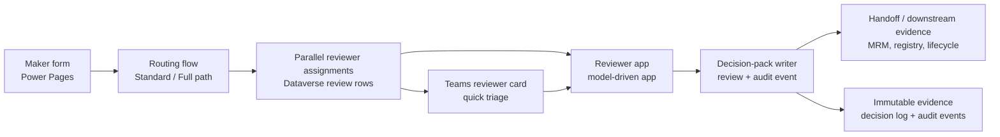

# Reviewer app build guide

This guide describes how to build the reviewer model-driven app for the `agent-intake` Standard and Full paths. The machine-readable source of truth is [`../templates/reviewer-app-spec.json`](../templates/reviewer-app-spec.json); use this document when a customer admin needs to replay the design manually because [`../scripts/provision_reviewer_app.ps1`](../scripts/provision_reviewer_app.ps1) hits a PAC CLI or Dataverse Web API gap.

> See ADR-011 in [`decisions.md`](decisions.md) for the policy decision that allows the exported managed model-driven app solution package to be retained under `agent-intake/artifacts/reviewer-app/`.

## Prerequisites

- `agent-intake` Dataverse schema deployed, including the v1.0-preview reviewer fields and option sets used in `reviewer-app-spec.json`
- Power Platform CLI (`pac`) installed and authenticated to the target environment (`pac auth create --environment https://<org>.crm.dynamics.com`)
- System Administrator or System Customizer rights in the target environment
- Reviewer users or Microsoft Entra ID groups identified for InfoSec, Privacy, Compliance, Legal, MRM, and Governance Lead assignment
- Optional Dataverse bearer token for the full Web API-backed bootstrap path in `provision_reviewer_app.ps1` (solution creation, reviewer views, security roles, and app-role association)

## 1. Purpose & audience

The reviewer app is the power-user surface for Standard and Full agent-intake requests that route to the parallel reviewer board. The primary audience is:

- InfoSec reviewers
- Privacy reviewers
- Compliance reviewers
- Legal reviewers
- MRM reviewers
- Governance Leads who oversee the queue, SLA posture, and escalation handling

The app supports triage, evidence review, queue management, and reviewer decision capture. Teams adaptive cards remain the quick-notification surface; the model-driven app is the primary operating surface once a reviewer needs full request context or audit evidence.

## 2. Architecture overview

### Implementation caveat

The preview schema links request and review data by the soft foreign key `fsi_requestid` rather than a Dataverse lookup. The default reviewer workspace therefore uses a **paired-form** pattern:

1. open the read-only request context form on `fsi_intakerequest`
2. pin the reviewer decision form on `fsi_intakereview` in a side pane or open it in a second browser tab

If a future schema pass adds a true lookup from `fsi_intakereview` to `fsi_intakerequest`, customers can replace the paired-form pattern with a single request form that contains a native related-record experience.

## 3. Tables surfaced

| Table | Purpose in reviewer app | Access |
|---|---|---|
| `fsi_intakerequest` | Primary queue, routing context, risk tier / zone, quorum, environment target, MRM handoff state | Read-only |
| `fsi_intakereview` | Reviewer-owned decision rows, due date, quorum weight, conditions text, completion timestamps | Read / write |
| `fsi_intakeapproval` | Sponsor and approver history for supervisory traceability | Read-only |
| `fsi_intakesponsorship` | Sponsor attestation evidence captured for FINRA Rule 3110 style review | Read-only |
| `fsi_intakedatasource` | Declared data-source summary and data-classification context | Read-only |
| `fsi_intakerisksignal` | Trigger-question results and derived routing signals | Read-only |
| `fsi_intakeauditevent` | Lifecycle trail, including reviewer-queued and reviewer-decided events | Read-only |
| `fsi_intakedecisionlog` | Immutable decision-pack evidence retained for books-and-records support | Read-only |

> `fsi_intakedecisionlog` and `fsi_intakeauditevent` stay read-only in the app so reviewers can inspect evidence without changing the retained record.

## 4. Views

The spec defines eight logical queue and audit views. Two design notes matter:

- **My open reviews** is implemented with `ownerid = Current User` on `fsi_intakereview`. This requires the routing flow to assign each review row to the reviewer as the Dataverse owner.
- **Awaiting my role** is materialized as one system view per reviewer role (InfoSec, Privacy, Compliance, Legal, MRM) because Dataverse system views do not evaluate a custom `@user.role` token against a choice column at runtime.

| View | Table | Default filter | Notes |
|---|---|---|---|
| `My open reviews` | `fsi_intakereview` | `ownerid = Current User` and `fsi_reviewoutcome = Pending` | Closest supported implementation of the user-scoped queue without a generated page |
| `All Standard requests in queue` | `fsi_intakerequest` | `fsi_pathused = Standard` and `fsi_status = AwaitingReviewers` | Governance-lead and board-wide triage |
| `All Full requests in queue` | `fsi_intakerequest` | `fsi_pathused = Full` and `fsi_status = AwaitingReviewers` | Highest-friction queue review |
| `MRM queue` | `fsi_intakerequest` | `fsi_mrmrequired = Yes`, `fsi_risktier = Tier 1 (High)`, `fsi_status = AwaitingReviewers` | Highlights Tier 1 MRM work |
| `Awaiting my role - <Role>` | `fsi_intakereview` | `fsi_reviewoutcome = Pending` and `fsi_reviewerrole = <Role>` | One materialized view per reviewer role |
| `Approved with conditions` | `fsi_intakereview` | `fsi_reviewoutcome = Approved with conditions` | Audit follow-up surface |
| `Denied` | `fsi_intakereview` | `fsi_reviewoutcome = Denied` | Audit follow-up surface |
| `Sponsor self-approvals attempted` | `fsi_intakerequest` | `fsi_makerupn = fsi_sponsorupn` | Default-denied risk surface for SoD review |

### Columns to include in the queue views

- Request queues: `fsi_requestid`, `fsi_agentdisplayname`, `fsi_makerdisplayname`, `fsi_intendedaudience`, `fsi_risktier`, `fsi_zone`, `fsi_quorumrequired`, `fsi_submittedon`
- Review queues: `fsi_requestid`, `fsi_reviewerrole`, `fsi_reviewerupn`, `fsi_reviewtype`, `fsi_dueon`, `fsi_reviewoutcome`, `fsi_quorumweight`
- Audit views: `fsi_conditionstext`, `fsi_reviewnotes`, `fsi_completedon` as appropriate

## 5. Dashboards

Create two system dashboards in the maker portal.

### Reviewer Operations dashboard

| Card | Source | Notes |
|---|---|---|
| Requests by tier | `fsi_intakerequest` chart grouped by `fsi_risktier` | Helps Governance Lead see workload concentration |
| Requests by path | `fsi_intakerequest` chart grouped by `fsi_pathused` | Separates Standard vs Full demand |
| MRM queue | `MRM queue` view | Keeps Tier 1 handoff visible |

### Reviewer SLA dashboard

| Card | Source | Notes |
|---|---|---|
| Average decision latency by role | `fsi_intakereview` chart grouped by `fsi_reviewerrole` using `fsi_startedon` → `fsi_completedon` | Supports SLA management |
| SLA breaches | `fsi_intakereview` view where `fsi_dueon < now()` and `fsi_reviewoutcome = Pending` | Operating queue for overdue work |
| Approved with conditions | `Approved with conditions` view | Captures follow-up obligations |
| Denied | `Denied` view | Captures rejection patterns and evidence |

PAC CLI does not yet build these dashboards from the command line. `provision_reviewer_app.ps1` therefore logs **MANUAL STEP REQUIRED** guidance and leaves dashboard assembly to the maker portal.

## 6. Forms

### Main reviewer form

Use the paired-form workspace pattern from the spec:

1. **Request context form** on `fsi_intakerequest` (read-only)
   - header: `fsi_requestid`, `fsi_agentdisplayname`, `fsi_status`, `fsi_pathused`, `fsi_risktier`, `fsi_zone`
   - maker context: `fsi_makerdisplayname`, `fsi_makerupn`, `fsi_intendedaudience`, `fsi_businessoutcome`, `fsi_businessjustification`
   - routing context: `fsi_quorumrequired`, `fsi_parallelreviewersjson`, `fsi_mrmrequired`, `fsi_mrmhandoffstatus`, `fsi_targetenvironmentname`
2. **Reviewer decision form** on `fsi_intakereview` (reviewer-editable)
   - assignment: `fsi_requestid`, `fsi_reviewerrole`, `fsi_reviewerupn`, `fsi_reviewtype`, `fsi_dueon`, `fsi_quorumweight`
   - decision: `fsi_reviewoutcome`, `fsi_conditionstext`, `fsi_reviewnotes`, `fsi_startedon`, `fsi_completedon`

This pattern still satisfies the product requirement of read-only request context plus a reviewer-only decision section, while respecting the current soft-key schema.

### Audit form

Create a read-only audit form on `fsi_intakedecisionlog` with:

- decision summary: `fsi_requestid`, `fsi_decisionoutcome`, `fsi_risktier`, `fsi_zone`, `fsi_pathused`, `fsi_decidedon`
- retained evidence: `fsi_policyversionapplied`, `fsi_decisionpackhash`, `fsi_retentionlabelapplied`, `fsi_retentionlabelappliedon`

Optionally add a second read-only form on `fsi_intakeauditevent` for support teams that need to inspect the event stream directly.

## 7. Security roles

Create these Dataverse security roles:

| Role | Scope |
|---|---|
| `FSI Agent Intake Reviewer - InfoSec` | InfoSec queue triage |
| `FSI Agent Intake Reviewer - Privacy` | Privacy queue triage |
| `FSI Agent Intake Reviewer - Compliance` | Compliance queue triage |
| `FSI Agent Intake Reviewer - Legal` | Legal queue triage |
| `FSI Agent Intake Reviewer - MRM` | MRM queue triage |
| `FSI Agent Intake Governance Lead` | Sees all reviewer queues and audit views |

### Privilege pattern

- `fsi_intakereview`: **Basic** Read / Write / Append / AppendTo for reviewer roles so the reviewer edits only the review rows owned by them
- `fsi_intakerequest`, `fsi_intakeapproval`, `fsi_intakesponsorship`, `fsi_intakedatasource`, `fsi_intakerisksignal`, `fsi_intakeauditevent`, `fsi_intakedecisionlog`: **Global** Read so reviewers can inspect request context and evidence
- Governance Lead: same read surfaces plus **Global** Read / Write / Append / AppendTo / Assign / Share on `fsi_intakereview`

Role-based views help keep the experience focused on the relevant queue. If a firm requires stronger row-level isolation than the default paired-form pattern provides, add a true Dataverse lookup and access-team model in a future schema revision.

## 8. Business rules

Two rules are required for the reviewer decision experience:

1. **Conditions text required** — when `fsi_reviewoutcome = Approved with conditions`, require `fsi_conditionstext`
2. **Decision lock after audit write** — after the decision writer records a `ReviewerDecided` event in `fsi_intakeauditevent`, prevent further edits to `fsi_reviewoutcome`, `fsi_conditionstext`, and `fsi_reviewnotes`

### Implementation note

The first rule is a native Dataverse business rule on `fsi_intakereview`. The second rule should be implemented in the reviewer decision writer flow or a plug-in because Dataverse business rules do not query a related table like `fsi_intakeauditevent`.

## 9. Teams notification integration

The reviewer Teams notification flow is `fsi-intake-reviewer-card`.

- Template: [`../templates/reviewer-notification-card.json`](../templates/reviewer-notification-card.json)
- Trigger: each routed `fsi_intakereview` assignment
- Actions: Approve, Approve with conditions, Deny, Open in reviewer app
- Per-role attestation: the flow should select the correct language from the card template's `fsiRoleAttestationCatalog` and inject it into `${fsi_reviewerattestation}` before posting

This guide does not duplicate the full Power Automate build instructions. The workflow-docs workstream adds the flow steps in `flow-configuration.md`.

## 10. Customer override

To add a new reviewer role:

1. Extend the `fsi_intake_reviewerrole` choice set with the new label and value
2. Add a new Dataverse security role following the reviewer-role pattern above
3. Materialize a new role-scoped queue view for `Awaiting my role - <NewRole>`
4. Update the Standard / Full routing policy so the classification engine can assign the new reviewer board member
5. Update `reviewer-notification-card.json` with new attestation text and update the Teams reviewer flow to render it
6. Re-run `provision_reviewer_app.ps1 -AppSpecJson <customer override spec>` so the solution metadata aligns with the customer-specific queue design

This override pattern helps meet customer-specific governance operating models while keeping the base app aligned with the shipped reviewer queue structure.
