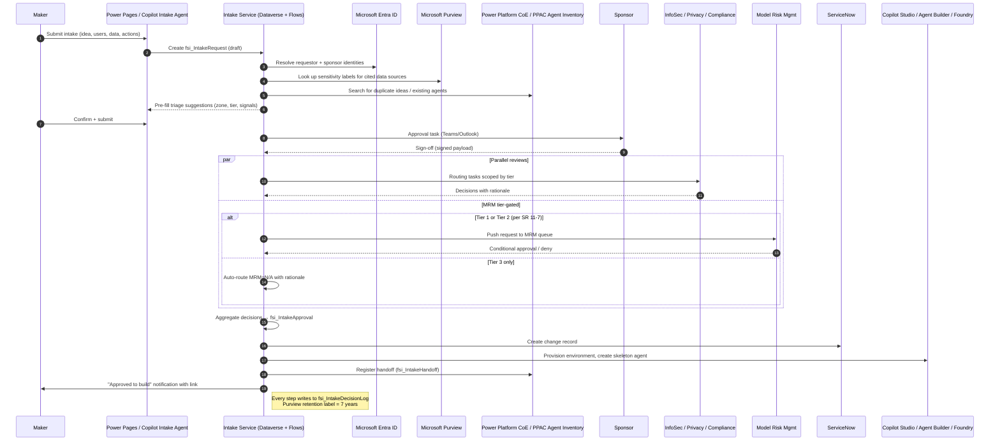

# US FSI AI Agent Intake — Build, Adopt, or Extend Decision Brief

<!-- Copilot-Researcher-Visualization -->
```html
<style>
    :root {
      --accent: #464FEB;
      --max-print-width: 540px;
      --text-title: #242424;
      --text-sub: #424242;
      --font: "Segoe Sans", "Segoe UI", "Segoe UI Web (West European)", -apple-system, "system-ui", Roboto, "Helvetica Neue", sans-serif;
      --overflow-wrap: break-word;
      --icon-background: #F5F5F5;
      --icon-size: 24px;
      --icon-font-size: 20px;
      --number-icon-size: 16px;
      --number-icon-font-size: 12px;
      --number-icon-color: #ffffff;
      --divider-color: #f0f0f0;
      --timeline-ln: linear-gradient(to right, transparent 0%, #e0e0e0 15%, #e0e0e0 85%, transparent 100%) no-repeat 6px 12px / 1px calc(100% - 48px);
      --timeline-date-color:#616161;
      --divider-padding: 4px;
      --row-gap: 32px;
      --max-width: 1100px;
      --side-pad: 20px;
      --line-thickness: 1px;
      --text-gap: 10px;
      --dot-size: 12px;
      --dot-border: 0;
      --dot-color: #000000;
      --dot-bg: #ffffff;
      --spine-color: #e0e0e0;
      --connector-color: #e0e0e0;
      --spine-gap: 60px;
      --h4-gap: 25px;
      --card-pad: 12px;
      --date-line: 1rem;
      --date-gap: 6px;
      --h4-line: 24px;
      --background-color: #f5f5f5;
      --border: 1px solid #E0E0E0;
      --border-radius: 16px;
      --tldr-container-title: #707070;
    }
    @media (prefers-color-scheme: dark) {
      :root {
        --accent: #7385FF;
        --timeline-ln: linear-gradient(to right, transparent 0%,#525252 15%, #525252 85%, transparent 100%) no-repeat 6px 12px / 1px calc(100% - 48px);
        --timeline-date-color:#707070;
        --bg-hover: #2a2a2a;
        --text-title: #ffffff;
        --text-sub: #d6d6d6;
        --shadow: 0 2px 10px rgba(0, 0, 0, 0.3);
        --hover-shadow: 0 4px 14px rgba(0, 0, 0, 0.5);
        --icon-background: #3d3d3d;
        --divider-color: #3d3d3d;
        --dot-color: #ffffff;
        --dot-bg: #292929;
        --spine-color: #525252;
        --connector-color: #525252;
        --background-color: #141414;
        --border: 1px solid #E0E0E0;
        --tldr-container-title: #999999;
      }
    }
    @media (prefers-contrast: more),
    (forced-colors: active) {
      :root {
        --accent: ActiveText;
        --timeline-ln: Canvas;
        --bg-hover: Canvas;
        --text-title: CanvasText;
        --text-sub: CanvasText;
        --shadow: 0 2px 10px Canvas;
        --hover-shadow: 0 4px 14px Canvas;
      }
    }    .tldr-container {
      display: flex;
      flex-direction:column;
      font-family: var(--font);
      gap: 12px;
      padding: clamp(12px, 4vw, 20px) 0;
      border-radius: var(--border-radius);
      align-items: stretch;
      box-sizing: border-box;
      width: calc(100vw - 17px);
      width: 100%;
      max-width: var(--max-width);
      margin-inline: auto;
      overflow-wrap: anywhere;
      word-break: break-word;
      overflow-x: auto;
    }
    .tldr-container h2 {
      color: var(--tldr-container-title);
      font-weight: 600;
      font-style: normal;
      font-size: clamp(18px, 3vw, 20px);
      line-height: 28px;
      border-bottom: var(--border);
      margin: 0;
    }
    .tldr-card {
      display: flex;
      flex-flow: row wrap;
      align-items: flex-start;
      gap: 4px;
      border-radius: 24px;
      min-width: 0; 
    }
    .tldr-card h3 {
      flex: 1 1 auto;
      min-width: 0;
      font-size: 16px;
      font-weight: 600;
      line-height: 22px;
      margin: 0;
      font-style: normal;
      color: var(--text-title);
      overflow-wrap: anywhere;
      word-break: break-word;

    }
    .tldr-card p {
      font-size: 16px;
      font-weight: 400;
      color: var(--text-sub);
      line-height: 20px;
      margin: 0;
      overflow-wrap: var(--overflow-wrap);
      flex: 0 0 100%;
      width: 100%;
      gap: 10px;
      padding: 0;
      word-break: break-word;
      hyphens: auto;
      min-width: 0;

    }
    .tldr-card p b,
    .tldr-card p strong {
      font-weight: normal;
    }
    
    @media (max-width: 480px) {
      .tldr-card {
        gap: 8px;
      }
    }    

</style>
<div class="tldr-container"><h2>Executive summary</h2>
<div class="tldr-card"><h3>Recommended option</h3><p><strong>Extend the Power Platform CoE Starter Kit's Innovation Backlog with an FSI overlay solution on Dataverse</strong>, branded internally as the "Agent Intake" solution.</p></div>
<div class="tldr-card"><h3>Why</h3><p>Best balance of regulatory fit, control coverage, integration cost, and time-to-value. Weighted score 86/100 versus 64 (adopt-as-is), 64 (build net-new), and 56 (vendor).</p></div>
<div class="tldr-card"><h3>What does <em>not</em> exist today</h3><p>No Microsoft-published, ready-to-deploy <em>pre-build</em> agent-intake template that captures sponsor sign-off, SR 11-7 model-risk tier, restricted-data signals, and zone classification as regulated records. Microsoft's published kits target <em>post-creation</em> inventory and compliance.</p></div>
<div class="tldr-card"><h3>Second-best</h3><p>Net-new build on Dataverse — same regulatory fit, but ~2× cost and ~3× time-to-value with no upside for an org that already runs 35 governance solutions on the same platform.</p></div>
</div>
```

---

## 1. Executive summary

**Question.** For a US financial-services firm that already operates a 35-solution governance suite on Power Platform / Dataverse, should we **build, adopt, or extend** a solution for the *pre-build* "agent intake" stage (idea → approval-to-build), covering Microsoft Copilot Studio agents, Microsoft 365 Copilot Agent Builder agents, declarative agents, custom engine agents, and Microsoft Foundry agents?

**Headline finding.** As of April 2026 there is **no Microsoft-published, ready-to-deploy pre-build intake template** that meets US FSI regulatory expectations end-to-end. Microsoft's strongest current assets — the **Power Platform CoE Starter Kit** Innovation Backlog component[22](https://learn.microsoft.com/en-us/power-platform/guidance/coe/innovationbacklog-components), the **Power CAT Copilot Studio Kit** Compliance Hub[20](https://learn.microsoft.com/en-us/microsoft-copilot-studio/guidance/kit-compliance-hub)[8](https://github.com/microsoft/Power-CAT-Copilot-Studio-Kit), **Microsoft Agent 365** + **Entra Agent ID** preview[12](https://learn.microsoft.com/en-us/entra/id-governance/agent-id-governance-overview), and the **Cloud Adoption Framework for AI Agents**[16](https://learn.microsoft.com/en-us/azure/cloud-adoption-framework/ai-agents/)[15](https://learn.microsoft.com/en-us/azure/cloud-adoption-framework/ai-agents/governance-security-across-organization) — all assume the agent has already been *built* or focus on idea capture for *apps/flows* rather than a regulated agent-build approval. Vendor offerings (AvePoint AgentPulse[4](https://www.avepoint.com/solutions/agentic-ai-governance), Avanade Purview Activation Accelerator, Credo AI, Holistic AI, Fiddler, Monitaur) and competitive platforms (ServiceNow AI Control Tower with explicit AI-Steward approval workflows[3](https://github.com/ServiceNow/ServiceNowDocs/blob/australia/markdown/intelligent-experiences/ai-control-tower/playbook-workflow-of-mcp-server-approval-request.md), Salesforce Agentforce Development Lifecycle[2](https://www.salesforce.com/blog/exploring-the-agentforce-development-lifecycle/), IBM watsonx.governance, AWS Bedrock AgentCore, Google Gemini Enterprise) demonstrate intake patterns and audit artifacts but none drop in cleanly to a Microsoft-stack FSI without integration work.

**Recommendation.** **Option B: Extend** the CoE Starter Kit's Innovation Backlog with an FSI overlay on Dataverse — re-using its idea/voting/measure tables for backwards compatibility while adding new entities for sponsor sign-off, model-risk tier (SR 11-7 Tier 1/2/3), governance zone, restricted-data and cross-border signals, and an immutable decision record for SEC 17a-4 / FINRA 4511 / CFTC 1.31 retention. The overlay should integrate to Microsoft Entra ID (sponsor identity), Microsoft Purview (sensitivity labels & DSPM-for-AI signals), the Power Platform Agent Inventory, ServiceNow (change record), and the firm's existing model-risk system. Total weighted score: **86/100**.

**Out of scope (already owned).** Post-approval registration, build-time controls, runtime monitoring, sharing detection, decommissioning. Where this report touches them, it is only to define the **handoff contract** from intake to those owned solutions.

**Important regulatory note.** OCC Bulletin **2011-12 was rescinded April 17, 2026** and replaced by revised interagency guidance (OCC Bulletin **2026-13** plus matching Federal Reserve and FDIC issuances). **SR 11-7 remains in force at the Federal Reserve** and is the operative reference; the revised interagency guidance preserves the SR 11-7 pillars (independent validation, ongoing monitoring, documentation) but expands scope to AI/ML and decision-support tools[23](https://learn.microsoft.com/en-us/power-platform/guidance/coe/use-innovationbacklog). Treat OCC 2011-12 references in existing internal artifacts as historical.

---

## 2. Methodology and source coverage

### Approach
We surveyed (a) Microsoft primary documentation on Microsoft Learn and aka.ms; (b) Microsoft and OfficeDev GitHub repositories; (c) third-party OSS repos visible to the public; (d) ISV product pages and press releases; (e) US FSI regulatory primary sources (FINRA, SEC, OCC, Federal Reserve); (f) analyst framing (Gartner AI TRiSM Market Guide, Forrester Wave AI Governance Q3 2025); and (g) competitive vendor documentation (ServiceNow, Salesforce, AWS, Google, IBM). Sources older than 18 months (i.e., before October 2024) are flagged inline as **[stale]** where they are still cited.

### Source coverage summary

<!-- Copilot-Researcher-Visualization -->
```html
<style>
    :root {
      --accent: #464FEB;
      --max-print-width: 540px;
      --text-title: #242424;
      --text-sub: #424242;
      --font: "Segoe Sans", "Segoe UI", "Segoe UI Web (West European)", -apple-system, "system-ui", Roboto, "Helvetica Neue", sans-serif;
      --overflow-wrap: break-word;
      --icon-background: #F5F5F5;
      --icon-size: 24px;
      --icon-font-size: 20px;
      --number-icon-size: 16px;
      --number-icon-font-size: 12px;
      --number-icon-color: #ffffff;
      --divider-color: #f0f0f0;
      --timeline-ln: linear-gradient(to right, transparent 0%, #e0e0e0 15%, #e0e0e0 85%, transparent 100%) no-repeat 6px 12px / 1px calc(100% - 48px);
      --timeline-date-color:#616161;
      --divider-padding: 4px;
      --row-gap: 32px;
      --max-width: 1100px;
      --side-pad: 20px;
      --line-thickness: 1px;
      --text-gap: 10px;
      --dot-size: 12px;
      --dot-border: 0;
      --dot-color: #000000;
      --dot-bg: #ffffff;
      --spine-color: #e0e0e0;
      --connector-color: #e0e0e0;
      --spine-gap: 60px;
      --h4-gap: 25px;
      --card-pad: 12px;
      --date-line: 1rem;
      --date-gap: 6px;
      --h4-line: 24px;
      --background-color: #f5f5f5;
      --border: 1px solid #E0E0E0;
      --border-radius: 16px;
      --tldr-container-title: #707070;
    }
    @media (prefers-color-scheme: dark) {
      :root {
        --accent: #7385FF;
        --timeline-ln: linear-gradient(to right, transparent 0%,#525252 15%, #525252 85%, transparent 100%) no-repeat 6px 12px / 1px calc(100% - 48px);
        --timeline-date-color:#707070;
        --bg-hover: #2a2a2a;
        --text-title: #ffffff;
        --text-sub: #d6d6d6;
        --shadow: 0 2px 10px rgba(0, 0, 0, 0.3);
        --hover-shadow: 0 4px 14px rgba(0, 0, 0, 0.5);
        --icon-background: #3d3d3d;
        --divider-color: #3d3d3d;
        --dot-color: #ffffff;
        --dot-bg: #292929;
        --spine-color: #525252;
        --connector-color: #525252;
        --background-color: #141414;
        --border: 1px solid #E0E0E0;
        --tldr-container-title: #999999;
      }
    }
    @media (prefers-contrast: more),
    (forced-colors: active) {
      :root {
        --accent: ActiveText;
        --timeline-ln: Canvas;
        --bg-hover: Canvas;
        --text-title: CanvasText;
        --text-sub: CanvasText;
        --shadow: 0 2px 10px Canvas;
        --hover-shadow: 0 4px 14px Canvas;
      }
    }    .metrics-container {
      display: grid;
      grid-template-columns: repeat(2, minmax(210px, 1fr));
      font-family: var(--font);
      padding: 12px 24px 24px 24px;
      gap: 12px;
      align-items: stretch;
      justify-content: center;
      box-sizing: border-box;
      width: calc(100vw - 17px);
    }
    .metric-card {
      padding: 20px 12px;
      text-align: center;
      display: flex;
      flex-direction: column;
      gap: 4px;
      background-color: var(--background-color);
      border-radius: var(--border-radius);
    }
    .metric-card h4 {
      margin: 0px;
      font-size: 14px;
      color: var(--text-sub);
      font-weight: 600;
      text-align: center;
      font-style: normal;
      line-height: 20px;
      text-overflow: ellipsis;
      order: 2;
    }
    .metric-card-value {
      margin-bottom: 8px;
      color: var(--accent);
      font-size: 24px;
      font-weight: 600;
      font-style: normal;
      text-align: center;
      line-height: 32px;
      text-overflow: ellipsis;
      order: 1;
    }
    .metric-card p {
      font-size: 12px;
      font-weight: 400;
      font-style: normal;
      color: var(--text-sub);
      line-height: 16px;
      margin: 0;
      overflow-wrap: var(--overflow-wrap);
     order: 3;
    }
    .metrics-container:has(> :nth-child(3)):not(:has(> :nth-child(4))) {
        grid-template-columns: repeat(3, minmax(150px, 1fr));
    }
    .metrics-container:has(> :nth-child(4)) > .metric-card {
        display:grid;
        grid-template-columns: 150px 1fr;
        column-gap:40px;
        row-gap:8px;
        padding:20px;
        border-radius: 0;
    }    
    .metrics-container:has(>:nth-child(4)) >.metric-card:not(:last-child) {
        border-bottom: var(--border);
    }
    .metrics-container:has(> :nth-child(4)) > .metric-card .metric-card-value {
        grid-column: 1;
        grid-row: 1 / span 2;
        align-self: center;
        text-align: center;
        margin:0;
    }
    .metrics-container:has(> :nth-child(4)) > .metric-card h4,
    .metrics-container:has(> :nth-child(4)) > .metric-card p {
        text-align:left; 
    }
    .metrics-container:has(> :nth-child(4)),
    .metrics-container:has(> :first-child:last-child) {
        grid-template-columns: 1fr;
        gap: 0px;
        background-color: var(--background-color);
        border-radius: var(--border-radius);
        padding: 0 24px;
    }
    @media (max-width:600px) {
        .metrics-container,
        .metrics-container:has(> :nth-child(3)):not(:has(> :nth-child(4))) {
            grid-template-columns:1fr;
        }
        .metric-card,
        .metric-card:last-child:nth-child(odd),
        .metrics-container:has(> :nth-child(4)) > .metric-card,
        .metrics-container:has(> :nth-child(4)) .metric-card:last-child:nth-child(odd) {
            display: flex;
            flex-direction: column;
            grid-column: span 1;
        }
        .metrics-container:has(> :nth-child(4)) > .metric-card h4,
        .metrics-container:has(> :nth-child(4)) > .metric-card p {
            text-align:center;
        }
    }
</style>
<div class="metrics-container">
 <div class="metric-card"><h4>Microsoft Learn / Docs primary pages reviewed</h4><div class="metric-card-value">19</div><p>Across CoE, Copilot Studio, M365 Copilot, Foundry, Entra, CAF.</p></div>
 <div class="metric-card"><h4>Microsoft GitHub repos inspected</h4><div class="metric-card-value">7</div><p>coe-starter-kit, Power-CAT-Copilot-Studio-Kit, agent-governance-toolkit, etc.</p></div>
 <div class="metric-card"><h4>ISV / vendor product pages</h4><div class="metric-card-value">9</div><p>AvePoint, Avanade, Rencore, Credo AI, Holistic AI, Fiddler, Monitaur, IBM, Salesforce.</p></div>
 <div class="metric-card"><h4>Competitive platforms compared</h4><div class="metric-card-value">5</div><p>ServiceNow, Salesforce, AWS Bedrock, Google Agentspace, IBM watsonx.</p></div>
 <div class="metric-card"><h4>FSI regulatory primary sources</h4><div class="metric-card-value">8</div><p>FINRA 3110, 4511, 24-09, 25-07; SEC 17a-4; SR 11-7; OCC 2026-13; CFTC 1.31.</p></div>
 <div class="metric-card"><h4>Sources flagged as stale (>18 mo)</h4><div class="metric-card-value">3</div><p>Innovation Backlog Learn page (2022), CoE InnovationBacklog repo folder (3 yrs), CAF AI Agent Adoption (Dec 2025 — current).</p></div>
</div>
```

### What we deliberately did *not* assume
- Any product Microsoft has only **announced or shown at Ignite/Build** is flagged "preview" or "announced" (e.g., Microsoft Agent 365 reached enrollment in Frontier in Nov 2025; Entra Agent ID Governance is still preview as of 02/19/2026)[12](https://learn.microsoft.com/en-us/entra/id-governance/agent-id-governance-overview).
- We do **not** invent product names. Where the competitive intake UX is undocumented in primary sources, we say so.
- We avoid the Microsoft-prohibited compliance overclaims ("ensures compliance" / "guarantees"). We use "supports compliance with", "helps meet", or "required for".

---

## 3. Canonical intake stage model (proposal)

We propose a **seven-stage intake model**, deliberately ending at "approval-to-build" so that the user's existing registry/lifecycle solution receives a clean handoff. Every stage emits an **immutable decision record** to a Dataverse audit table with a SOX-aligned retention policy of 7 years (SEC 17a-4(b)(4) records of original entry require 6 years; FINRA 4511(b) defaults to ≥6 years for any record without a specified retention period; we standardize on 7 to absorb worst case).


*Figure 1: Proposed seven-stage canonical intake model for FSI AI agent requests, with retention/audit and telemetry bands wrapping every stage.*

### Stage-by-stage description

<!-- Copilot-Researcher-Visualization -->
```html
<style>
    :root {
      --accent: #464FEB;
      --max-print-width: 540px;
      --text-title: #242424;
      --text-sub: #424242;
      --font: "Segoe Sans", "Segoe UI", "Segoe UI Web (West European)", -apple-system, "system-ui", Roboto, "Helvetica Neue", sans-serif;
      --overflow-wrap: break-word;
      --icon-background: #F5F5F5;
      --icon-size: 24px;
      --icon-font-size: 20px;
      --number-icon-size: 16px;
      --number-icon-font-size: 12px;
      --number-icon-color: #ffffff;
      --divider-color: #f0f0f0;
      --timeline-ln: linear-gradient(to right, transparent 0%, #e0e0e0 15%, #e0e0e0 85%, transparent 100%) no-repeat 6px 12px / 1px calc(100% - 48px);
      --timeline-date-color:#616161;
      --divider-padding: 4px;
      --row-gap: 32px;
      --max-width: 1100px;
      --side-pad: 20px;
      --line-thickness: 1px;
      --text-gap: 10px;
      --dot-size: 12px;
      --dot-border: 0;
      --dot-color: #000000;
      --dot-bg: #ffffff;
      --spine-color: #e0e0e0;
      --connector-color: #e0e0e0;
      --spine-gap: 60px;
      --h4-gap: 25px;
      --card-pad: 12px;
      --date-line: 1rem;
      --date-gap: 6px;
      --h4-line: 24px;
      --background-color: #f5f5f5;
      --border: 1px solid #E0E0E0;
      --border-radius: 16px;
      --tldr-container-title: #707070;
    }
    @media (prefers-color-scheme: dark) {
      :root {
        --accent: #7385FF;
        --timeline-ln: linear-gradient(to right, transparent 0%,#525252 15%, #525252 85%, transparent 100%) no-repeat 6px 12px / 1px calc(100% - 48px);
        --timeline-date-color:#707070;
        --bg-hover: #2a2a2a;
        --text-title: #ffffff;
        --text-sub: #d6d6d6;
        --shadow: 0 2px 10px rgba(0, 0, 0, 0.3);
        --hover-shadow: 0 4px 14px rgba(0, 0, 0, 0.5);
        --icon-background: #3d3d3d;
        --divider-color: #3d3d3d;
        --dot-color: #ffffff;
        --dot-bg: #292929;
        --spine-color: #525252;
        --connector-color: #525252;
        --background-color: #141414;
        --border: 1px solid #E0E0E0;
        --tldr-container-title: #999999;
      }
    }
    @media (prefers-contrast: more),
    (forced-colors: active) {
      :root {
        --accent: ActiveText;
        --timeline-ln: Canvas;
        --bg-hover: Canvas;
        --text-title: CanvasText;
        --text-sub: CanvasText;
        --shadow: 0 2px 10px Canvas;
        --hover-shadow: 0 4px 14px Canvas;
      }
    }    .flow-chart-container {
      display: flex;
      flex-direction: column;
      gap: 16px;
      position: relative;
      margin: 0 auto;
      font-family: var(--font);
      align-items: stretch;
      box-sizing: border-box;
      width: calc(100vw - 17px);
    }
    .step {
      text-align: center;
      display:flex;
      flex-direction:column;
      position: relative;
      padding: 12px 24px 20px;
      background-color: var(--background-color);
      border-radius: var(--border-radius);
      margin-bottom:16px;
      margin-top:16px;
    }
    .step-content {
      margin: 0;
      color: var(--text-sub);
      padding: 0;
      font-size: 14px;
      font-weight: 400;
      line-height: 20px;
    }
    .step-title {
      margin: 0 0 8px;
      font-size: 14px;
      line-height:20px;
      font-weight: 600;
      color: var(--text-title);
      padding: 12px 0 4px 0;
      align-self: stretch;
    }
    .step:not(:last-child)::after {
      content: "⏐";
      display:block;
      position: absolute;
      bottom: -36px;
      left: 50%;
      transform: translateX(-50%);
      font-size: 20px;
      color: var(--spine-color);
      padding:0;
      z-index: 1;
    }
    .step:not(:last-child)::before {
      content: "";
      position: absolute;
      bottom: -12px;
      left: 0;
      width: 100%;
      z-index: 0;
    }
</style>
<div class="flow-chart-container">
<div class="step"><h5 class="step-title">Stage 1 — Discover & educate</h5><p class="step-content">Maker learns agents are possible and that they must be requested through this intake. Surfaces: Power Pages portal, Teams app, M365 Copilot intake-agent.</p></div>
<div class="step"><h5 class="step-title">Stage 2 — Capture idea & business case</h5><p class="step-content">Structured form: business problem, intended users, expected actions, candidate data sources, success metric, agent type (Copilot Studio / Agent Builder / declarative / custom engine / Foundry).</p></div>
<div class="step"><h5 class="step-title">Stage 3 — Auto-classify & triage</h5><p class="step-content">AI Builder / Copilot rules pre-fill candidate model-risk tier and governance zone, detect duplicates against existing intake & Agent Inventory, and flag restricted-data / cross-border / conflict-of-interest signals.</p></div>
<div class="step"><h5 class="step-title">Stage 4 — Risk-tier & zone</h5><p class="step-content">Human-in-the-loop confirms SR 11-7 Tier 1/2/3 and governance Zone 1/2/3 (Citizen / Partnered / Professional, per Microsoft's published zoned model).</p></div>
<div class="step"><h5 class="step-title">Stage 5 — Multi-disciplinary review</h5><p class="step-content">Routed in parallel to Sponsor / Relationship Manager → Business Owner → Information Security → Privacy → Compliance → Model Risk Management. Higher tiers add deeper reviewers and SLAs.</p></div>
<div class="step"><h5 class="step-title">Stage 6 — Decision (approve / reject / defer)</h5><p class="step-content">Approval committee or delegated authority records decision with rationale. Decision record becomes a regulated artifact under SEC 17a-4 / FINRA 4511 / CFTC 1.31.</p></div>
<div class="step"><h5 class="step-title">Stage 7 — Handoff to build & registry</h5><p class="step-content">Approved request hands a typed payload to the firm's existing agent registry/lifecycle solution + the appropriate build platform (Copilot Studio environment, Agent Builder, or Foundry project).</p></div>
</div>
```
[19](https://learn.microsoft.com/en-us/microsoft-copilot-studio/guidance/sec-gov-phase2)  

### Cross-cutting bands

- **Records retention & audit log.** Every state change (form submission, classification, reviewer comment, approval, rejection) creates an append-only Dataverse row in an "Intake Decision Log" table with a Microsoft Purview retention label set to ≥7 years and immutability enforced by the label policy. This pattern supports compliance with SEC 17a-4(f)(2)(i) electronic recordkeeping requirements (post-2022 amendments removed the strict WORM-only mandate but retained "non-rewriteable, non-erasable" or audit-trail alternative options).
- **Feedback, telemetry, duplicate detection.** Every intake feeds usage signals (time-to-decision, rejection reasons, duplicate hit rate, sponsor responsiveness) into a Power BI workspace already present in the firm's CoE.

### How the model handles the FSI "must-haves"

| FSI requirement | Captured at stage | Stored in entity (proposed) |
|---|---|---|
| Sponsor / Relationship Manager sign-off evidence | Stage 5 (sponsor approval action) | `IntakeApproval` (signature, timestamp, Entra object ID) |
| Model risk tier (SR 11-7 Tier 1/2/3) | Stage 4 (human-in-the-loop) | `IntakeRiskTier` (proposed tier, confirmed tier, rationale) |
| Zone classification (1/2/3) | Stage 4 | `IntakeRequest.GovernanceZone` |
| Restricted-data flags (NPI, MNPI, PCI, PHI) | Stages 2 & 3 | `IntakeDataSignal` (flag, source, sensitivity label) |
| Cross-border data signals | Stages 2 & 3 | `IntakeDataSignal.CrossBorder` |
| Conflict-of-interest signals | Stages 2 & 5 | `IntakeRiskSignal.COI` |
| Records retention of decision | Stage 6 (and band) | `IntakeDecisionLog` with Purview retention label |

---

## 4. Comparison matrix (Deliverable 1)

Each row is rated 1-5 on **FSI fit** specifically for the *pre-build intake* stage (this is **not** an overall product rating). "Last update" is the most recent verified release/commit/announcement as of April 2026.

### 4.1 Microsoft-published candidates

| # | Candidate | Vendor / repo | License & cost | Agent types covered | FSI fit (1-5) | Regulated-records support | Risk-tiering support | PP / Dataverse integration | Last update | Maturity | Gaps for FSI intake |
|---|---|---|---|---|---|---|---|---|---|---|---|
| M1 | **CoE Starter Kit — Innovation Backlog** | github.com/microsoft/coe-starter-kit (`CenterofExcellenceInnovationBacklog`)[9](https://github.com/microsoft/coe-starter-kit) | MIT, included with CoE | Apps & flows (originally); not agent-aware | 2 | None native — needs Purview retention overlay | None | Native (Dataverse, Power Apps canvas)[22](https://learn.microsoft.com/en-us/power-platform/guidance/coe/innovationbacklog-components) | Folder last commit ~3 yrs ago[9](https://github.com/microsoft/coe-starter-kit); doc page last updated 02/2022[23](https://learn.microsoft.com/en-us/power-platform/guidance/coe/use-innovationbacklog) | GA but **stale** | No agent fields, no risk tier, no sponsor entity, no model-risk routing, no decision record concept |
| M2 | **CoE Starter Kit — App Catalog** (core components) | Same repo, `CenterofExcellenceCoreComponents`[9](https://github.com/microsoft/coe-starter-kit) | MIT | Apps; surfaces approved/certified solutions[21](https://learn.microsoft.com/en-us/power-platform/guidance/coe/core-components) | 2 | None native | None | Native | July 2025 release[21](https://learn.microsoft.com/en-us/power-platform/guidance/coe/core-components) | GA | Catalog of *built* assets, not intake of *to-be-built* requests |
| M3 | **CoE Starter Kit — Environment Request Management** | Same repo, core components | MIT | Environment requests (not agents) | 2 | Limited (request log) | None | Native | July 2025 | GA | Solves environment requests, not agent intake; useful pattern to replicate |
| M4 | **CoE Starter Kit — Maker Onboarding (Nurture Components)** | Same repo, `CenterofExcellenceNurtureComponents` | MIT | Maker onboarding & adoption | 1 | None | None | Native | July 2025[9](https://github.com/microsoft/coe-starter-kit) | GA | Adoption tooling, not approval workflow |
| M5 | **Power CAT Copilot Studio Kit — Compliance Hub** | github.com/microsoft/Power-CAT-Copilot-Studio-Kit[8](https://github.com/microsoft/Power-CAT-Copilot-Studio-Kit) | MIT[8](https://github.com/microsoft/Power-CAT-Copilot-Studio-Kit) | Copilot Studio agents only | 3 (post-creation, not intake) | Compliance cases & SLA tracking[20](https://learn.microsoft.com/en-us/microsoft-copilot-studio/guidance/kit-compliance-hub) | Risk threshold config but not SR 11-7 tiering | Native | March 2026 release[7](https://github.com/microsoft/Power-CAT-Copilot-Studio-Kit/releases) | GA / Preview | Explicitly **post-creation** — "Compliance is enforced after creation"[20](https://learn.microsoft.com/en-us/microsoft-copilot-studio/guidance/kit-compliance-hub); not pre-build intake |
| M6 | **Power CAT Copilot Studio Kit — Agent Inventory** | Same repo[8](https://github.com/microsoft/Power-CAT-Copilot-Studio-Kit) | MIT | Copilot Studio + PPAC agents | 2 (registry, not intake) | Inventory list | None | Native | March 2026 | GA | Inventory of existing agents |
| M7 | **Power CAT Copilot Studio Kit — Agent Insights Hub** | Same repo (Preview)[7](https://github.com/microsoft/Power-CAT-Copilot-Studio-Kit/releases) | MIT | Copilot Studio agents | 2 | Telemetry only | None | Native | March 2026 | **Preview** | Analytics, not intake |
| M8 | **Microsoft Copilot Control System** (Microsoft 365 admin center) | Microsoft Learn[17](https://learn.microsoft.com/en-us/microsoft-365/copilot/copilot-control-system/security-governance) | Bundled with M365 / E5 | M365 Copilot, prebuilt agents, Copilot Studio agents published to M365 | 3 (post-publication controls) | Purview eDiscovery, Audit, DSPM-for-AI[17](https://learn.microsoft.com/en-us/microsoft-365/copilot/copilot-control-system/security-governance) | None for SR 11-7; relies on tenant-level switches | None directly to Dataverse intake | M365 Copilot Agents settings GA; Agent Registry GA | GA | Approve/block agents, not capture-business-case intake |
| M9 | **Microsoft Agent 365** + **Entra Agent ID Governance** | Microsoft Learn / Entra[12](https://learn.microsoft.com/en-us/entra/id-governance/agent-id-governance-overview) | Frontier program / E7 paid tier[12](https://learn.microsoft.com/en-us/entra/id-governance/agent-id-governance-overview) | All agent types via Entra Agent ID | 3 | Sponsor concept native[12](https://learn.microsoft.com/en-us/entra/id-governance/agent-id-governance-overview); Lifecycle Workflows | None for SR 11-7 explicitly; sponsor-driven access | None directly | Preview, last updated 02/19/2026[12](https://learn.microsoft.com/en-us/entra/id-governance/agent-id-governance-overview) | **Preview** | Identity & access lifecycle, not business-case intake |
| M10 | **Cloud Adoption Framework for AI Agents** | Microsoft Learn[16](https://learn.microsoft.com/en-us/azure/cloud-adoption-framework/ai-agents/)[15](https://learn.microsoft.com/en-us/azure/cloud-adoption-framework/ai-agents/governance-security-across-organization) | Free guidance | All agent types | 3 (guidance only) | "Maintain an agent registry" guidance[15](https://learn.microsoft.com/en-us/azure/cloud-adoption-framework/ai-agents/governance-security-across-organization) | "Tier agents by criticality" guidance[15](https://learn.microsoft.com/en-us/azure/cloud-adoption-framework/ai-agents/governance-security-across-organization); no template | N/A (it's docs) | Last updated 12/03/2025[16](https://learn.microsoft.com/en-us/azure/cloud-adoption-framework/ai-agents/) | Guidance | No reference implementation, no Dataverse solution |
| M11 | **Copilot Studio Agentic AI Maturity Model** (Pillar 3) | Microsoft Learn[18](https://learn.microsoft.com/en-us/microsoft-copilot-studio/guidance/maturity-model-security-governance) | Free guidance | All Copilot Studio agents | 4 (excellent framework) | Audit guidance | "Zoned governance model adopted using environments (safe, supported, IT managed)"[18](https://learn.microsoft.com/en-us/microsoft-copilot-studio/guidance/maturity-model-security-governance) | N/A (it's docs) | Current | Guidance | No build artifact |
| M12 | **Microsoft 365 Agents Toolkit** | github.com/OfficeDev/microsoft-365-agents-toolkit | MIT | Declarative & custom engine agents | 1 (dev tool) | None | None | None | Active | GA | Build-time tooling, not intake |
| M13 | **`microsoft/agent-governance-toolkit`** | github.com/microsoft/agent-governance-toolkit[6](https://github.com/microsoft/agent-governance-toolkit) | MIT, **Public Preview**[6](https://github.com/microsoft/agent-governance-toolkit) | Cross-stack runtime governance | 1 (runtime, not intake) | OWASP Agentic Top 10 compliance tests[6](https://github.com/microsoft/agent-governance-toolkit) | None | None | Active (1.3k stars)[6](https://github.com/microsoft/agent-governance-toolkit) | Public Preview | Runtime policy enforcement; explicitly *not* intake |
| M14 | **`microsoft/Microsoft-AI-Decision-Framework`** | GitHub | MIT | Selecting M365 Copilot vs Copilot Studio vs Foundry vs Agent Service | 2 | None | None | None | Active (51 stars) | Active | Helpful upstream of intake; could be embedded in stage 2 |
| M15 | **Data Agent Governance & Security Accelerator** | github.com/microsoft/Data-and-Agent-Governance-and-Security-Accelerator | MIT | Microsoft Foundry resources | 2 | DLP, sensitivity labels, audit logging | None | None | Active | GA | Automation for Foundry, not maker intake |
| M16 | **Microsoft Adoption "Agent Success Kit"** | adoption.microsoft.com[10](https://adoption.microsoft.com/en-us/ai-agents/success-kit/) | Free | All agent types | 2 | Email templates, IT controls guide[10](https://adoption.microsoft.com/en-us/ai-agents/success-kit/) | None | None | Current | GA | Adoption resources, no intake template |

### 4.2 Vendor and partner offerings

| # | Vendor / product | License & cost | Agent types covered | FSI fit (1-5) | Regulated-records support | Risk-tiering support | PP / Dataverse integration | Last update | Maturity | Gaps for FSI intake |
|---|---|---|---|---|---|---|---|---|---|---|
| V1 | **AvePoint AgentPulse Command Center** | Commercial subscription | Microsoft Copilot Studio, SharePoint, M365 Foundry, Vertex AI[4](https://www.avepoint.com/solutions/agentic-ai-governance) | 3 (operational visibility, lifecycle re-cert) | "Custom metadata per AI agent…re-certification"[4](https://www.avepoint.com/solutions/agentic-ai-governance) | Risk definitions configurable[4](https://www.avepoint.com/solutions/agentic-ai-governance) | Power Platform DLP integration[4](https://www.avepoint.com/solutions/agentic-ai-governance) | GA Mar 9, 2026 | GA | Discovery & ongoing governance, not pre-build intake; closes shadow-AI gap but assumes the agent already exists |
| V2 | **Avanade Purview Activation Accelerator** | Project-based services | Data governance underpinning agents | 2 | Purview-driven retention | None | Indirect via Purview | Listed on Microsoft Marketplace | GA | Purview kickstart, not intake |
| V3 | **Avanade AI Control Tower** | Project-based services | Multi-agent oversight | 2 | None publicly documented | None publicly documented | Possible (consulting led) | Catalog artifact | GA / consulting offering | Limited public detail; would require RFP to assess |
| V4 | **Rencore Power Platform Governance** | Commercial subscription | Power Apps, Power Automate, Power Pages, Copilot Studio | 2 (post-build inventory + DLP) | Audit logs | None | Native via Rencore connector | June 2025 (added AI/no-code support) | GA | Inventory & policy enforcement, not pre-build intake |
| V5 | **Credo AI Enterprise Governance** | Commercial subscription, on Microsoft Marketplace | Cross-stack AI systems & agents | 4 (strong AI-governance lineage) | "Centralized inventory, risk management" | Risk policy management | Indirect (API) | Forrester Wave Q3 2025 Leader; Agent Registry launched ~April 2026 | GA | External system; integration to Dataverse needed; UX is generic |
| V6 | **Holistic AI** | Commercial subscription | Cross-stack | 3 | "Identify, protect, enforce" | Yes (general AI risk) | Indirect (API) | Forrester Wave Q3 2025 ranked #4 | GA | Same — external; needs integration |
| V7 | **Fiddler AI Control Plane for Agents** | Commercial subscription | Cross-stack | 3 (observability strong) | Yes | Yes (general AI risk) | Indirect | Active | GA | Observability bias; intake light |
| V8 | **Monitaur** | Commercial subscription | Cross-stack, insurance-focused | 3 (insurance lens) | Guided risk assessment, evidence mapping | Yes | Indirect | Active | GA | Insurance-skewed; FSI banking/securities customization needed |
| V9 | **CoreView / AvePoint Confide / Hitachi Solutions / Quisitive** | Various commercial / services | Power Platform & M365 governance | 1-2 | Variable | None specific to AI intake | Variable | — | GA | None publish a *pre-build agent intake* product specifically |

### 4.3 Competitive platform intake patterns (for transferable design ideas, not adoption)

| # | Platform | Intake artifact | Approval routing | Audit artifacts | Transferability to Microsoft-stack FSI |
|---|---|---|---|---|---|
| C1 | **ServiceNow AI Control Tower / AI Agent Studio** | "Approvals" workspace per AI asset; AI Steward role required to approve[3](https://github.com/ServiceNow/ServiceNowDocs/blob/australia/markdown/intelligent-experiences/ai-control-tower/playbook-workflow-of-mcp-server-approval-request.md) | Three-phase playbook: **Assess → Build & Test → Deploy**, with Architecture review, Risk Assessment, and Stakeholder review explicitly enumerated in the Assess phase[3](https://github.com/ServiceNow/ServiceNowDocs/blob/australia/markdown/intelligent-experiences/ai-control-tower/playbook-workflow-of-mcp-server-approval-request.md) | MCP server record + state log; gateway pause control after approval[3](https://github.com/ServiceNow/ServiceNowDocs/blob/australia/markdown/intelligent-experiences/ai-control-tower/playbook-workflow-of-mcp-server-approval-request.md) | **High** — phase model maps cleanly to our stages 4-7. If the firm uses ServiceNow as system-of-record, the Microsoft Power Platform intake should write a change ticket back to ServiceNow at stage 6. |
| C2 | **Salesforce Agentforce — Agent Development Lifecycle** | "Ideation and design" phase: define purpose, persona, tools, decision logic, blueprint[2](https://www.salesforce.com/blog/exploring-the-agentforce-development-lifecycle/) | Five-phase ADLC: ideation/design → development → testing/validation → deployment/release → monitoring/tuning[2](https://www.salesforce.com/blog/exploring-the-agentforce-development-lifecycle/) | Agentforce Builder versioning + analytics[2](https://www.salesforce.com/blog/exploring-the-agentforce-development-lifecycle/) | **Medium** — confirms a structured intake/design step is industry standard; the phase split is informative but not directly portable to a Power Platform implementation. |
| C3 | **AWS Bedrock AgentCore** | Newer (re:Invent 2025); registry + governance features but no public pre-build intake template | Policy & evaluations framework | Audit logs + policy violation logs | **Low-Medium** — primarily runtime control plane; little intake guidance |
| C4 | **Google Gemini Enterprise (formerly Agentspace)** | IAM roles & permissions for admins / users; rebranded Oct 9, 2025 | IAM-driven only; no published intake workflow template | Cloud Audit Logs | **Low** — IAM provisioning, not business-case intake |
| C5 | **IBM watsonx.governance** | Streamlined inventory of tools for agents; agentic AI lifecycle features added June 2025 | Approval gating in lifecycle; in-the-loop and offline evals | Tool inventory + evaluation records | **Medium** — lifecycle and evaluation pattern transfers; product lock-in if adopted directly |

### 4.4 Notable third-party / community OSS

| # | Repo | Stars (Apr 2026) | Last commit | License | Maintainer | Relevance to FSI agent intake |
|---|---|---|---|---|---|---|
| O1 | `tommullens1/copilot-agent-governance` | small | 2025 | not verified | individual | A community governance template; governance only (env strategy, tenant controls)[1](https://www.nasaa.org/wp-content/uploads/2025/07/NASAA-Comment-Letter-re-FINRA-Reg-Notice-25-07_07-14-2025.pdf) — not a pre-build intake form |
| O2 | `microsoft/Power-CAT-Copilot-Studio-Kit` | 363 | last week | MIT | Microsoft CAT | (See M5-M7 above — most relevant Microsoft-published intake-adjacent kit) |
| O3 | `microsoft/agent-governance-toolkit` | 1.3k | yesterday | MIT | Microsoft | Runtime; not intake |
| O4 | `Azure-Samples/foundry-citadel-platform` | active | 2026 | MIT | Microsoft Azure-Samples | "Shared AI registry" for Foundry; not pre-build intake |
| O5 | `microsoft/Microsoft-AI-Decision-Framework` | 51 | active | MIT | Microsoft | Useful as a tool *inside* an intake form (technology selection step) |

> **Important gap**: A keyword search for *"copilot agent intake"* and *"AI agent request workflow"* on GitHub returned no maintained Microsoft-aligned project that captures a regulated FSI intake form (sponsor + tier + restricted-data signals). We **explicitly mark this as a verifiable gap**; the closest is `tommullens1/copilot-agent-governance`, which is governance template guidance rather than an intake solution.

---

## 5. Reference architecture for FSI agent intake (Deliverable 2)


*Figure 2: Reference architecture — maker UX surfaces sit on top of a Dataverse-backed intake service that integrates with Microsoft Entra ID, Microsoft Purview, the Power Platform CoE, the agent build platforms, ServiceNow, and the firm's model-risk system.*

### 5.1 Components

#### Maker UX (choose one as primary; keep email-to-intake as a fallback)

| Surface | Strengths | Weaknesses | FSI fit |
|---|---|---|---|
| **Power Pages portal** | Branded, anonymous-aware, Dataverse-native, mobile-friendly, supports Web API and forms | External-facing infra requires DAST/penetration testing | **Best for FSI** — internal-to-Entra-ID portal pattern; integrates directly with Dataverse forms |
| **Microsoft Teams app (canvas app embedded in Teams)** | Already in user workflow; SSO trivial | Limited file upload UX | Strong; great as a secondary surface |
| **M365 Copilot intake agent (declarative agent over Dataverse)** | Conversational; reads/writes Dataverse via Graph connectors | Requires guardrails to avoid sensitive-data leakage; declarative agents are **GA** but evolving | Strong for "drift the maker through the form by chat"; pair with form-based fallback |
| **Outlook + Power Automate "email-to-intake"** | Lowest friction; some reviewers prefer email | Hard to enforce required fields | Use as failover only |

**Recommended UX combination**: **Power Pages portal as primary** + **declarative M365 Copilot agent as conversational front door** + **Teams app for sponsors** to approve in their working surface.

#### Intake service (Power Platform / Dataverse data plane)

Built as a single managed solution containing:
- Dataverse tables (entity model below)
- Cloud flows (classification, routing, notifications, telemetry)
- Approvals (Power Automate Approvals or custom pattern with cancellable child flows)
- AI Builder model for risk-signal extraction
- Application user(s) for system-to-system writes

#### Integrations

| Integration | Purpose | Microsoft service | Stage(s) involved |
|---|---|---|---|
| **Microsoft Entra ID** | Sponsor identity, group lookups, Conditional Access for portal | Entra ID + Conditional Access[19](https://learn.microsoft.com/en-us/microsoft-copilot-studio/guidance/sec-gov-phase2) | 5 (sponsor sign-off), 6 |
| **Microsoft Purview** | Sensitivity-label lookup; DSPM-for-AI risk signals; retention label on decision records[17](https://learn.microsoft.com/en-us/microsoft-365/copilot/copilot-control-system/security-governance) | Purview Information Protection, DSPM for AI | 3, 6, retention band |
| **Power Platform CoE** | Read existing agents/apps (App Catalog, Innovation Backlog idea overlap), maker telemetry[21](https://learn.microsoft.com/en-us/power-platform/guidance/coe/core-components) | CoE Starter Kit Dataverse | 3, 5, 7 |
| **Power Platform admin center — Agent Inventory** | Cross-check duplicates against existing agents | PPAC Agents Inventory (Preview) | 3, 7 |
| **Microsoft Foundry / Copilot Studio / Agent Builder** | Handoff: provision environment, create agent skeleton with metadata[14](https://learn.microsoft.com/en-us/azure/cloud-adoption-framework/ai-agents/build-secure-process) | Foundry SDK, Copilot Studio APIs | 7 |
| **ServiceNow (if used)** | Open change ticket for tracked deployments; mirror approval status | ServiceNow REST | 6, 7 |
| **Model-risk system** | Push high-tier requests into the firm's MRM workflow for SR 11-7 model validation | Firm-specific (often a custom GRC platform) | 5, 6 |
| **Microsoft Entra Agent ID** | At handoff, mint an Agent identity blueprint in the target environment with sponsor assigned[12](https://learn.microsoft.com/en-us/entra/id-governance/agent-id-governance-overview) | Entra Agent ID Governance (Preview)[12](https://learn.microsoft.com/en-us/entra/id-governance/agent-id-governance-overview) | 7 |

### 5.2 Data model — entities and key fields

#### Core entities (proposed)
- **`fsi_IntakeRequest`** (id, title, business_problem, requestor_entra_oid, sponsor_entra_oid, intended_users_group, agent_type [enum: copilot_studio | agent_builder | declarative | custom_engine | foundry], status [enum: draft | submitted | triaged | tiered | review | approved | rejected | deferred], created_on, modified_on, governance_zone [1|2|3], proposed_model_risk_tier [1|2|3], confirmed_model_risk_tier [1|2|3])
- **`fsi_IntakeDataSource`** (id, request_id, source_system, sensitivity_label_lookup, classification [public | internal | confidential | restricted_NPI | restricted_MNPI | restricted_PCI | restricted_PHI], cross_border_flag, country_of_processing)
- **`fsi_IntakeAction`** (id, request_id, action_name, target_system, target_action_or_api, autonomy_level [advisory | semi_auto | autonomous])
- **`fsi_IntakeRiskSignal`** (id, request_id, signal_type [coi | restricted_data | cross_border | regulated_communication | suitability_advice | trade_decision | credit_decision], severity [low | medium | high], detected_by [auto | human], detected_on)
- **`fsi_IntakeReview`** (id, request_id, reviewer_role [sponsor | business | infosec | privacy | compliance | mrm], reviewer_entra_oid, decision [approve | reject | defer], rationale, decided_on)
- **`fsi_IntakeApproval`** (id, request_id, approval_authority [sponsor | committee | mrm], decision [approve | reject | defer], conditions_text, approved_on, expires_on)
- **`fsi_IntakeDecisionLog`** (id, request_id, event_type, event_payload_json, hash, recorded_on, recorded_by)
- **`fsi_IntakeDuplicateMatch`** (id, request_id, matched_existing_agent_id, match_score, match_reason)
- **`fsi_IntakeHandoff`** (id, request_id, target_environment, target_agent_id [nullable], created_on)

#### Reuse from existing CoE Innovation Backlog
Where backwards compatibility helps, surface the existing `Innovation Backlog Idea`, `Backlog Item PainPointSet`, and `Backlog Item PersonaSet` tables as read-write linked records so the firm doesn't lose voting/idea-pool history[22](https://learn.microsoft.com/en-us/power-platform/guidance/coe/innovationbacklog-components).

### 5.3 Sequence diagram (Mermaid)



### 5.4 Records-retention design pattern

- Use a **dedicated Purview retention label** (`Agent Intake Decision — 7y immutable`) and apply it via auto-labeling rules to every row in `fsi_IntakeDecisionLog`. This pattern supports compliance with SEC 17a-4(f), FINRA 4511, and CFTC 1.31 records preservation expectations.
- Export decision records nightly to an immutable archive (Azure Storage with **immutable blob policy** or third-party WORM-compliant store) so the firm has a defensible second copy independent of Dataverse.
- Apply a sensitivity label of "Confidential — Restricted" by default to intake requests that touch NPI / MNPI / PCI / PHI categories.

---

## 6. Build-vs-Adopt recommendation (Deliverable 3)

### 6.1 Options considered
- **Option A — Adopt CoE Innovation Backlog as-is**: install the existing Innovation Backlog solution and use it for agent ideas without modifications.
- **Option B — Extend CoE Innovation Backlog with FSI overlays** (RECOMMENDED): keep the existing tables for backwards compatibility; add the FSI overlay solution described in §5.
- **Option C — Adopt a vendor product** (AvePoint AgentPulse / Credo AI / Holistic AI / Monitaur).
- **Option D — Build net-new** on Dataverse without touching the CoE.

### 6.2 Weighted decision matrix


*Figure 3: Weighted decision matrix — per-criterion scores (left axis) and overall weighted score 0-100 (right axis). Option B (extend) achieves 86; second-best is a tie at 64 between A and D.*

| Criterion (weight) | A — Adopt as-is | B — Extend with FSI overlay (REC) | C — Vendor | D — Build net-new |
|---|---|---|---|---|
| **Regulatory fit (FSI / SR 11-7 / FINRA 25-07 / 24-09)** (25%) | 1 — no FSI fields, stale | **4** — purpose-built fields + retention label | 3 — generic AI-governance, not FSI-specific | 5 — fully custom |
| **Integration cost** (15%) | 5 — none beyond install | **4** — re-uses Dataverse, Power Automate, Purview, CoE | 2 — REST integration, IdP federation, license | 1 — start-from-zero patterns |
| **Total cost of ownership over 3 years** (15%) | 5 | **4** | 2 — vendor subscription | 1 — large ongoing engineering investment |
| **Time-to-value** (15%) | 5 — days | **4** — 8-12 weeks for MVP | 3 — 12-20 weeks (vendor + integration) | 1 — 6-9 months |
| **Vendor / supply-chain risk** (10%) | 5 | **5** — Microsoft-only | 2 — additional ISV; some vendors ranked outside Forrester Wave Q3 2025 leaders | 5 |
| **Control coverage (intake-specific FSI controls)** (20%) | 1 | **5** — covers sponsor, tier, zone, restricted data, COI, retention | 4 — strong general controls, intake patchwork | 5 |
| **Weighted score (0-100)** | **64** | **86** | **56** | **64** |

### 6.3 Recommendation

**Adopt Option B — Extend CoE Innovation Backlog with FSI overlays.**

**Why:**
1. **Maximum regulatory fit per dollar.** The firm gets purpose-built fields (sponsor, tier, restricted-data signals, decision log) without abandoning the institutional muscle memory of the CoE Innovation Backlog[22](https://learn.microsoft.com/en-us/power-platform/guidance/coe/innovationbacklog-components). The overlay pattern makes it possible to apply a single Purview retention label to a single Dataverse table — a cleaner audit story than spreading the same data across vendor product + Dataverse.
2. **Re-uses 35-solution governance suite.** Because the firm already runs 35 solutions on Power Platform/Dataverse, every additional Dataverse solution incurs near-zero marginal infrastructure cost; integration to Entra ID, Purview, the existing CoE, and the existing registry/lifecycle solution is "the same as last time."
3. **Defends against the post-creation gap.** Microsoft's Compliance Hub explicitly enforces *post-creation* compliance and triggers cases when thresholds are breached[20](https://learn.microsoft.com/en-us/microsoft-copilot-studio/guidance/kit-compliance-hub). The firm needs a *pre-creation* gate, which today does not exist in the Microsoft toolchain. Extending the CoE fills that gap.
4. **Avoids vendor lock-in for a workflow that is mostly metadata.** Intake is fundamentally form + workflow + records. Vendor products excel at runtime observability, model risk monitoring, and governance reporting — capabilities the firm already has post-approval. Paying for a vendor for the intake stage means duplicating capability you already own and inheriting a vendor roadmap that will diverge from your FSI specifics.
5. **Risk-priced TCO.** Build-net-new (D) ties on score but at higher cost and time. Adopt-as-is (A) ties on score but only because of low cost — it has zero FSI control coverage.

**Second-best option: Option D (build net-new).** If reviewers reject any reuse of the existing Innovation Backlog tables (e.g., for legal-hold or schema-cleanliness reasons), the same FSI overlay design in §5 implements as a stand-alone solution. The architecture, data model, and backlog are unchanged; only the table-namespace differs.

**Reject:** Option C (vendor) is rejected as the primary intake solution because no surveyed vendor publishes a pre-build, FSI-specific Dataverse-native intake template. Several vendors are recommended as **complementary** post-approval (AvePoint AgentPulse for shadow-AI discovery[4](https://www.avepoint.com/solutions/agentic-ai-governance), Credo AI / Holistic AI for portfolio-level model risk reporting if the firm chooses to externalize that view).

<!-- Copilot-Researcher-Visualization -->
```html
<style>
    :root {
      --accent: #464FEB;
      --max-print-width: 540px;
      --text-title: #242424;
      --text-sub: #424242;
      --font: "Segoe Sans", "Segoe UI", "Segoe UI Web (West European)", -apple-system, "system-ui", Roboto, "Helvetica Neue", sans-serif;
      --overflow-wrap: break-word;
      --icon-background: #F5F5F5;
      --icon-size: 24px;
      --icon-font-size: 20px;
      --number-icon-size: 16px;
      --number-icon-font-size: 12px;
      --number-icon-color: #ffffff;
      --divider-color: #f0f0f0;
      --timeline-ln: linear-gradient(to right, transparent 0%, #e0e0e0 15%, #e0e0e0 85%, transparent 100%) no-repeat 6px 12px / 1px calc(100% - 48px);
      --timeline-date-color:#616161;
      --divider-padding: 4px;
      --row-gap: 32px;
      --max-width: 1100px;
      --side-pad: 20px;
      --line-thickness: 1px;
      --text-gap: 10px;
      --dot-size: 12px;
      --dot-border: 0;
      --dot-color: #000000;
      --dot-bg: #ffffff;
      --spine-color: #e0e0e0;
      --connector-color: #e0e0e0;
      --spine-gap: 60px;
      --h4-gap: 25px;
      --card-pad: 12px;
      --date-line: 1rem;
      --date-gap: 6px;
      --h4-line: 24px;
      --background-color: #f5f5f5;
      --border: 1px solid #E0E0E0;
      --border-radius: 16px;
      --tldr-container-title: #707070;
    }
    @media (prefers-color-scheme: dark) {
      :root {
        --accent: #7385FF;
        --timeline-ln: linear-gradient(to right, transparent 0%,#525252 15%, #525252 85%, transparent 100%) no-repeat 6px 12px / 1px calc(100% - 48px);
        --timeline-date-color:#707070;
        --bg-hover: #2a2a2a;
        --text-title: #ffffff;
        --text-sub: #d6d6d6;
        --shadow: 0 2px 10px rgba(0, 0, 0, 0.3);
        --hover-shadow: 0 4px 14px rgba(0, 0, 0, 0.5);
        --icon-background: #3d3d3d;
        --divider-color: #3d3d3d;
        --dot-color: #ffffff;
        --dot-bg: #292929;
        --spine-color: #525252;
        --connector-color: #525252;
        --background-color: #141414;
        --border: 1px solid #E0E0E0;
        --tldr-container-title: #999999;
      }
    }
    @media (prefers-contrast: more),
    (forced-colors: active) {
      :root {
        --accent: ActiveText;
        --timeline-ln: Canvas;
        --bg-hover: Canvas;
        --text-title: CanvasText;
        --text-sub: CanvasText;
        --shadow: 0 2px 10px Canvas;
        --hover-shadow: 0 4px 14px Canvas;
      }
    }    .contrastive-comparison-container {
      display: grid;
      grid-template-columns: repeat(2, minmax(240px,1fr));
      gap: 16px;
      padding: 0 16px;
      margin: 0;
      font-family: var(--font);
      align-items: stretch;
      box-sizing: border-box;
      width: calc(100vw - 17px);
    }
    .contrastive-comparison-card {
      display: grid;
      grid-template-columns: 24px minmax(0, 1fr);
      grid-template-rows: minmax(24px, auto) 1fr;
      grid-template-areas:
        "icon title"
        "body body";
      column-gap: 8px;
      row-gap: 8px;
      margin: 0 0 10px;
      padding: 0 20px 16px;
      align-items: start;
      overflow: visible;
      box-sizing: border-box;
      background-color: var(--background-color);
      border-radius: var(--border-radius);
    }
    .contrastive-comparison-card .icon {
      grid-area: icon;
      width: var(--icon-font-size);
      height: var(--icon-font-size);
      font-size: var(--icon-font-size);
      align-items: center;
      justify-content: center;
      align-self: center;
      justify-self: start;
      display: inline-grid;
    }
    .contrastive-comparison-card h4 {
      grid-area: title;
      margin-bottom: 10px;
      font-weight: 600;
      line-height: 20px;
      font-size: 14px;
      align-self: center;
      align-items: center;
      color: var(--text-title);
      padding-top: 8px;
      font-style: normal;
      padding-bottom: 6px;
    }
    .contrastive-comparison-card p,
    .contrastive-comparison-card ul {
      margin: 0;
      padding-left: 4px;
      color: var(--text-sub);
      line-height: 20px;
      grid-area: body;
      min-width: 0;
      font-weight: 400;
      font-size: 14px;
      font-style: normal;
    }
    .contrastive-comparison-card ul {
      grid-area: body;
    }
    .contrastive-comparison-card li {
      display: block;
      position: relative;
      padding-left: 12px;
      margin-bottom: 8px;
    }
    .contrastive-comparison-card li::before {
      content: '';
      position: absolute;
      width: 6px;
      height: 6px;
      margin: 8px 12px 0 0;
      background-color: var(--text-sub);
      border-radius: 50%;
      left: 0;
    }
    @media (max-width:600px) {
        .contrastive-comparison-container {
            grid-template-columns:1fr;
        }
    }
</style>
<div class="contrastive-comparison-container">
 <div class="contrastive-comparison-card"><span class="icon" aria-hidden="true">✅</span><h4>Why Option B wins</h4><ul><li>Highest weighted score (86/100)</li><li>FSI fields are first-class citizens</li><li>Re-uses CoE muscle memory and 35 existing solutions</li><li>Single Purview retention label across decisions</li><li>Microsoft-only vendor surface</li><li>Hand-off to existing registry/lifecycle solution is trivial</li></ul></div>
 <div class="contrastive-comparison-card"><span class="icon" aria-hidden="true">⚠️</span><h4>Why others lose</h4><ul><li>A: stale, no agent fields, no risk tier (FSI fit = 1)</li><li>C: vendors duplicate capabilities you already own; integration cost; vendor-roadmap risk</li><li>D: same regulatory fit as B but ~2× cost, ~3× time-to-value</li><li>None of A/C/D maintains backwards compatibility with existing Innovation Backlog ideas</li></ul></div>
</div>
```

---

## 7. Implementation backlog (Deliverable 4)

The backlog is sized for a Power Platform / Dataverse delivery team of **4-6 FTE** (1 architect, 2 makers, 1 Power Platform admin, 1 BA/PO, ~0.5 RAI/Compliance liaison) over an MVP target of **8-12 weeks**, with the next release adding the higher-tier model-risk integration. Stories are titled in the form `<Epic prefix> – <story>`. "Primary FSI control" lists the single most important control the story underwrites; controls cited are FINRA 3110 (supervision), FINRA 4511 (records), FINRA 24-09 / 25-07 (AI guidance), SEC 17a-4 (records retention), SOX 302/404 (controls attestation), GLBA 501(b) (information safeguards), SR 11-7 / OCC 2026-13 (model risk), CFTC 1.31 (records).

### Epic 1 — Foundation: solution, environment, identity (Weeks 1-2)

| ID | Story | Description | Dependency | Primary FSI control(s) | DoD hint |
|---|---|---|---|---|---|
| 1.1 | Create managed solution `FSI Agent Intake` in CoE-aligned environment | Provision new Dataverse solution; align publisher/prefix `fsi_`; configure ALM pipeline | Existing CoE environment, ALM Accelerator | SOX 302/404 | Solution exported & re-imported successfully via pipeline |
| 1.2 | Define Microsoft Entra security groups | `FSI-Intake-Maker`, `FSI-Intake-Sponsor`, `FSI-Intake-Reviewer-{InfoSec,Privacy,Compliance,MRM}`, `FSI-Intake-Approver`, `FSI-Intake-Admin` | Entra IDG | FINRA 3110, GLBA 501(b) | Groups created; RBAC mapped; tested with privileged-access workflow |
| 1.3 | Configure DLP & Connector policy for the intake environment | Tighten allowed connectors; require auth for HTTP; align with existing tenant DLP[19](https://learn.microsoft.com/en-us/microsoft-copilot-studio/guidance/sec-gov-phase2) | Power Platform admin | GLBA 501(b), FINRA 24-09 | Environment in scope of restrictive DLP policy; connector allow-list documented |
| 1.4 | Stand up Microsoft Purview retention label `Agent Intake Decision — 7y immutable` | Auto-applied to `fsi_IntakeDecisionLog`; non-retroactively rewriteable | Purview compliance admin | SEC 17a-4, FINRA 4511, CFTC 1.31 | Label visible in Purview; auto-apply rule tested on a seed record |

### Epic 2 — Data model & seed data (Weeks 2-4)

| ID | Story | Description | Dependency | Primary FSI control | DoD hint |
|---|---|---|---|---|---|
| 2.1 | Create core Dataverse tables | `fsi_IntakeRequest`, `fsi_IntakeDataSource`, `fsi_IntakeAction`, `fsi_IntakeRiskSignal`, `fsi_IntakeReview`, `fsi_IntakeApproval`, `fsi_IntakeDecisionLog`, `fsi_IntakeDuplicateMatch`, `fsi_IntakeHandoff` | 1.1 | SOX 302/404 | All tables deployed; field-level audit enabled on `fsi_IntakeRequest` |
| 2.2 | Add FK to existing `Innovation Backlog Idea` | Optional FK enables backwards-compatibility[22](https://learn.microsoft.com/en-us/power-platform/guidance/coe/innovationbacklog-components) | CoE Innovation Backlog installed | — | Lookup column tested |
| 2.3 | Seed reference data: agent types, zones, tiers, restricted-data classes | Populate option sets for `agent_type`, `governance_zone`, `model_risk_tier`, `restricted_data_class` | 2.1 | SR 11-7 | Reference data versioned in solution |
| 2.4 | Add field-level audit on all decision-bearing fields | Enable audit on tier, zone, decision, signature, approval expiry | 2.1 | FINRA 4511, SOX 404 | Audit log records show changes during smoke test |

### Epic 3 — Maker UX surfaces (Weeks 3-7)

| ID | Story | Description | Dependency | Primary FSI control | DoD hint |
|---|---|---|---|---|---|
| 3.1 | Build Power Pages portal "Request an AI agent" | Anonymous-aware (Entra-required); reuses Dataverse forms; mobile-friendly | 2.1, Entra | FINRA 3110, GLBA 501(b) | Maker can complete a request end-to-end; page tested with screen reader |
| 3.2 | Build Microsoft Teams app version (canvas app + Adaptive Cards) | Same form surfaces in Teams; sponsors approve in Adaptive Cards | 2.1, 3.1 | FINRA 3110 | Tenant-deployed Teams app; sign-in via SSO works |
| 3.3 | Build M365 Copilot **declarative** intake agent | Front door: conversational guidance through the intake; writes back to Dataverse via custom connector | 2.1, 3.1 | FINRA 24-09 | Agent published to org library; manifest reviewed for guardrails |
| 3.4 | Build Outlook + Power Automate "email-to-intake" fallback | Parses simple body to draft request; flagged as low-fidelity until maker confirms | 2.1 | FINRA 3110 | Email-triggered flow creates a draft request |

### Epic 4 — Auto-classify, triage, duplicate detection (Weeks 4-7)

| ID | Story | Description | Dependency | Primary FSI control | DoD hint |
|---|---|---|---|---|---|
| 4.1 | Risk-signal classifier flow (AI Builder + rules) | Detect restricted-data, COI, cross-border, suitability, trade/credit decisions | 2.1, AI Builder model | FINRA 24-09, GLBA 501(b) | Test corpus of 25 example requests scored with target precision/recall |
| 4.2 | Initial tier and zone proposer | Map agent_type + actions + autonomy → proposed model-risk tier and zone[19](https://learn.microsoft.com/en-us/microsoft-copilot-studio/guidance/sec-gov-phase2) | 4.1 | SR 11-7 | Decision matrix doc + tests |
| 4.3 | Duplicate detection against existing intake & PPAC Agent Inventory | Use semantic similarity + name/owner heuristics | 2.1, PPAC Agent Inventory access | FINRA 3110 (avoid duplicate supervision) | Blocking list returned for top-3 candidates |
| 4.4 | Restricted-data lookup against Microsoft Purview sensitivity labels | Pull sensitivity labels for cited SharePoint/OneDrive sources[17](https://learn.microsoft.com/en-us/microsoft-365/copilot/copilot-control-system/security-governance) | Purview API | GLBA 501(b) | Returns labels for a known site |

### Epic 5 — Review & approval orchestration (Weeks 5-9)

| ID | Story | Description | Dependency | Primary FSI control | DoD hint |
|---|---|---|---|---|---|
| 5.1 | Sponsor sign-off workflow with signed evidence | Sponsor signature captured (Entra OID + timestamp + payload hash) | 2.1, Entra | FINRA 3110 | Audit row written; signature payload verifiable |
| 5.2 | Parallel routing to InfoSec / Privacy / Compliance | Approvals scoped by tier and zone | 2.1 | FINRA 24-09, SOX 302/404 | Reviewer SLAs visible; dashboards for stuck items |
| 5.3 | Tier-gated MRM routing | Tier 1 / Tier 2 push to MRM queue (firm system); Tier 3 auto-bypass with rationale per SR 11-7[23](https://learn.microsoft.com/en-us/power-platform/guidance/coe/use-innovationbacklog) | Firm MRM API | SR 11-7 / OCC 2026-13 | Tier 1 request lands in MRM queue; rejection/approval flows back |
| 5.4 | Decision committee orchestrator | Aggregate reviewer decisions; record rationale; capture conditions | 5.1-5.3 | SOX 302/404, FINRA 4511 | Approve/Reject/Defer outcomes test-passed |
| 5.5 | Auto-reject / auto-approve where policy permits | Tier-3 + Zone-1 + no risk signals → auto-approve with sponsor sign-off | 4.x, 5.1 | FINRA 3110 | Documented decision policy; audit trail complete |

### Epic 6 — Records retention and handoff (Weeks 7-10)

| ID | Story | Description | Dependency | Primary FSI control | DoD hint |
|---|---|---|---|---|---|
| 6.1 | Decision log writer | Append-only writer; payload hash; sequence number | 1.4, 2.1 | SEC 17a-4, FINRA 4511, CFTC 1.31 | Hash chain validates; mutation attempts blocked |
| 6.2 | Nightly export to immutable archive | Azure Storage with immutable blob policy; signed manifest | 6.1 | SEC 17a-4(f) | Retention attempt-to-delete blocked during test |
| 6.3 | Handoff connector to registry/lifecycle solution | Typed payload — request id, tier, zone, sponsor OID, conditions, audit pointer | Existing registry solution | FINRA 3110 | Approved request creates registry record |
| 6.4 | Handoff connector to Copilot Studio / Foundry / Agent Builder | Provision environment; register Entra Agent ID blueprint with sponsor[12](https://learn.microsoft.com/en-us/entra/id-governance/agent-id-governance-overview)[19](https://learn.microsoft.com/en-us/microsoft-copilot-studio/guidance/sec-gov-phase2) | Foundry, Copilot Studio APIs, Entra Agent ID Preview | SR 11-7 | Approved Tier-3 / Zone-1 request boots a Copilot Studio agent skeleton |
| 6.5 | ServiceNow change record creator | Open change ticket aligned with firm CAB cadence[3](https://github.com/ServiceNow/ServiceNowDocs/blob/australia/markdown/intelligent-experiences/ai-control-tower/playbook-workflow-of-mcp-server-approval-request.md) | ServiceNow REST | SOX 302/404 | Approval state mirrored in ServiceNow |

### Epic 7 — Telemetry, dashboards, feedback (Weeks 8-12)

| ID | Story | Description | Dependency | Primary FSI control | DoD hint |
|---|---|---|---|---|---|
| 7.1 | Power BI dashboard for intake operations | Time-to-decision, rejection reasons, tier mix, sponsor responsiveness, duplicate rate | 2.1 | FINRA 3110 (continuous supervision) | CoE-aligned workspace; refresh schedule documented |
| 7.2 | Maker feedback capture + closure loop | Post-decision survey; reasons for declined ideas; appeal path | 5.4 | FINRA 25-07 (modern workplaces) | Feedback rows surface in dashboard |
| 7.3 | Reviewer scorecard | SLA adherence per reviewer role; backlog aging | 5.x | SOX 302/404 | Scorecard published monthly |
| 7.4 | Quarterly attestation report | Auto-generated SOX-style attestation pack: list of approved/rejected requests, audit-trail completeness check | 6.1 | SOX 302/404, FINRA 4511 | Sample report passes internal audit walkthrough |

### Epic 8 — Hardening and rollout (Weeks 10-12)

| ID | Story | Description | Dependency | Primary FSI control | DoD hint |
|---|---|---|---|---|---|
| 8.1 | Pen-test of Power Pages portal | External-facing security review | 3.1 | GLBA 501(b) | No high/critical findings; mediums tracked |
| 8.2 | Disaster-recovery test | Run restore drill from immutable archive | 6.2 | SEC 17a-4(f) | Restore drill within RTO |
| 8.3 | Privileged-access review | Periodic access review of Entra groups | 1.2 | FINRA 3110, SOX 404 | Access review pack approved |
| 8.4 | RAI impact assessment of the intake itself | Evaluate the intake's own AI Builder classifier under the firm's RAI policy and Microsoft's Responsible AI standard[15](https://learn.microsoft.com/en-us/azure/cloud-adoption-framework/ai-agents/governance-security-across-organization) | 4.1 | FINRA 24-09 | RAI assessment signed |
| 8.5 | Rollout in waves: pilot business unit → broader rollout | Communications, training, change-management | 7.1 | — | Pilot completion report; lessons learned applied |

<!-- Copilot-Researcher-Visualization -->
```html
<style>
    :root {
      --accent: #464FEB;
      --max-print-width: 540px;
      --text-title: #242424;
      --text-sub: #424242;
      --font: "Segoe Sans", "Segoe UI", "Segoe UI Web (West European)", -apple-system, "system-ui", Roboto, "Helvetica Neue", sans-serif;
      --overflow-wrap: break-word;
      --icon-background: #F5F5F5;
      --icon-size: 24px;
      --icon-font-size: 20px;
      --number-icon-size: 16px;
      --number-icon-font-size: 12px;
      --number-icon-color: #ffffff;
      --divider-color: #f0f0f0;
      --timeline-ln: linear-gradient(to right, transparent 0%, #e0e0e0 15%, #e0e0e0 85%, transparent 100%) no-repeat 6px 12px / 1px calc(100% - 48px);
      --timeline-date-color:#616161;
      --divider-padding: 4px;
      --row-gap: 32px;
      --max-width: 1100px;
      --side-pad: 20px;
      --line-thickness: 1px;
      --text-gap: 10px;
      --dot-size: 12px;
      --dot-border: 0;
      --dot-color: #000000;
      --dot-bg: #ffffff;
      --spine-color: #e0e0e0;
      --connector-color: #e0e0e0;
      --spine-gap: 60px;
      --h4-gap: 25px;
      --card-pad: 12px;
      --date-line: 1rem;
      --date-gap: 6px;
      --h4-line: 24px;
      --background-color: #f5f5f5;
      --border: 1px solid #E0E0E0;
      --border-radius: 16px;
      --tldr-container-title: #707070;
    }
    @media (prefers-color-scheme: dark) {
      :root {
        --accent: #7385FF;
        --timeline-ln: linear-gradient(to right, transparent 0%,#525252 15%, #525252 85%, transparent 100%) no-repeat 6px 12px / 1px calc(100% - 48px);
        --timeline-date-color:#707070;
        --bg-hover: #2a2a2a;
        --text-title: #ffffff;
        --text-sub: #d6d6d6;
        --shadow: 0 2px 10px rgba(0, 0, 0, 0.3);
        --hover-shadow: 0 4px 14px rgba(0, 0, 0, 0.5);
        --icon-background: #3d3d3d;
        --divider-color: #3d3d3d;
        --dot-color: #ffffff;
        --dot-bg: #292929;
        --spine-color: #525252;
        --connector-color: #525252;
        --background-color: #141414;
        --border: 1px solid #E0E0E0;
        --tldr-container-title: #999999;
      }
    }
    @media (prefers-contrast: more),
    (forced-colors: active) {
      :root {
        --accent: ActiveText;
        --timeline-ln: Canvas;
        --bg-hover: Canvas;
        --text-title: CanvasText;
        --text-sub: CanvasText;
        --shadow: 0 2px 10px Canvas;
        --hover-shadow: 0 4px 14px Canvas;
      }
    }    .list-container{
      font-family: var(--font);
      padding: 12px 32px 12px 0px;
      border-radius: 8px;
      gap: 16px;
      align-items: stretch;
      box-sizing: border-box;
      width: calc(100vw - 17px);
    }
    .list-card {
      display: flex;
      flex-flow: row wrap;
      align-items: center;
      padding: 0 20px 12px;
      background-color: var(--background-color);
      border-radius: var(--border-radius);
      margin-bottom: 16px;
      justify-content: space-between;
    }
    .list-card h4 {
      flex: 1 1 auto;
      min-width: 0;
      font-size: 14px;
      font-weight: 600;
      margin: 0;
      padding: 12px 0px 4px 0px;
      gap: 4px;
      font-style: normal;
      color: var(--text-title);
    }
    .list-card .icon {
      display: grid;
      place-items: center;
      align-items: center;
      justify-items: center;
      flex: 0 0 var(--number-icon-size);
      color: var(--number-icon-color);
      width: var(--number-icon-size);
      height: var(--number-icon-size);
      margin-top: 8px;
      margin-right: 12px;
      font-weight: 600;
      border-radius: 50%;
      border: 1px solid var(--accent);
      background: var(--accent);
      gap: 10px;
      padding-bottom: 1px;
      padding-left: 1px;
      font-size: var(--number-icon-font-size);
    }
    .list-card p {
      font-size: 14px;
      font-weight: 400;
      color: var(--text-sub);
      margin: 0;
      overflow-wrap: var(--overflow-wrap);
      flex: 0 0 100%;
      width: 100%;
      padding: 0;
      font-style: normal;
    }
    .list-container .list-container-title {
      display: none;
    }
    .list-container ul {
      margin: 0;
      padding: 0;
      list-style-type: none;
      gap: 16px;
    }
    .list-card p b,
    .list-card p strong {
      font-weight: normal;
    }
</style>
<div class="list-container"><div class="list-container-title">Top backlog risks to flag for the steering group</div><ul>
<div class="list-card"><span class="icon" aria-hidden="true">1</span><h4>Entra Agent ID is preview</h4><p>Roadmap dependency — design must work without it.</p></div>
<div class="list-card"><span class="icon" aria-hidden="true">2</span><h4>OCC 2011-12 was rescinded</h4><p>Update internal artifacts to OCC 2026-13 / SR 11-7.</p></div>
<div class="list-card"><span class="icon" aria-hidden="true">3</span><h4>FINRA 25-07 still in comment</h4><p>Final rule could shift requirements.</p></div>
<div class="list-card"><span class="icon" aria-hidden="true">4</span><h4>Compliance Hub is post-creation</h4><p>Do not confuse with intake when briefing leadership.</p></div>
</ul></div>
```
[12](https://learn.microsoft.com/en-us/entra/id-governance/agent-id-governance-overview)   [20](https://learn.microsoft.com/en-us/microsoft-copilot-studio/guidance/kit-compliance-hub)

---

## 8. Open questions and gaps to validate with Microsoft / vendors

| # | Question / gap | Why it matters | Suggested validation |
|---|---|---|---|
| Q1 | Will Microsoft publish a *pre-build* agent intake template within the CoE in the next 12 months? | If yes, our overlay can shrink. | Direct ask to the Power CAT and CoE PG; check the CoE Starter Kit milestones page |
| Q2 | When will Microsoft Entra Agent ID Governance reach **GA**? | Story 6.4 depends on stable APIs. | Microsoft 365 roadmap; Entra public roadmap |
| Q3 | Will the Compliance Hub gain **pre-build** approval workflows or stay post-creation? | Affects whether we eventually consolidate intake + post-creation enforcement. | Open issue / GitHub discussion on `microsoft/Power-CAT-Copilot-Studio-Kit`; product feedback |
| Q4 | Does Microsoft 365 E7 / Agent 365 plan a published pre-build intake artifact under Frontier? | Could change the Microsoft stack baseline. | Frontier program webinars; partner briefings |
| Q5 | What is the firm's committed retention for intake records — 6 vs 7 vs 10 years? | Affects Purview label policy. | Records-management group |
| Q6 | Does the firm's MRM tooling expose a stable API for Tier 1/2 routing? | Story 5.3 depends on it. | MRM team |
| Q7 | Does Microsoft Purview DSPM-for-AI's coverage of Foundry agents match what we need at intake (it's documented for M365 Copilot first)?[17](https://learn.microsoft.com/en-us/microsoft-365/copilot/copilot-control-system/security-governance) | Intake risk classifier benefits. | Purview product team |
| Q8 | Will FINRA Rule 25-07 advance from comment to rule, and will it tighten "modern workplace" recordkeeping further? | Story 6.x retention design may need revision. | FINRA notice page, comment letters[1](https://www.nasaa.org/wp-content/uploads/2025/07/NASAA-Comment-Letter-re-FINRA-Reg-Notice-25-07_07-14-2025.pdf) |
| Q9 | Does AvePoint AgentPulse expose a public pre-build approval workflow API or only post-discovery? | Affects whether AgentPulse can be a complement to (not replacement for) our intake. | AvePoint product team |
| Q10 | Is Credo AI / Holistic AI's "agent registry" capability suitable as a downstream sink? | Could replace internal Power BI dashboards. | Vendor RFP |
| Q11 | Is `tommullens1/copilot-agent-governance` maintained by an authoritative party? | Cited in our community list but ownership not verified. | Inspect repo activity, contact maintainer if relevant |
| Q12 | Does ServiceNow AI Control Tower expose a webhook to receive intake approvals from a non-ServiceNow system of record? | Story 6.5 design depends on it. | ServiceNow ITOM team |

**Explicit "could not verify" gaps:**
- We could not verify a publicly published Microsoft pre-build intake template specifically for **declarative agents**; declarative-agent governance discussion in primary sources focuses on packaging and admin-center publishing, not maker intake.
- We could not verify that **Avanade AI Control Tower** publishes detailed product documentation outside of marketplace artifacts; treat Avanade and similar SI offerings as services-led until confirmed.
- We could not find any **FS-ISAC- or BITS-published** AI agent intake template (FS-ISAC has published GenAI guidance papers in 2024-2025 but not an intake template).

---

## 9. Bibliography (with access dates)

> All URLs accessed **April 30, 2026** unless otherwise noted. Primary sources are preferred. Items flagged **[stale]** are >18 months old.

### Microsoft official guidance
1. Microsoft Learn — *Use the Innovation Backlog app to manage app and flow ideas.* https://learn.microsoft.com/en-us/power-platform/guidance/coe/use-innovationbacklog (Last updated 02/14/2022). **[stale]**[23](https://learn.microsoft.com/en-us/power-platform/guidance/coe/use-innovationbacklog)
2. Microsoft Learn — *Use the Innovation Backlog components.* https://learn.microsoft.com/en-us/power-platform/guidance/coe/innovationbacklog-components (Last updated 02/08/2023). **[stale]**[22](https://learn.microsoft.com/en-us/power-platform/guidance/coe/innovationbacklog-components)
3. Microsoft Learn — *Use core components (Power Platform CoE).* https://learn.microsoft.com/en-us/power-platform/guidance/coe/core-components[21](https://learn.microsoft.com/en-us/power-platform/guidance/coe/core-components)
4. Microsoft Learn — *Define and enforce agent compliance with Copilot Studio Kit Compliance Hub.* https://learn.microsoft.com/en-us/microsoft-copilot-studio/guidance/kit-compliance-hub (Last updated 12/11/2025).[20](https://learn.microsoft.com/en-us/microsoft-copilot-studio/guidance/kit-compliance-hub)
5. Microsoft Learn — *Implement a zoned governance strategy.* https://learn.microsoft.com/en-us/microsoft-copilot-studio/guidance/sec-gov-phase2 (Last updated 01/20/2026).[19](https://learn.microsoft.com/en-us/microsoft-copilot-studio/guidance/sec-gov-phase2)
6. Microsoft Learn — *Pillar 3: AI governance and security (Agentic AI maturity model).* https://learn.microsoft.com/en-us/microsoft-copilot-studio/guidance/maturity-model-security-governance[18](https://learn.microsoft.com/en-us/microsoft-copilot-studio/guidance/maturity-model-security-governance)
7. Microsoft Learn — *Copilot Control System overview.* https://learn.microsoft.com/en-us/microsoft-365/copilot/copilot-control-system/overview
8. Microsoft Learn — *Copilot Control System security and governance.* https://learn.microsoft.com/en-us/microsoft-365/copilot/copilot-control-system/security-governance[17](https://learn.microsoft.com/en-us/microsoft-365/copilot/copilot-control-system/security-governance)
9. Microsoft Learn — *AI agent adoption (Cloud Adoption Framework).* https://learn.microsoft.com/en-us/azure/cloud-adoption-framework/ai-agents/ (Last updated 12/03/2025).[16](https://learn.microsoft.com/en-us/azure/cloud-adoption-framework/ai-agents/)
10. Microsoft Learn — *Governance and security for AI agents across the organization (CAF).* https://learn.microsoft.com/en-us/azure/cloud-adoption-framework/ai-agents/governance-security-across-organization[15](https://learn.microsoft.com/en-us/azure/cloud-adoption-framework/ai-agents/governance-security-across-organization)
11. Microsoft Learn — *Process to build agents across your organization.* https://learn.microsoft.com/en-us/azure/cloud-adoption-framework/ai-agents/build-secure-process[14](https://learn.microsoft.com/en-us/azure/cloud-adoption-framework/ai-agents/build-secure-process)
12. Microsoft Learn — *Microsoft 365 agents deployment checklist.* https://learn.microsoft.com/en-us/microsoft-365/copilot/agent-essentials/m365-agents-checklist[13](https://learn.microsoft.com/en-us/microsoft-365/copilot/agent-essentials/m365-agents-checklist)
13. Microsoft Learn — *Governing Agent Identities (Preview).* https://learn.microsoft.com/en-us/entra/id-governance/agent-id-governance-overview (Last updated 02/19/2026).[12](https://learn.microsoft.com/en-us/entra/id-governance/agent-id-governance-overview)
14. Microsoft Learn — *Environment groups (Power Platform).* https://learn.microsoft.com/en-us/power-platform/admin/environment-groups
15. Microsoft Learn — *Establish a security baseline (Power Platform Well-Architected).* https://learn.microsoft.com/en-us/power-platform/well-architected/security/establish-baseline
16. Microsoft Power Platform Blog — *Evolving Power Platform Governance for AI Agents.* https://www.microsoft.com/en-us/power-platform/blog/2025/07/31/evolving-power-platform-governance-for-ai-agents/ (Jul 31, 2025).[11](https://www.microsoft.com/en-us/power-platform/blog/2025/07/31/evolving-power-platform-governance-for-ai-agents/)
17. Microsoft Adoption — *Agent Success Kit.* https://adoption.microsoft.com/en-us/ai-agents/success-kit/[10](https://adoption.microsoft.com/en-us/ai-agents/success-kit/)
18. Microsoft Adoption — *Governance for Copilot Agents (Copilot Adoption Accelerator).* https://cdn.prod.website-files.com/.../governance-for-copilot-agents.pdf

### Microsoft GitHub
19. `microsoft/coe-starter-kit` (1,327 commits, 941 stars).[9](https://github.com/microsoft/coe-starter-kit)
20. `microsoft/Power-CAT-Copilot-Studio-Kit` (737 commits, 363 stars).[8](https://github.com/microsoft/Power-CAT-Copilot-Studio-Kit) *Releases:* https://github.com/microsoft/Power-CAT-Copilot-Studio-Kit/releases[7](https://github.com/microsoft/Power-CAT-Copilot-Studio-Kit/releases)
21. `microsoft/agent-governance-toolkit` (1.3k stars; Public Preview).[6](https://github.com/microsoft/agent-governance-toolkit)
22. `microsoft/Microsoft-AI-Decision-Framework` (51 stars).
23. `microsoft/Data-and-Agent-Governance-and-Security-Accelerator`.
24. `OfficeDev/microsoft-365-agents-toolkit` (684+ stars).
25. `MicrosoftDocs/power-platform` — `innovationbacklog-components.md`.[5](https://github.com/MicrosoftDocs/power-platform/blob/main/power-platform/guidance/coe/innovationbacklog-components.md)

### Vendor / partner offerings
26. AvePoint — *Agentic AI Governance & Visibility (AgentPulse).* https://www.avepoint.com/solutions/agentic-ai-governance[4](https://www.avepoint.com/solutions/agentic-ai-governance)
27. AvePoint — *AgentPulse Command Center GA announcement (March 9, 2026).* https://www.financialcontent.com/.../avepoint-agentpulse-command-center
28. Rencore — *Power Platform Governance.* https://rencore.com/product/power-platform-governance/
29. Rencore — *AI/no-code/low-code governance expansion (June 24, 2025).*
30. Avanade — *Microsoft Purview Activation Accelerator.*
31. Credo AI — *Enterprise AI Governance (Microsoft Marketplace).*
32. Credo AI — *Forrester Wave AI Governance 2025 Leader announcement.*
33. Holistic AI — *Enterprise AI Governance Platform.*
34. Fiddler AI — *AI Control Plane for Enterprise Agents.*
35. Monitaur — *Guided Risk Assessment & Evidence Mapping.*

### Competitive platforms (intake patterns)
36. ServiceNow Docs — *MCP server approval workflow (AI Control Tower).* https://github.com/ServiceNow/ServiceNowDocs/blob/australia/markdown/intelligent-experiences/ai-control-tower/playbook-workflow-of-mcp-server-approval-request.md (Last updated 2025-11-23).[3](https://github.com/ServiceNow/ServiceNowDocs/blob/australia/markdown/intelligent-experiences/ai-control-tower/playbook-workflow-of-mcp-server-approval-request.md)
37. Salesforce Architecture Blog — *Exploring the Agentforce Development Lifecycle* (Oct 12, 2025). https://www.salesforce.com/blog/exploring-the-agentforce-development-lifecycle/[2](https://www.salesforce.com/blog/exploring-the-agentforce-development-lifecycle/)
38. Salesforce Developers — *Einstein Trust Layer.*
39. Google Cloud Documentation — *IAM roles and permissions (Gemini Enterprise / formerly Agentspace).*
40. AWS — *Amazon Bedrock AgentCore* (re:Invent 2025).
41. IBM — *Agentic AI governance, evaluation and lifecycle (watsonx.governance).*

### Analyst framing
42. Gartner — *Market Guide for AI Trust, Risk and Security Management* (18 February 2025). https://www.gartner.com/en/documents/.../market-guide-for-ai-trust-risk-and-security-management
43. Forrester — *The Forrester Wave™: AI Governance Solutions, Q3 2025.*
44. Forrester — *The Forrester Wave™: Data Governance Solutions, Q3 2025 ("Governance Has Entered the Agentic Era").*

### US FSI regulatory primary sources
45. FINRA — *Rule 3110 Supervision.* https://www.finra.org/rules-guidance/rulebooks/finra-rules/3110
46. FINRA — *Rule 4511 Books and Records.*
47. FINRA — *Regulatory Notice 24-09 (Generative AI / LLMs, June 27, 2024).* https://www.finra.org/rules-guidance/notices/24-09
48. FINRA — *Regulatory Notice 25-07: Supporting Modern Member Workplaces (April 14, 2025).*
49. SIFMA — Comment Letter on FINRA Notice 25-07 (July 14, 2025).
50. NASAA — Comment Letter on FINRA 25-07 (July 14, 2025). https://www.nasaa.org/wp-content/uploads/2025/07/NASAA-Comment-Letter-re-FINRA-Reg-Notice-25-07_07-14-2025.pdf[1](https://www.nasaa.org/wp-content/uploads/2025/07/NASAA-Comment-Letter-re-FINRA-Reg-Notice-25-07_07-14-2025.pdf)
51. SEC — *Amendments to Electronic Recordkeeping Requirements for Broker-Dealers (Rule 17a-4)* (October 12, 2022). https://www.sec.gov/.../broker-dealer-recordkeeping-small-entity-compliance-guide
52. eCFR — *17 CFR 240.17a-4.*
53. Federal Reserve — *SR 11-7 attachment: Supervisory Guidance on Model Risk Management* (April 4, 2011). https://www.federalreserve.gov/supervisionreg/srletters/sr1107a1.pdf (foundational; **[stale]** by date but **operative as of April 2026**)
54. OCC — *Bulletin 2026-13 — Model Risk Management: Revised Guidance* (April 17, 2026). https://www.occ.gov/news-issuances/bulletins/2026/bulletin-2026-13.html
55. FS-ISAC — *Guidance on AI Risks; GenAI in Financial Services* (Feb 2024 and 2025).

### Community / commentary cited (use for context only, not as primary source for product claims)
56. Mayer Brown — *FINRA Reminds Members of Regulatory Obligations When Using Generative AI* (July 1, 2024).
57. Debevoise — *FINRA's 2025 Regulatory Oversight Report: Focus on AI* (Feb 2025).
58. Power Platform Community / `tommullens1/copilot-agent-governance` (community governance template; ownership not verified).[1](https://www.nasaa.org/wp-content/uploads/2025/07/NASAA-Comment-Letter-re-FINRA-Reg-Notice-25-07_07-14-2025.pdf)
59. Holger Imbery — *Practical Governance for Microsoft Copilot Studio and the Power Platform* (Oct 24, 2025). MVP commentary.[1](https://www.nasaa.org/wp-content/uploads/2025/07/NASAA-Comment-Letter-re-FINRA-Reg-Notice-25-07_07-14-2025.pdf)

---

> **A note on scope discipline.** This report intentionally stops at "approved-to-build" because the firm already operates a 35-solution governance suite, including the post-approval registry/lifecycle solution. Wherever this brief mentions agent registries, build-time controls, or runtime monitoring, it is only to define the **handoff contract** from intake to those owned solutions; recommending changes to those solutions is **out of scope**.