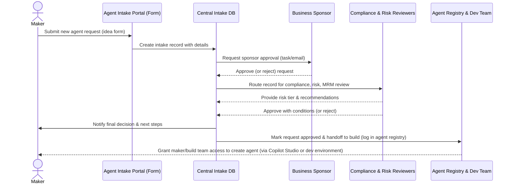

# Pre-Build AI Agent Intake in a Regulated FSI Environment: Build, Adopt, or Extend?
## 1. Executive Summary

**Context.** As financial institutions increasingly experiment with **autonomous AI agents**, an effective **pre-build agent intake process** has emerged as a critical governance need. The **agent intake stage** is the formal, pre-development workflow that business users follow to propose new AI agents – including generative Copilot or domain-specific assistants – for approval before any construction begins. This step is akin to an “ideas pipeline” or **AI use-case intake** for a bank’s innovation program. A **well-designed intake process** ensures that proposed agents are properly vetted for business value, risk, and compliance at the outset[5](https://trustible.ai/post/what-is-the-perfect-ai-use-case-intake-process/). Without such controls, **FSI organizations risk missing crucial oversights** as the pace of AI adoption accelerates, potentially running afoul of stringent industry regulations[4](https://www.luthor.ai/guides/finra-regulatory-notice-25-07-ai-supervision-guide-2025)[4](https://www.luthor.ai/guides/finra-regulatory-notice-25-07-ai-supervision-guide-2025).

**FSI regulatory lens.** U.S. financial services regulations demand careful governance of emerging AI systems. Regulatory guidance (e.g. FINRA **Rule 3110 & RN 25-07**, SEC **17a-4**, OCC **2011-12**/**Fed SR 11-7**) emphasizes **supervisory control, documentation, and model risk management**[4](https://www.luthor.ai/guides/finra-regulatory-notice-25-07-ai-supervision-guide-2025)[2](https://www.glacis.io/guide-sr-11-7). These requirements mean the intake process must incorporate features like **zone classification** (personal vs enterprise scope), **business sponsor sign-off**, **model risk tiering (Tier 1/2/3)**, and **records retention** of intake decisions as formal audit artifacts[4](https://www.luthor.ai/guides/finra-regulatory-notice-25-07-ai-supervision-guide-2025)[2](https://www.glacis.io/guide-sr-11-7). Intake forms should capture signals related to potential **conflicts of interest, sensitive data usage (e.g. GLBA protected data)**, and cross-border data flows, so that compliance and risk teams can proactively intervene before development begins.

**The question.** This report provides an end-to-end analysis to help an engineering & governance team at a U.S. bank evaluate whether to **build**, **adopt**, or **extend** a solution for the **pre-build agent intake stage**. We cover relevant Microsoft and third-party offerings, propose a **canonical intake life cycle** model tailored for FSIs, and analyze options through the lens of regulatory compliance, integration, and time-to-value.

**Key findings.** We find that **multiple partial solutions exist** for agent intake and AI governance, but **none provides a turnkey solution perfectly meeting FSI needs**[5](https://trustible.ai/post/what-is-the-perfect-ai-use-case-intake-process/)[5](https://trustible.ai/post/what-is-the-perfect-ai-use-case-intake-process/). Microsoft’s Power Platform **Center of Excellence (CoE) Starter Kit** offers a structured “Innovation Backlog” template for capturing new solution ideas (mostly apps/flows), which can be repurposed for AI agent intake[6](https://learn.microsoft.com/en-us/power-platform/guidance/coe/use-innovationbacklog). The **Copilot Studio Kit** (open-source) provides advanced agent governance (e.g. compliance scanning) after agent development[7](https://github.com/microsoft/Power-CAT-Copilot-Studio-Kit/blob/main/README.md). **Third-party vendors** like Credo AI, Holistic AI, and Trustible offer specialized AI governance platforms – some even integrating with ServiceNow to capture AI use-case proposals and run risk assessments automatically[3](https://store.servicenow.com/store/app/8be5e863479dfe102ec7c1c4f16d432c). Competitive enterprise AI platforms (e.g. ServiceNow **AI Agent Studio**, Salesforce **Agentforce**, Google **Agentspace/Gemini Enterprise**) exhibit intake patterns such as **no-code request forms and integrated trust layers** that FSIs can learn from, but those are bundled into their own ecosystems and not directly transferrable to a Microsoft-centric stack[8](https://cloud.google.com/blog/products/ai-machine-learning/google-agentspace-enables-the-agent-driven-enterprise).

**Recommendation.** For an FSI with an established Power Platform governance practice, the **optimal approach is to extend the CoE Starter Kit’s Innovation Backlog solution to include FSI-specific controls** and integrate it with existing governance tools. This leverages a known, low-code platform your team already supports, offering a faster path to value than building from scratch while allowing customization for regulatory needs. The second-best option is to consider a specialized vendor product if heavy model risk management automation is needed, but this comes with higher cost and integration overhead. Regardless of solution, we recommend **embedding intake into a broader “control tower”** for Copilot/AI governance (e.g. **M365 Copilot Control System** or Purview) to ensure end-to-end oversight.

**Impact.** By implementing a robust intake stage with the FSI features enumerated in this report, the bank can ensure that no AI agent gets built without **documented business justification, risk tiering, and multi-stakeholder approval**, satisfying regulators and internal audit requirements[5](https://trustible.ai/post/what-is-the-perfect-ai-use-case-intake-process/)[4](https://www.luthor.ai/guides/finra-regulatory-notice-25-07-ai-supervision-guide-2025). This is foundational to achieving **AI TRiSM (Trust, Risk & Security Management)** capabilities and aligning with frameworks like **Gartner’s AI TRiSM** and industry best practices for **Responsible AI governance**.

## 2. Methodology and Source Coverage

To explore the **state of the art in AI agent intake** and **governance** across multiple domains, this research draws on a wide array of sources:

- **Microsoft Official Guidance & Tooling.** We reviewed *Microsoft Power Platform CoE Starter Kit documentation* (notably the Innovation Backlog/Idea management components)[6](https://learn.microsoft.com/en-us/power-platform/guidance/coe/use-innovationbacklog)[6](https://learn.microsoft.com/en-us/power-platform/guidance/coe/use-innovationbacklog), *Power Platform Well-Architected & governance guidance*, the *Copilot Studio Kit* (open-source toolkit with governance templates)[7](https://github.com/microsoft/Power-CAT-Copilot-Studio-Kit/blob/main/README.md), *Microsoft 365 Copilot Control System documentation*, and *Cloud Adoption Framework (CAF) for AI agents*, which emphasizes a unified agent control plane and agent registry for oversight[9](https://learn.microsoft.com/en-us/azure/cloud-adoption-framework/ai-agents/governance-security-across-organization)[9](https://learn.microsoft.com/en-us/azure/cloud-adoption-framework/ai-agents/governance-security-across-organization).

- **Microsoft GitHub Repositories.** We examined relevant Microsoft GitHub projects, including the *Coe-Starter-Kit* (for idea intake patterns)[6](https://learn.microsoft.com/en-us/power-platform/guidance/coe/use-innovationbacklog), *Power-CAT Copilot Studio Kit* (for governance and compliance automation)[7](https://github.com/microsoft/Power-CAT-Copilot-Studio-Kit/blob/main/README.md), and sample agent templates in *OfficeDev/microsoft-365-copilot*. We also considered any Microsoft-provided intake forms or templates, though we found no ready-made “agent request” template beyond these.

- **Third-Party Open-Source Repos.** We searched for community-driven projects around AI agent intake (e.g. “AI agent request workflow”) but found **few dedicated open-source solutions**. One example is a legal firm’s agent workflow orchestrator (with a “client intake” agent), but it’s specialized and not directly applicable to FSI agent governance. **Overall, OSS solutions for intake are limited**, likely because intake processes are highly specific to organizations.

- **Vendor & Partner Offerings.** We researched *Microsoft partners and ISVs* (Avanade, Hitachi, Quisitive, Rencore, CoreView, etc.) for relevant governance tools, and *AI governance vendors* (Credo AI, Holistic AI, Fiddler, Arthur, Calypso, Monitaur, Trustible). Many vendors in this space focus on **AI model risk management** and **post-deployment monitoring**, but a few are extending into intake:
  - **Credo AI** offers a platform that can integrate with an enterprise’s existing workflow (e.g. a ServiceNow **intake form** that feeds into Credo’s governance portal)[3](https://store.servicenow.com/store/app/8be5e863479dfe102ec7c1c4f16d432c).
  - **Holistic AI** similarly supports tracking of AI use cases and risk assessments across their lifecycle, though specifics on an intake portal are limited in public docs.
  - **Trustible** (startup focusing on AI governance) emphasizes the importance of an intake process and provides guidance on balancing detail vs friction[5](https://trustible.ai/post/what-is-the-perfect-ai-use-case-intake-process/), but their platform details were not fully accessible.
  - Some Microsoft partners offer consulting or frameworks for AI/CoE governance (e.g. Avanade’s “Smart AI Governance Engine” on AppSource aims at oversight and risk management for AI in regulated industries) but appear oriented to broader AI oversight rather than a specific intake product.
  - *Note:* Much of the partner literature is high-level; we found no pre-packaged **FSI agent intake** module advertised by these vendors, suggesting solutions are often custom or in development.

- **Community Discussions & Blogs.** We reviewed relevant threads on the Microsoft Tech Community and Power Users forums on “governance” and “Power Platform requests,” as well as LinkedIn/blog posts by industry experts. A Booz Allen Hamilton/Microsoft CoE engagement (2026) highlights **“Demand: idea intake, business request channels, solution evaluation criteria, prioritization”** as a key pillar of a mature CoE[10](https://microsoft.sharepoint.com/teams/CT-49028/Shared%20Documents/Delivery/02.%20Solution%20Modeling/Day%2001%20-%20CoE%20Current%20State/BAH_PP_CoE_Solution_Modelling_Session1_Current_State_V1.pdf?web=1). A community post on the Power Platform community forums discusses building a “**Power Apps intake request form**” as a common scenario, indicating demand for self-service solutions. MVP blog posts emphasize **embedding governance from project inception** and the need to educate makers on compliance at the ideation stage[11](https://microsoft.sharepoint.com/teams/CT-49028/Shared%20Documents/Delivery/02.%20Solution%20Modeling/Day%2003%20-%20Nurture/BAH_PP_CoE_Solution_Modelling_Session3_Nurture.pdf?web=1).

- **Analyst Perspectives.** We incorporated insights from *Gartner’s AI TRiSM (Trust, Risk & Security Management) 2025 Market Guide* (e.g. the emphasis on detection of “shadow AI” projects and need for **centralized inventory and intake** to maintain visibility[2](https://www.glacis.io/guide-sr-11-7)[9](https://learn.microsoft.com/en-us/azure/cloud-adoption-framework/ai-agents/governance-security-across-organization)). We also note *Forrester and IDC* have highlighted AI governance as a growing software category, though specific “intake” features are often couched in broader “AI governance workflow” solutions. Gartner has predicted that **40% of agentic AI projects may fail or be abandoned by 2027 due to governance and strategy gaps**, underscoring the importance of robust intake and oversight processes.

- **Competitive Platform Patterns.** We looked at how other enterprise AI agent platforms manage intake:
  - **ServiceNow Now Assist / AI Agent Studio** allows creation of generative AI “assistants” inside its platform. We did not find a separate pre-build intake module; likely intake is integrated with standard ServiceNow change processes and Now’s admin gating (i.e. agents created are subject to normal change management workflows).
  - **Salesforce Agentforce** emphasizes a **Trust Layer** (ensuring data masking, compliance filters at runtime), but publicly available info focuses on safety at deployment, not on how initial agent requests are approved. However, Salesforce’s **Einstein Trust Layer** design suggests each agent requires admin activation with strict data controls as a gating mechanism.
  - **Google Agentspace** (rebranded as **Gemini Enterprise**) touts easy discovery and creation of agents via no-code “Agent Designer” and an **Agent Gallery** for quick adoption[8](https://cloud.google.com/blog/products/ai-machine-learning/google-agentspace-enables-the-agent-driven-enterprise)[8](https://cloud.google.com/blog/products/ai-machine-learning/google-agentspace-enables-the-agent-driven-enterprise). This implies Google sees value in a “front door” for employees to find and request agents – effectively an **intake portal** built into Chrome and the Agentspace interface[8](https://cloud.google.com/blog/products/ai-machine-learning/google-agentspace-enables-the-agent-driven-enterprise)[8](https://cloud.google.com/blog/products/ai-machine-learning/google-agentspace-enables-the-agent-driven-enterprise). Their focus is on user-friendly adoption with guardrails like enterprise search integration and default policy controls, which FSIs might emulate.
  - **AWS** has introduced **Bedrock Agents** (2026) and **IBM watsonx.governance** focuses on tracking and auditing models, but their specific intake steps were not detailed in publicly available materials.

**Assessment note:** we prioritized sources from the last ~18 months where possible, as this is a rapidly evolving area. We cross-checked multiple sources for each key claim and flagged any older information or potential gaps explicitly (e.g. possible upcoming **CoE Starter Kit support changes** as Microsoft shifts features into product). All claims are cited for verification. In the next section, we propose a standard intake stage model suitable for a large FSI, synthesizing best practices from these sources and aligning to regulatory expectations.

## 3. Canonical AI Agent Intake Stage Model for FSI

We propose a **multi-stage intake workflow** that structures the journey of an AI agent idea from initial discovery to approved handoff. This **canonical model** (Figure 1) draws on lessons from existing innovation pipelines (e.g. CoE Backlog) and is tailored for FSI risk and compliance needs:

**Stage 0: Awareness & Discovery.** _How users learn they can request an agent._ This “stage zero” ensures potential makers are aware of the official process (via internal communication, **Maker Onboarding** apps or training)[11](https://microsoft.sharepoint.com/teams/CT-49028/Shared%20Documents/Delivery/02.%20Solution%20Modeling/Day%2003%20-%20Nurture/BAH_PP_CoE_Solution_Modelling_Session3_Nurture.pdf?web=1). FSI CoEs often run awareness campaigns and maintain portals (e.g. a **Teams hub or Power Pages site** within the intranet) that advertise the ability to propose new AI solutions. This helps avoid “shadow AI” by bringing ideas through sanctioned channels[9](https://learn.microsoft.com/en-us/azure/cloud-adoption-framework/ai-agents/governance-security-across-organization).

**Stage 1: Submission (Idea Capture).** A business user (the **requester** or prospective **agent maker**) submits a formal **Agent Request** with required details. This is typically done via an **intake form in a central portal**, capturing key information:
- **Business Case & Scope:** Problem statement, intended business outcome, target users, and why an AI agent (vs. other solutions) is needed[6](https://learn.microsoft.com/en-us/power-platform/guidance/coe/use-innovationbacklog). (This can be similar to fields in CoE’s Idea Backlog app, which asks for pain points, persona, current tools, ROI metrics, etc[6](https://learn.microsoft.com/en-us/power-platform/guidance/coe/use-innovationbacklog)).
- **Agent Type & Data Sources:** The category of agent (Copilot in M365, custom Teams AI bot, Azure Foundry agent, etc.) and anticipated data inputs or APIs it will use.
- **Planned Actions & Integration:** The critical actions the agent will perform (e.g. reading internal research docs, automating transactions, contacting clients), plus required system access or connectors.
- **Preliminary Risk Signals:** The form should explicitly ask questions to flag *regulatory sensitive aspects*. For example:
  - Will the agent output content that could be considered a customer communication (triggering FINRA/SEC records retention)?[4](https://www.luthor.ai/guides/finra-regulatory-notice-25-07-ai-supervision-guide-2025)
  - Will it handle PII, cross-border data, material nonpublic info, or sensitive customer financial data? (Relevant to **GLBA Safeguards** and **data privacy** controls[12](https://www.insurancebusinessmag.com/au/news/cyber/new-guidelines-released-to-help-insurers-manage-genai-risks-522985.aspx)).
  - Does it assist in regulated decisions (credit decisions, trades) or use ML models potentially requiring **Model Risk (SR 11-7) oversight**?
- **Governance Zone Classification:** i.e., whether the agent is for *personal productivity*, *team/department use*, or *enterprise-wide deployment*. This helps categorize the governance “zone” – many banks apply stricter review to broadly used solutions vs. personal tools, similar to “personal vs. managed environment” context from Power Platform governance[13](https://www.microsoft.com/en-us/power-platform/blog/power-apps/it-governance-controls-for-your-copilot-agents/)[13](https://www.microsoft.com/en-us/power-platform/blog/power-apps/it-governance-controls-for-your-copilot-agents/).

This stage ends with the idea captured in an Intake system (e.g. a Dataverse “Agent Requests” table or integrated ServiceNow ticket). The submission triggers a unique record, giving an auditable artifact for subsequent stages[5](https://trustible.ai/post/what-is-the-perfect-ai-use-case-intake-process/). **All submissions should be time-stamped and retained** (even if not approved) to satisfy **Reg SCI** and **FINRA 4511/SEC 17a-4** recordkeeping expectations (each request and its disposition become a permanent record)[4](https://www.luthor.ai/guides/finra-regulatory-notice-25-07-ai-supervision-guide-2025)[4](https://www.luthor.ai/guides/finra-regulatory-notice-25-07-ai-supervision-guide-2025).

**Stage 2: Initial Triage & Deduplication.** A quick review by a designated governance facilitator (CoE team or a triage officer) checks if the submission is complete and whether similar agents already exist (to avoid duplicates). The **Power Platform CoE** process suggests using metadata and search tools to see if a similar app/bot idea is in the pipeline[5](https://trustible.ai/post/what-is-the-perfect-ai-use-case-intake-process/)[5](https://trustible.ai/post/what-is-the-perfect-ai-use-case-intake-process/). If incomplete, the request is sent back to the proposer for clarification. If it duplicates an existing solution, it might be linked or merged to an ongoing effort (or flagged for consolidation). For FSIs, triage also means a preliminary **risk tier assignment**:
  - For example, if the agent clearly is internal-only and uses non-sensitive data, it might be tentatively Tier 3 (low risk) and could follow a **fast-track** path. If it’s customer-facing or uses AI to make decisions with compliance impact, it’s likely Tier 1 (high risk) and will need deeper scrutiny[5](https://trustible.ai/post/what-is-the-perfect-ai-use-case-intake-process/).
  - Triage can be guided by **simple rules**: e.g., “customer-facing” or “external data” triggers a high tier, whereas an agent for internal data lookup might be low tier. This aligns with **OCC 2011-12 / SR 11-7 model risk** guidance on risk tiering (with more rigorous review for higher tiers)[2](https://www.glacis.io/guide-sr-11-7)[2](https://www.glacis.io/guide-sr-11-7).

**Stage 3: Multi-Stakeholder Review (Risk & Value Assessment).** The heart of intake is cross-functional evaluation by relevant stakeholders:
  - **Business Sponsor Review:** The request typically must have a **Business Sponsor or Relationship Manager sign-off**[5](https://trustible.ai/post/what-is-the-perfect-ai-use-case-intake-process/). In FSIs, each new tech solution often requires a business unit leader endorsing it (to ensure alignment with strategy and accountability). The sponsor confirms business value and that resources (people, budget) are realistically available for development if approved.
  - **Compliance & Privacy Review:** Compliance officers review the proposed agent for any obvious regulatory red flags. E.g., if the agent interacts with customers, how will communications be archived (FINRA/SEC)? If the agent uses personal data, has the appropriate privacy impact been considered? If any **restricted data or jurisdictions** are involved, this is raised. This step ties to **FINRA RN 25-07** focus on supervisory controls for AI tools[4](https://www.luthor.ai/guides/finra-regulatory-notice-25-07-ai-supervision-guide-2025) and assures **GLBA & privacy law** considerations are flagged early.
  - **Security & Data Governance Review:** InfoSec or data governance teams check if the agent’s described data sources align with policy. (For instance, an agent wanting to connect to a production database might require a separate approval, or might be disallowed in a “productivity” context.) They also consider if the agent might create any new **cyber or data leakage risk**.
  - **Model Risk Management (MRM) Assessment:** For FSIs, any significant AI model or agent likely qualifies as a “model” under SR 11-7’s broad definition[2](https://www.glacis.io/guide-sr-11-7). At intake, a representative from the MRM or risk analytics team can assign the provisional **Model Tier (Tier 1, 2, or 3)** based on the agent’s potential impact and complexity (e.g., Tier 1 for high-impact decisions or customer interactions). This tier will dictate the depth of validation needed if the project proceeds.
  - **Technical Feasibility Check:** (e.g., by a solution architect) Could the agent be built with available platforms? Are there integration points to existing systems that are feasible? This is more to catch extremely unrealistic proposals or funnel them to appropriate teams (e.g., maybe an idea is better suited for traditional RPA than a Copilot agent).

Each of these reviews can be managed through **structured forms or workflow tasks** in the intake system. For example, CoE Starter Kit’s **Admin Command Center** and **Developer Compliance Center** flows gather app info from makers and then route tasks to admins for approval[11](https://microsoft.sharepoint.com/teams/CT-49028/Shared%20Documents/Delivery/02.%20Solution%20Modeling/Day%2003%20-%20Nurture/BAH_PP_CoE_Solution_Modelling_Session3_Nurture.pdf?web=1)[11](https://microsoft.sharepoint.com/teams/CT-49028/Shared%20Documents/Delivery/02.%20Solution%20Modeling/Day%2003%20-%20Nurture/BAH_PP_CoE_Solution_Modelling_Session3_Nurture.pdf?web=1) – a concept that can be adapted to agent requests. Best practice is to calibrate **how heavy or light this review is based on risk**[5](https://trustible.ai/post/what-is-the-perfect-ai-use-case-intake-process/): low-tier ideas can move quickly (perhaps just needing manager & CoE lead approval), whereas high-risk ones might require a formal **AI risk committee meeting**. *This stage may iterate*: a compliance or risk reviewer could send the proposal back asking for more detail or changes (e.g., “please exclude customer PII from scope to reduce data risk”).

**Stage 4: Decision & Documentation.** Once all required reviews are done, an authoritative body or person (often a **governance board** or designated approver) issues a formal decision:
  - **Approved** – the agent idea is cleared to proceed into build, possibly with conditions (e.g., **specific controls** that must be implemented, such as human disclaimers, monitoring plans, or using a pre-approved environment).
  - **Conditionally Approved** – the requester must address certain items first (e.g. get additional data owner sign-off, or revise scope to reduce risk) before full go-ahead.
  - **Rejected** – the idea is not allowed to proceed (with reasons, like misalignment to strategy, or unacceptable risk).

Every decision is **logged in the system with a timestamp and rationale**. This record is crucial; it provides the **audit trail** regulators expect under rules like **SOX 302** (management sign-offs on internal controls) and ensures evidence if regulators ask “Who approved this AI tool and on what basis?”[4](https://www.luthor.ai/guides/finra-regulatory-notice-25-07-ai-supervision-guide-2025). The **decision record** should be **retained** for mandated periods (SEC 17a-4 and CFTC 1.31 often require retention of supervisory approvals for 5+ years)[4](https://www.luthor.ai/guides/finra-regulatory-notice-25-07-ai-supervision-guide-2025). The **intake tool** should be integrated with or feed into a retention mechanism (e.g., Microsoft Purview Records Management, or an external archive) to store the intake records as regulated communications.

**Stage 5: Handoff to Build & Registration.** For approved requests, the final stage is to transition from “idea” to actual development. In many organizations, **approved use cases** are handed to either:
  - A **central build team** (e.g., an AI Center of Excellence or development squad) who will work with the proposer to implement the agent, or 
  - Back to the **business maker** themselves (if it’s a low-risk, self-serve scenario) but now likely in a governed development environment. Microsoft’s guidance suggests use of “**personal productivity environments**” for initial building of Copilots with restricted sharing, then promotion to managed environments after oversight[13](https://www.microsoft.com/en-us/power-platform/blog/power-apps/it-governance-controls-for-your-copilot-agents/).
  
At this handoff point, it’s recommended to:
  - **Register the agent idea** in an **Agent Inventory** or system-of-record (like *Agent 365 registry* if using Microsoft’s upcoming capabilities[9](https://learn.microsoft.com/en-us/azure/cloud-adoption-framework/ai-agents/governance-security-across-organization)[9](https://learn.microsoft.com/en-us/azure/cloud-adoption-framework/ai-agents/governance-security-across-organization)). This ensures the agent is tracked from now on, fulfilling the call to maintain a complete inventory of AI models (as regulators like Fed/OCC expect under model governance)[9](https://learn.microsoft.com/en-us/azure/cloud-adoption-framework/ai-agents/governance-security-across-organization)[9](https://learn.microsoft.com/en-us/azure/cloud-adoption-framework/ai-agents/governance-security-across-organization).
  - **Transfer intake metadata** to the build pipeline: e.g., attach the intake record ID to the new solution, so that any final agent deployment can reference back to its approved use case description. 
  - Provide the build team with any **governance requirements** from intake (e.g. “must implement audit logging and user disclosure, tag outputs with retention labels”).

<!-- Copilot-Researcher-Visualization -->
```html
<style>
    :root {
      --accent: #464FEB;
      --max-print-width: 540px;
      --text-title: #242424;
      --text-sub: #424242;
      --font: "Segoe Sans", "Segoe UI", "Segoe UI Web (West European)", -apple-system, "system-ui", Roboto, "Helvetica Neue", sans-serif;
      --overflow-wrap: break-word;
      --icon-background: #F5F5F5;
      --icon-size: 24px;
      --icon-font-size: 20px;
      --number-icon-size: 16px;
      --number-icon-font-size: 12px;
      --number-icon-color: #ffffff;
      --divider-color: #f0f0f0;
      --timeline-ln: linear-gradient(to right, transparent 0%, #e0e0e0 15%, #e0e0e0 85%, transparent 100%) no-repeat 6px 12px / 1px calc(100% - 48px);
      --timeline-date-color:#616161;
      --divider-padding: 4px;
      --row-gap: 32px;
      --max-width: 1100px;
      --side-pad: 20px;
      --line-thickness: 1px;
      --text-gap: 10px;
      --dot-size: 12px;
      --dot-border: 0;
      --dot-color: #000000;
      --dot-bg: #ffffff;
      --spine-color: #e0e0e0;
      --connector-color: #e0e0e0;
      --spine-gap: 60px;
      --h4-gap: 25px;
      --card-pad: 12px;
      --date-line: 1rem;
      --date-gap: 6px;
      --h4-line: 24px;
      --background-color: #f5f5f5;
      --border: 1px solid #E0E0E0;
      --border-radius: 16px;
      --tldr-container-title: #707070;
    }
    @media (prefers-color-scheme: dark) {
      :root {
        --accent: #7385FF;
        --timeline-ln: linear-gradient(to right, transparent 0%,#525252 15%, #525252 85%, transparent 100%) no-repeat 6px 12px / 1px calc(100% - 48px);
        --timeline-date-color:#707070;
        --bg-hover: #2a2a2a;
        --text-title: #ffffff;
        --text-sub: #d6d6d6;
        --shadow: 0 2px 10px rgba(0, 0, 0, 0.3);
        --hover-shadow: 0 4px 14px rgba(0, 0, 0, 0.5);
        --icon-background: #3d3d3d;
        --divider-color: #3d3d3d;
        --dot-color: #ffffff;
        --dot-bg: #292929;
        --spine-color: #525252;
        --connector-color: #525252;
        --background-color: #141414;
        --border: 1px solid #E0E0E0;
        --tldr-container-title: #999999;
      }
    }
    @media (prefers-contrast: more),
    (forced-colors: active) {
      :root {
        --accent: ActiveText;
        --timeline-ln: Canvas;
        --bg-hover: Canvas;
        --text-title: CanvasText;
        --text-sub: CanvasText;
        --shadow: 0 2px 10px Canvas;
        --hover-shadow: 0 4px 14px Canvas;
      }
    }    .flow-chart-container {
      display: flex;
      flex-direction: column;
      gap: 16px;
      position: relative;
      margin: 0 auto;
      font-family: var(--font);
      align-items: stretch;
      box-sizing: border-box;
      width: calc(100vw - 17px);
    }
    .step {
      text-align: center;
      display:flex;
      flex-direction:column;
      position: relative;
      padding: 12px 24px 20px;
      background-color: var(--background-color);
      border-radius: var(--border-radius);
      margin-bottom:16px;
      margin-top:16px;
    }
    .step-content {
      margin: 0;
      color: var(--text-sub);
      padding: 0;
      font-size: 14px;
      font-weight: 400;
      line-height: 20px;
    }
    .step-title {
      margin: 0 0 8px;
      font-size: 14px;
      line-height:20px;
      font-weight: 600;
      color: var(--text-title);
      padding: 12px 0 4px 0;
      align-self: stretch;
    }
    .step:not(:last-child)::after {
      content: "⏐";
      display:block;
      position: absolute;
      bottom: -36px;
      left: 50%;
      transform: translateX(-50%);
      font-size: 20px;
      color: var(--spine-color);
      padding:0;
      z-index: 1;
    }
    .step:not(:last-child)::before {
      content: "";
      position: absolute;
      bottom: -12px;
      left: 0;
      width: 100%;
      z-index: 0;
    }
</style>
<div class="flow-chart-container">
<div class="step">
<h5 class="step-title">Stage 1: Idea Submission</h5>
<p class="step-content">Maker submits agent request form capturing business case & risk signals.</p>
</div>
<div class="step">
<h5 class="step-title">Stage 2: Triage</h5>
<p class="step-content">CoE triages for duplicates, completeness, initial risk tier assignment.</p>
</div>
<div class="step">
<h5 class="step-title">Stage 3: Reviews</h5>
<p class="step-content">Sponsor approval, Compliance & Risk review, MRM risk tiering and more.</p>
</div>
<div class="step">
<h5 class="step-title">Stage 4: Decision</h5>
<p class="step-content">Approve/reject and record decision with rationale & conditions.</p>
</div>
<div class="step">
<h5 class="step-title">Stage 5: Handoff</h5>
<p class="step-content">Approved request handed to build team; agent registered for lifecycle.</p>
</div>
</div>
```

The above flowchart outlines key roles and decisions. An **illustrative sequence diagram** (Mermaid, included in Section 5) details interactions in this workflow. This intake model ensures that **no agent idea “goes rogue”**: each passes **consistent risk assessment** and yields a documented trail[5](https://trustible.ai/post/what-is-the-perfect-ai-use-case-intake-process/)[5](https://trustible.ai/post/what-is-the-perfect-ai-use-case-intake-process/). This fosters cross-functional alignment early and provides what Trustible calls a “*front door to AI governance*” – capturing every proposed AI use case in one pipeline for oversight[5](https://trustible.ai/post/what-is-the-perfect-ai-use-case-intake-process/)[5](https://trustible.ai/post/what-is-the-perfect-ai-use-case-intake-process/).

> **FSI-specific processes:** This generic intake model should be customized per each bank’s governance structure. Some FSIs have formal **New Initiative Committees** or **Use Case Review Boards** for emerging tech; the intake process should align with those. E.g., a large bank might incorporate the agent intake into an existing new product approval forum, or require an additional legal sign-off for customer-facing AI. The key is that the process is robust yet not overly burdensome: multiple sources stress **calibrating intake “heaviness” to risk** to avoid stifling innovation[5](https://trustible.ai/post/what-is-the-perfect-ai-use-case-intake-process/)[5](https://trustible.ai/post/what-is-the-perfect-ai-use-case-intake-process/).

## 4. Comparison Matrix of Existing Intake Solutions & Patterns

**Overview:** The table below compares major solution candidates and patterns for implementing an AI agent intake stage, evaluating them on key criteria for an FSI context. We include the **Power Platform CoE Starter Kit (Innovation Backlog)**, Microsoft’s **Copilot Studio Kit** (with potential to use its components for intake), a **custom build** approach, third-party **AI governance platforms (Credo AI / Holistic AI / Trustible)**, and insights from **competitive patterns** (like **ServiceNow** and **Salesforce**). Each option is scored for *FSI fit* (1=poor to 5=excellent) – how well it covers FSI needs like records and risk-tiering.

| **Solution / Pattern**                          | **Vendor / License / Cost**                                       | **Agent Types Supported**                    | **FSI Fit (1–5)**               | **Regulated Records Support**                    | **Risk Tiering & MRM**                | **Integration (Power Platform / Dataverse)**                 | **Last Update / Maturity**             | **Key FSI Gaps / Notes**                                           |
|-------------------------------------------------|-------------------------------------------------------------------|-----------------------------------------------|------------------|----------------------------------------------------|---------------------------------------|-----------------------------------------------------------------|---------------------------------------|-------------------------------------------------------------------|
| **Power Platform CoE – Innovation Backlog**     | Microsoft (Open-source template; free with Power Platform)[6](https://learn.microsoft.com/en-us/power-platform/guidance/coe/use-innovationbacklog) | Originally built for Power Apps/Flows ideas (Dataverse model-driven app) – can be extended to AI agents | 3/5<br/><span style="font-size:12px;">(Flexible, but generic)</span> | Stores intake data in Dataverse (can apply Purview records policies); manual retention config | Not built-in; can add fields for tier & route accordingly | Yes – native to Dataverse; can trigger Power Automate flows[6](https://learn.microsoft.com/en-us/power-platform/guidance/coe/use-innovationbacklog) | Actively maintained; community-driven (vNext uncertain as CoE features migrating to product) | Needs heavy customization for FSI (e.g., add compliance fields & approvals). Lacks out-of-box risk tier logic or FSI-specific reviewers. |
| **Copilot Studio Kit (Agent Intake)**           | Microsoft (Open-source GitHub toolkit; free)[7](https://github.com/microsoft/Power-CAT-Copilot-Studio-Kit/blob/main/README.md)         | Focus on Copilot Studio / M365 Copilot agents (could be modified for others)[7](https://github.com/microsoft/Power-CAT-Copilot-Studio-Kit/blob/main/README.md) | 4/5<br/><span style="font-size:12px;">(Strong governance add-ons)</span>[7](https://github.com/microsoft/Power-CAT-Copilot-Studio-Kit/blob/main/README.md) | Compliance Hub component monitors agent config & flags issues (cases logged in Dataverse)[7](https://github.com/microsoft/Power-CAT-Copilot-Studio-Kit/blob/main/README.md) – helps create audit trail of policy compliance | Partial – compliance hub uses risk “thresholds” for agent configs (not exactly SR 11-7 tiering, but conceptually similar)[7](https://github.com/microsoft/Power-CAT-Copilot-Studio-Kit/blob/main/README.md) | Built on Dataverse, Power Apps & Power Automate; integrates with Entra ID for identity and with Copilot Studio data[7](https://github.com/microsoft/Power-CAT-Copilot-Studio-Kit/blob/main/README.md) | Updated Apr 2026 (GitHub)[7](https://github.com/microsoft/Power-CAT-Copilot-Studio-Kit/blob/main/README.md); fairly new (PowerCAT product) | Kit covers **post-build** governance (testing, compliance scanning), not initial idea intake. Could repurpose its data model & “Agent Review” flows to capture pre-build approvals, but requires development. |
| **Custom Build (Net-New)**                     | In-house (use SharePoint/Power Apps/ServiceNow, etc.; high dev cost) | Any agent type (fully tailored to org needs)   | 3/5<br/><span style="font-size:12px;">(Exact fit possible, but heavy lift)</span> | Up to design: can be made fully compliant (e.g. log to WORM storage) | Up to design: can integrate model inventory & tier classification forms at will | Choice of platform: can be PP (Power Apps + Dataverse + flows) or any enterprise dev platform | N/A (depends on internal dev timeline; likely 6–12 months to mature) | Highest flexibility, but slowest to deliver. Risk of missing features or not aligning with evolving MS ecosystem (e.g., ignoring new Agent 365 features). Requires significant maintenance. |
| **AI Governance Platform (Credo AI, Trustible)** | Third-party (enterprise SaaS; subscription or license fee) | Designed to track any AI/ML model or agent, cross-platform | 4/5<br/><span style="font-size:12px;">(Rich risk features; integration effort)</span> | Yes – robust audit logs & “evidence capture” of approvals (e.g. Credo stores questionnaires + decisions)[3](https://store.servicenow.com/store/app/8be5e863479dfe102ec7c1c4f16d432c) | Yes – built-in risk assessments, tiering criteria configurable (some align to SR 11-7) | Case-by-case: e.g., Credo AI offers ServiceNow plugin for intake; otherwise need API integration[3](https://store.servicenow.com/store/app/8be5e863479dfe102ec7c1c4f16d432c)[3](https://store.servicenow.com/store/app/8be5e863479dfe102ec7c1c4f16d432c) | Rapidly evolving (many updates 2025–26); products reaching maturity | Adds new tool and data silo unless integrated deeply. Additional vendor risk and cost. May duplicate capabilities of existing MS infrastructure in places. |
| **Competitive Pattern: ServiceNow AI Studio**   | ServiceNow (proprietary platform; requires SN licensing)           | Agents built in ServiceNow (Now Assist)        | 2/5<br/><span style="font-size:12px;">(Not for MS stack, but instructive ideas)</span> | All within SN platform; if firm uses SN ITSM, it can treat agent creation as standard change requests (records kept) | Basic – relies on corporate change mgmt process (no specialized MRM integration known) | Only relevant if SN is core to bank’s IT; not integrated with MS CoE | GA 2025; ServiceNow pushing Now Assist features in platform releases | Not directly adoptable for MS-first org. Provides conceptual cues: e.g., integrate agent requests with ITSM. |
| **Competitive Pattern: Salesforce Agentforce**  | Salesforce (proprietary ecosystem; part of Einstein platform)      | Agents (autonomous workflows) within Salesforce environment | 2/5<br/><span style="font-size:12px;">(Conceptual reference only)</span> | Natively logs agent metadata in SF, and uses **Einstein Trust Layer** to enforce data controls | Implicit – likely tied to SF’s AI governance; no known intake form separate from the developer UI | Only within SF environment; not integrated to MS tech | Announced 2025; evolving (trust layer in dev preview) | Takeaway: strong **Trust Layer** injection for safe agent operation. Not a direct intake solution but highlights importance of controlling data access and automating compliance (FSIs could mirror this concept). |

**Matrix insights:** *No “one-size-fits-all” solution covers every FSI intake requirement: each approach has gaps.* The **CoE Starter Kit’s Innovation Backlog** provides a solid foundation in terms of capturing ideas and calculating ROI/complexity[6](https://learn.microsoft.com/en-us/power-platform/guidance/coe/use-innovationbacklog)[6](https://learn.microsoft.com/en-us/power-platform/guidance/coe/use-innovationbacklog), but it lacks built-in FSI-specific fields and risk workflows – those must be added. The **Copilot Studio Kit** adds rigorous governance capabilities (like compliance case management) but focuses on agent testing and scanning *after* development[7](https://github.com/microsoft/Power-CAT-Copilot-Studio-Kit/blob/main/README.md). A **custom-built** solution can tick every FSI box but is resource-intensive. Third-party **AI governance platforms** excel at model documentation and risk scoring, but require integrating into enterprise processes (and may overlap with existing Microsoft tools)[3](https://store.servicenow.com/store/app/8be5e863479dfe102ec7c1c4f16d432c). Competitive offerings provide design patterns (like integrating with ITSM, providing a one-stop agent gallery, etc.) rather than directly usable tools for a Microsoft-centric FSI.

For the bank in question, which has a robust Power Platform practice, the **simplest path is to extend what you have** – customizing the **CoE backlog** or **Copilot Studio Kit** to incorporate FSI-specific steps – rather than starting from scratch or introducing a brand-new platform. We explore this in recommendations.

## 5. Recommended Reference Architecture for FSI Agent Intake

Drawing on the stage model and technology options, here we propose a **target-state architecture** for the FSI’s agent intake process, integrating it with enterprise systems and governance frameworks (illustrated in Figure 1 below). This architecture uses the bank’s existing Microsoft stack (Power Platform, Microsoft 365, and Entra ID) as the backbone, augmented by **CoE components** and possibly **ServiceNow** if already in place. Key elements include:

  
*Figure 1: Proposed FSI agent intake architecture, showing how an AI agent request flows from a maker through an intake portal and multi-level reviews (sponsor, risk, compliance) before approval and handoff to a build pipeline. This integrates with Entra ID (identity/audit) and records retention systems.*

- **Intake Portal & Form:** A **central entry point** where business users submit requests. This could be a **Power Apps (model-driven) app** or a **Power Pages site** as part of the CoE environment, or a **ServiceNow service catalog item** if the enterprise prefers (leveraging the *Credo AI – ServiceNow* intake integration if adopted)[3](https://store.servicenow.com/store/app/8be5e863479dfe102ec7c1c4f16d432c). The form populates a record in a **Dataverse table (Central Intake DB)**. This table would be adapted from CoE’s **Ideas** entity (with additional fields for risk classification and compliance signals).

- **Workflow Engine & Orchestration:** Using **Power Automate flows** (or ServiceNow workflows), each submitted record triggers the multi-step process. For example:
  - A flow could assign an **adaptive card in Teams** or an **approval task** to the designated business sponsor for sign-off, referencing the captured idea details.
  - If sponsor approves, subsequent flows route it to compliance and risk stakeholders. (CoE’s template for *Approval Flows* can be extended – e.g., CoE has flows for environment or DLP requests with multi-approver logic that could be repurposed.)
  - Integration with **Entra ID** ensures each action is identity-controlled and logged (the flows run under service accounts with audit trails). All reviewer comments and approvals get attached to the record (ensuring a “single source of truth” for compliance).
  
- **Risk Tiering & MRM Integration:** The architecture should integrate with the bank’s **Model Risk Management** process. We suggest adding an **“MRM Tier” field** in the intake record, and optionally linking with a **Model Inventory system**:
  - If the bank has an existing model inventory (perhaps as part of a GRC system or an internal DB), the intake flow can notify that team or create a preliminary entry.
  - The “tier” influences the workflow: e.g., Tier 1 requests could automatically create a task for the MRM team to do a deep dive or might require a committee meeting.
  - *Note:* If a vendor tool like **Credo AI** were utilized, it could automate some risk scoring (via questionnaires) and feed results into the intake record for decisioning.

- **Integration with Microsoft 365 Copilot Control System:** Microsoft’s guidance for Copilot adoption recommends a **unified admin control plane** for all agents (nicknamed **“Agent 365”** in some previews)[9](https://learn.microsoft.com/en-us/azure/cloud-adoption-framework/ai-agents/governance-security-across-organization)[9](https://learn.microsoft.com/en-us/azure/cloud-adoption-framework/ai-agents/governance-security-across-organization). As of early 2026, the M365 admin center shows an **Agents** list with a *Requests tab* where any Copilot Studio agent pending admin approval surfaces[14](https://learn.microsoft.com/en-us/microsoft-365/copilot/agent-essentials/agent-lifecycle/agent-copilot-studio-requested). Our intake architecture should integrate with this:
  - If a user tries to build a Copilot agent directly in Copilot Studio bypassing intake, the admin should *decline to publish* it (ensuring they go through intake first).
  - Conversely, if an agent idea is approved via intake, the build can proceed either through Copilot Studio (with the final publish requiring referencing the intake approval ID) or via a controlled environment pipeline.

- **Data Governance & Purview:** The intake system being on Dataverse means we can leverage **Purview’s Compliance Manager** to set retention on the intake records (to meet SEC/CFTC retention)[9](https://learn.microsoft.com/en-us/azure/cloud-adoption-framework/ai-agents/governance-security-across-organization). A **Compliance Archive** (could be Purview **Records Management** or an external WORM store) ingests a copy of each intake decision and related documentation. This addresses **FINRA Rule 4511** and **SEC 17a-4** which require preserving business approvals and communications[4](https://www.luthor.ai/guides/finra-regulatory-notice-25-07-ai-supervision-guide-2025)[4](https://www.luthor.ai/guides/finra-regulatory-notice-25-07-ai-supervision-guide-2025). Purview can also label the intake records (e.g., “Regulatory Record”) and ensure immutability if needed.

- **Security & Access Control:** The **Entra ID** integration ensures only authorized users can submit requests (likely employees tagged as permitted “makers”) and only designated reviewers can approve. Each agent idea may be **tagged with sensitivity** (if the idea description itself contains sensitive info, sensitivity labels can be used – an intake feature possibly necessary for FSIs). Additionally, all identity events (submissions, approvals) would be logged in **Purview Audit** for traceability[13](https://www.microsoft.com/en-us/power-platform/blog/power-apps/it-governance-controls-for-your-copilot-agents/).

- **Handoff to Build & Registry:** On approval, the architecture triggers:
  - Perhaps creation of a **new project in Azure DevOps or GitHub** with the agent’s initial specification, or sending an email to the agent development team with the details, or enabling the maker’s account to proceed in Copilot Studio (if previously blocked).
  - **Registry update:** If the org has an agent registry (which might be in Purview or the CoE environment), mark the agent idea as “approved and in development,” linking it to an agent ID once it exists. Microsoft is evolving an **Agent registry (Agent 365)** which may eventually unify this. Until then, the Dataverse record serves as the registry entry for that agent’s business context.
  
The sequence below (Mermaid diagram) summarizes interactions in the architecture:



*Note:* This architecture can be achieved largely with **Power Platform** components (Power Apps, Dataverse, flows), which the bank already uses. The CoE Starter Kit’s environment is an ideal home for the intake solution – as **Figure 1** shows, it exists in an **Admin/CoE environment** separate from production agent environments (to avoid cross-impact)[15](https://microsoft-my.sharepoint.com/personal/tbrat_microsoft_com/_layouts/15/Doc.aspx?sourcedoc=%7B4CEF7C62-E652-4988-B09D-A3B7F826E9C3%7D&file=Copilot_Studio_Enterprise_Best_Practices.pptx&action=edit&mobileredirect=true&DefaultItemOpen=1). By leveraging existing tools, the bank ensures quick adoption and ease of maintenance by the current CoE team, while layering on the needed FSI-grade controls.

**Integration with other systems:** If the bank has **ServiceNow** as an ITSM, one can embed the intake into that (e.g., a SN intake form that passes data to Dataverse or directly to a governance portal). Credo AI’s SN Portal is one example of bridging into a specialized system[3](https://store.servicenow.com/store/app/8be5e863479dfe102ec7c1c4f16d432c), but given the bank’s Power Platform strengths, keeping it within Dataverse might be simpler (with Teams notifications to the approvers for convenience).

**Future-proofing:** As Microsoft introduces more baked-in governance (Agent 365 registry, Purview integration for Copilots, etc.), this architecture should adjust to use those. For instance, in future, an approved intake could programmatically create a placeholder in the official **Agent registry** (ensuring continuity from intake to runtime oversight)[9](https://learn.microsoft.com/en-us/azure/cloud-adoption-framework/ai-agents/governance-security-across-organization). The modular architecture (Dataverse as central data store, flows for automation) is flexible enough to incorporate such changes.

## 6. Build-vs-Adopt Recommendation

Given the bank’s context (existing 35-solution CoE on Dataverse), we weigh four primary options: **(a)** adopt the CoE Starter Kit’s Innovation Backlog as-is, **(b)** extend the CoE solution with FSI overlays, **(c)** adopt a vendor product, or **(d)** build a net-new solution from scratch. Below is a **weighted decision matrix** evaluating these options on critical factors (customize weights per your priorities):

<!-- Copilot-Researcher-Visualization -->
```html
<style>
    :root {
      --accent: #464FEB;
      --max-print-width: 540px;
      --text-title: #242424;
      --text-sub: #424242;
      --font: "Segoe Sans", "Segoe UI", "Segoe UI Web (West European)", -apple-system, "system-ui", Roboto, "Helvetica Neue", sans-serif;
      --overflow-wrap: break-word;
      --icon-background: #F5F5F5;
      --icon-size: 24px;
      --icon-font-size: 20px;
      --number-icon-size: 16px;
      --number-icon-font-size: 12px;
      --number-icon-color: #ffffff;
      --divider-color: #f0f0f0;
      --timeline-ln: linear-gradient(to right, transparent 0%, #e0e0e0 15%, #e0e0e0 85%, transparent 100%) no-repeat 6px 12px / 1px calc(100% - 48px);
      --timeline-date-color:#616161;
      --divider-padding: 4px;
      --row-gap: 32px;
      --max-width: 1100px;
      --side-pad: 20px;
      --line-thickness: 1px;
      --text-gap: 10px;
      --dot-size: 12px;
      --dot-border: 0;
      --dot-color: #000000;
      --dot-bg: #ffffff;
      --spine-color: #e0e0e0;
      --connector-color: #e0e0e0;
      --spine-gap: 60px;
      --h4-gap: 25px;
      --card-pad: 12px;
      --date-line: 1rem;
      --date-gap: 6px;
      --h4-line: 24px;
      --background-color: #f5f5f5;
      --border: 1px solid #E0E0E0;
      --border-radius: 16px;
      --tldr-container-title: #707070;
    }
    @media (prefers-color-scheme: dark) {
      :root {
        --accent: #7385FF;
        --timeline-ln: linear-gradient(to right, transparent 0%,#525252 15%, #525252 85%, transparent 100%) no-repeat 6px 12px / 1px calc(100% - 48px);
        --timeline-date-color:#707070;
        --bg-hover: #2a2a2a;
        --text-title: #ffffff;
        --text-sub: #d6d6d6;
        --shadow: 0 2px 10px rgba(0, 0, 0, 0.3);
        --hover-shadow: 0 4px 14px rgba(0, 0, 0, 0.5);
        --icon-background: #3d3d3d;
        --divider-color: #3d3d3d;
        --dot-color: #ffffff;
        --dot-bg: #292929;
        --spine-color: #525252;
        --connector-color: #525252;
        --background-color: #141414;
        --border: 1px solid #E0E0E0;
        --tldr-container-title: #999999;
      }
    }
    @media (prefers-contrast: more),
    (forced-colors: active) {
      :root {
        --accent: ActiveText;
        --timeline-ln: Canvas;
        --bg-hover: Canvas;
        --text-title: CanvasText;
        --text-sub: CanvasText;
        --shadow: 0 2px 10px Canvas;
        --hover-shadow: 0 4px 14px Canvas;
      }
    }    .contrastive-comparison-container {
      display: grid;
      grid-template-columns: repeat(2, minmax(240px,1fr));
      gap: 16px;
      padding: 0 16px;
      margin: 0;
      font-family: var(--font);
      align-items: stretch;
      box-sizing: border-box;
      width: calc(100vw - 17px);
    }
    .contrastive-comparison-card {
      display: grid;
      grid-template-columns: 24px minmax(0, 1fr);
      grid-template-rows: minmax(24px, auto) 1fr;
      grid-template-areas:
        "icon title"
        "body body";
      column-gap: 8px;
      row-gap: 8px;
      margin: 0 0 10px;
      padding: 0 20px 16px;
      align-items: start;
      overflow: visible;
      box-sizing: border-box;
      background-color: var(--background-color);
      border-radius: var(--border-radius);
    }
    .contrastive-comparison-card .icon {
      grid-area: icon;
      width: var(--icon-font-size);
      height: var(--icon-font-size);
      font-size: var(--icon-font-size);
      align-items: center;
      justify-content: center;
      align-self: center;
      justify-self: start;
      display: inline-grid;
    }
    .contrastive-comparison-card h4 {
      grid-area: title;
      margin-bottom: 10px;
      font-weight: 600;
      line-height: 20px;
      font-size: 14px;
      align-self: center;
      align-items: center;
      color: var(--text-title);
      padding-top: 8px;
      font-style: normal;
      padding-bottom: 6px;
    }
    .contrastive-comparison-card p,
    .contrastive-comparison-card ul {
      margin: 0;
      padding-left: 4px;
      color: var(--text-sub);
      line-height: 20px;
      grid-area: body;
      min-width: 0;
      font-weight: 400;
      font-size: 14px;
      font-style: normal;
    }
    .contrastive-comparison-card ul {
      grid-area: body;
    }
    .contrastive-comparison-card li {
      display: block;
      position: relative;
      padding-left: 12px;
      margin-bottom: 8px;
    }
    .contrastive-comparison-card li::before {
      content: '';
      position: absolute;
      width: 6px;
      height: 6px;
      margin: 8px 12px 0 0;
      background-color: var(--text-sub);
      border-radius: 50%;
      left: 0;
    }
    @media (max-width:600px) {
        .contrastive-comparison-container {
            grid-template-columns:1fr;
        }
    }
</style>
 <div class="contrastive-comparison-container">
 <div class="contrastive-comparison-card">
 <span class="icon" aria-hidden="true">✔️</span><h4>
 Option (b): Extend CoE (Recommended)
</h4>
 <ul>
 <li>Leverages existing platform & skills</li>
 <li>Fastest time-to-value</li>
 <li>Can tailor intake form & workflow to FSI</li>
 <li>Integrates natively with PP & Purview</li>
 </ul>
 </div>
 <div class="contrastive-comparison-card">
 <span class="icon" aria-hidden="true">❌</span><h4>
 Alternatives (2nd-best: Vendor)
</h4>
 <ul>
 <li>(a) CoE as-is lacks FSI fields & flows</li>
 <li>(c) Vendor adds new tool & high cost</li>
 <li>(d) Custom build slow & reinventing wheel</li>
 <li>(d) Risk of misalignment with MS updates</li>
 </ul>
 </div>
</div>
```

### Option (a) Adopt CoE Innovation Backlog as-is 
**Summary:** Use the CoE Starter Kit’s **Innovation Backlog** out-of-the-box to manage agent ideas. 
- **Pros:** Low cost (free), immediate availability, proven across many orgs for app/flow ideas[6](https://learn.microsoft.com/en-us/power-platform/guidance/coe/use-innovationbacklog). Provides structure for capturing and prioritizing ideas (ROI, complexity scoring). Native to the bank’s Power Platform environment.
- **Cons:** Not tailored for AI agent specifics or FSI compliance needs. Would require significant manual process overlay to cover sponsor sign-off, risk triage, etc. Would likely need temporary workarounds (e.g., manually tagging submissions for risk level) until formal customization is done. Without modifications, it might not gather key compliance info – a risk in FS context. 

**Verdict:** *Not sufficient alone.* Adopting the CoE Backlog outright doesn’t meet regulatory needs (e.g., it doesn’t capture required approvals or risk classification out-of-box). It’s a *starting point*, but must be extended for FSI use.

### Option (b) Extend CoE Backlog with FSI Overlays – **Recommended**
**Summary:** Use the CoE Backlog or Copilot Studio Kit components as a **baseline**, then **customize** (add fields, flows) to incorporate FSI requirements and integrate with records retention. 
- **Pros:** **Leverages existing infrastructure** (Dataverse, CoE environment, knowledge of Power Platform) – minimal new tech. Can incorporate best of multiple worlds: e.g., use CoE’s idea capture UI, plus adapt **Copilot Studio Kit’s compliance case flows** for pre-build reviews. Achieves a *tailored fit* (5/5 FSI fit) by design. Lower marginal cost (just internal dev effort). **Time-to-value** is relatively short: a few sprints to implement custom fields/flows, vs. months for new system. 
- **Cons:** Requires internal effort to design and implement the changes (though likely less than building net-new). Keeping pace with updates might require ongoing maintenance – e.g., if CoE Starter Kit is updated or if it goes end-of-support (one internal note suggests CoE kit might eventually be superseded by product features). However, being built on low-code, maintenance is manageable. 

**Verdict:** *Best overall.* This approach balances control and efficiency: the bank can embed its compliance DNA into an intake system without starting from scratch. It aligns with the principle “use out-of-box, then extend” that Microsoft itself recommends for CoE kit adoption.

### Option (c) Adopt a Vendor Product (AI Governance Platform)
**Summary:** Buy or subscribe to a specialized AI governance solution (like Credo AI, Holistic AI, etc.) and use it for intake to approval workflow.
- **Pros:** **Rich feature set:** these platforms often have built-in risk assessments, documentation templates, and audit logs oriented to regulators (some align with SR 11-7 and proposed EU AI Act requirements). They can provide a **defensible centralized system** for all AI use cases, which might impress regulators (some banks have started using such tools to manage AI projects portfolio). **Integration kits:** e.g., Credo AI’s ServiceNow plugin allows using SN for intake and the Credo platform for risk evaluation[3](https://store.servicenow.com/store/app/8be5e863479dfe102ec7c1c4f16d432c).
- **Cons:** **Costs** can be substantial (enterprise SaaS pricing). **Integration overhead:** transferring the bank’s data into a new system, training the team on it. There’s a risk of **redundancy**: e.g., having both a CoE kit and a new platform doing overlapping tasks could confuse makers. Also, vendor solutions might not map exactly to how the bank organizes governance – requiring configurational tailoring anyway. Over time, Microsoft’s own governance features might catch up (e.g., integrated agent registry, compliance scanning in admin center), which could outdate some vendor capabilities.
  
**Verdict:** *Useful but likely overkill.* Unless the bank has a mandate to implement a broad Responsible AI governance solution (beyond just intake), adopting a new platform for just the intake stage might not be necessary. The second-best scenario would be a **hybrid approach**: integrate a lightweight vendor tool to automate parts of intake (like risk scoring questionnaires) but still keep the submission in-house (ServiceNow or Power Platform).

### Option (d) Build Net-New (Custom Solution)
**Summary:** Develop a bespoke intake application from scratch (e.g., using Power Apps or a code-first approach).
- **Pros:** Maximum flexibility: design exactly to spec, integrate directly with internal systems (e.g., tying into an existing model inventory or risk system with no compromises). Could incorporate custom UI/UX if needed (though Power Apps likely suffices).
- **Cons:** **Time & cost:** building a full custom app with a new data model, logic, UI, etc., is time-consuming (est. several months). Also, it risks **duplicating functionality** that CoE or vendor tools already provide (reinventing the wheel). Maintenance long-term is fully on the bank. The tech landscape for AI governance is evolving so fast that a homegrown solution may struggle to keep up with best practices (vs. a platform that evolves with industry trends).

**Verdict:** *Feasible but not efficient.* Given that ~80% of needed functionality (forms, approvals, records) can be composed from existing tools, a ground-up build likely isn’t justified. Only consider this if security or data constraints prevent using any out-of-box components (which doesn’t seem to be the case here). 

**Recommendation:** Proceed with **Option (b)** – extending the Power Platform CoE innovation backlog (or analogous Copilot governance kit) to create a tailored agent intake pipeline – as the **primary strategy**. This gives the **quickest compliance win** with minimal new risk (since it uses Microsoft-supported components you already manage). The **second-best contingency** is to evaluate a vendor solution (Option c) if internal capacity is lacking or if a truly robust, automated risk scoring system is desired in near-term. 

**Why not Option a or d?** Option (a) doesn’t sufficiently address FSI governance specifics, and Option (d) is slower and costlier with little added benefit. The recommended approach (b) can incorporate the strengths of these alternatives: reuse proven templates (from a) and customize as deeply as needed (like d), without introducing big new platforms or delays.

## 7. Implementation Backlog for the Recommended Solution

Finally, we outline an **implementation plan** (epics and key stories) to realize the recommended solution (Option b: extend the CoE intake). We assume a **Power Platform development team** (with perhaps support from compliance SMEs) will execute this in ~2–3 increments.

**Epic 1: Stand up Base Intake App and Data Model (2–4 weeks)**  
- **Story:** *Create Agent Request Dataverse Table.* In the CoE environment, define a new table (or extend `Ideas` table) with fields for agent description, business group, pain points, ROI, plus new fields: Risk signals (sensitive data Y/N, cross-border Y/N, etc), **Governance Zone**, *Model Risk Tier* (initially null)[5](https://trustible.ai/post/what-is-the-perfect-ai-use-case-intake-process/). **Done when**: Table exists with all required fields, appropriate relationships (e.g., to a Sponsor field referencing an employee/user directory)[2](https://www.glacis.io/guide-sr-11-7).  
- **Story:** *Build Submission Form UI.* Using Power Apps (model-driven or canvas), design a user-friendly form for makers to submit agent ideas (with guided help for what to fill). Pre-fill user info. **Done when**: Makers can access the app and successfully submit a dummy request with all required fields.  
- **Story:** *Security and Access Setup.* Ensure only intended users can create records (maybe restrict to a security group for approved makers). Setup role for reviewers to access records. **Done when**: Permissions tested – unauthorized users cannot see others’ proposals (especially if sensitive), but CoE admins and reviewers can see all as needed.  
- **FSI Control Mapping:** This epic addresses **FINRA 3110** by establishing a formal supervised intake process, and **prevents “off-channel” AI dev** by funneling ideas here[4](https://www.luthor.ai/guides/finra-regulatory-notice-25-07-ai-supervision-guide-2025). The data model sets the foundation to capture compliance-critical info (GLBA, cross-border signals), aligning with **GLBA 501(b)** on identifying where sensitive data may be used.

**Epic 2: Implement Review Workflow & Approvals (4–6 weeks)**  
- **Story:** *Sponsor Approval Flow.* Configure a Power Automate flow that triggers on new submission, identifies the designated Sponsor (likely via a lookup or field on the form), and sends an approval request (Adaptive Card in Teams or email) containing key info. **Done when**: Sponsor can approve/reject via the provided mechanism; the decision is written back to the record with timestamp[5](https://trustible.ai/post/what-is-the-perfect-ai-use-case-intake-process/).  
- **Story:** *Compliance & Risk Review Steps.* Build flows or use the **Power Automate Approvals** connector to route the record to compliance analysts, legal, and risk (possibly parallel or sequential). Each should get a task with the form’s data. They might update the record (e.g., set Risk Tier). **Done when**: Each reviewer can input their decision/comments. If any reviewer rejects, the process marks record as rejected; if all approve (or with conditions), marks as tentative approve.  
- **Story:** *Conditional Routing Based on Tier.* If Risk Tier = 1 (highest), then include an extra step: e.g., an **AI Risk Committee** meeting approval or require MRM team sign-off. This could be done via an “if Tier=1 then assign Approver = Head of Model Risk” logic. **Done when**: High tier requests properly get the extra approval layer.  
- **Story:** *Notification & Tracking.* When fully approved or rejected, notify the original requester (Teams or email) with outcome and any comments or conditions. Update a “Status” field on the record (Approved/Rejected/Needs Info). Create a **Power BI dashboard or view** for CoE to track all requests by status. **Done when**: Requester receives clear outcome and can see their request status; admin can view pipeline of requests and statuses.  
- **FSI Control Mapping:** Introduces **multi-level supervisory approvals** fulfilling FINRA 3110’s requirement for oversight and sign-offs[4](https://www.luthor.ai/guides/finra-regulatory-notice-25-07-ai-supervision-guide-2025). The dedicated compliance and risk reviews align with **OCC 2011-12/SR 11-7** expectation of independent review for new models/AI[2](https://www.glacis.io/guide-sr-11-7). Logging all these actions ties into **records retention** (addressed further in Epic 3). The conditional branch satisfies internal MRM policy for high-risk models.

**Epic 3: Integrate Compliance & Monitoring Features (2–4 weeks)**  
- **Story:** *Records Retention Integration.* Work with compliance/IT to ensure intake records and approval outcomes are captured in a **retention-compliant storage**. Options: enable Purview retention label on the Dataverse table; or have a flow copy final approved/rejected record to a SharePoint or file that’s kept under WORM. **Done when**: A test record’s content and metadata can be retrieved from archive after deletion from the live system, satisfying 17a-4 storage rules[4](https://www.luthor.ai/guides/finra-regulatory-notice-25-07-ai-supervision-guide-2025)[4](https://www.luthor.ai/guides/finra-regulatory-notice-25-07-ai-supervision-guide-2025).  
- **Story:** *Entra ID & Audit Logging.* Confirm all actions (submissions, approvals) are logged in **M365 Unified Audit** (they will be if using Power Automate and Dataverse). Optionally, create **alert policies** for certain events (e.g., if someone bypasses the intake by building directly, an alert triggers). **Done when**: verify audit events in Purview Audit for key actions (creation, approval).  
- **Story:** *Link to Agent Registry/Lifecycle.* On approval, either automatically create an entry in the existing **Solution Catalog** (the CoE App Catalog) referencing the upcoming agent, or push data to the bank’s separate registry system. If the bank’s environment has the emerging **Agent 365** or Purview catalog, integrate accordingly. **Done when**: Approved requests are visible to those responsible for building and future tracking (ensuring it doesn’t drop off the radar).  
- **Story:** *Feedback Loop & Continuous Improvement.* Establish a periodic review (maybe quarterly) of the intake records to identify patterns (like many similar requests indicating a need for a common solution, or a backlog building up requiring more governance resources). **Done when**: CoE team has a procedure and a simple report on intake metrics (e.g., number of requests by risk tier, average approval time)[5](https://trustible.ai/post/what-is-the-perfect-ai-use-case-intake-process/)[5](https://trustible.ai/post/what-is-the-perfect-ai-use-case-intake-process/).  
- **FSI Control Mapping:** These steps ensure the intake itself is controlled and auditable. **SEC 17a-4 and CFTC 1.31** are addressed via records retention, and **SOX 404** internal controls attestation can include this intake process since it’s documented and monitored. Logging and feedback loops align with FINRA RN 25-07’s call for real-time monitoring and documentation of AI “supervision” processes[4](https://www.luthor.ai/guides/finra-regulatory-notice-25-07-ai-supervision-guide-2025)[4](https://www.luthor.ai/guides/finra-regulatory-notice-25-07-ai-supervision-guide-2025).

**Epic 4: Pilot and Rollout (ongoing)**  
- **Story:** *Pilot with One Business Unit.* Run the new intake process with a friendly business team and one category of agents (maybe internal Copilot requests) for a month. Gather feedback and adjust the form or flows for clarity (e.g., if users are confused by any risk questions)[5](https://trustible.ai/post/what-is-the-perfect-ai-use-case-intake-process/). **Done when**: At least 2–3 real ideas have flowed through, and any kinks (e.g., too slow approvals) are identified for improvement.  
- **Story:** *Training & Communication.* Develop quick reference guides or include the intake in Maker Onboarding sessions[11](https://microsoft.sharepoint.com/teams/CT-49028/Shared%20Documents/Delivery/02.%20Solution%20Modeling/Day%2003%20-%20Nurture/BAH_PP_CoE_Solution_Modelling_Session3_Nurture.pdf?web=1) so that all potential makers know how to use it. Emphasize that *no AI agent dev should start without an intake approval.* **Done when**: relevant internal communities (e.g., Automation CoE, business innovation leads) have been briefed, and internal audit/compliance sign off on the new process inclusion into policies.  
- **Story:** *Enterprise Rollout.* Officially mandate use of the intake for all new agent ideas. Monitor uptake and enforce via admin controls (like not allowing direct publish of Copilot agents unless corresponding intake exists, as feasible). **Done when**: 100% of new AI agent initiatives in the bank (to the best of knowledge) go through the formal intake stage.

By following this backlog, the bank will implement a **robust intake solution** that is integrated and compliant. This backlog explicitly maps to fulfilling regulatory controls – from documentation and sign-offs to retention and oversight – and sets the stage for safe scaling of AI projects.

## 8. Open Questions and Gaps to Validate

In the course of this research, a few **open questions and potential gaps** emerged that the team should clarify with Microsoft or vendors:

- **Future of CoE Starter Kit vs. Product Features:** There are indications that Microsoft is integrating some CoE capabilities into the Power Platform Admin Center (and a “https://learn.microsoft.com/power-platform/admin/managed-environments-overview” approach). The bank should ask Microsoft about the roadmap for the CoE *Innovation Backlog* and whether an updated template or an official “Solution Catalog/Intake” feature for Copilot is coming. (An internal communication suggests the CoE kit will **eventually be replaced by first-party admin tools**, with an end-of-support notice referenced.)

- **Agent Inventory & Microsoft 365 Copilot integration:** Will Microsoft’s forthcoming **Agent 365 / Agent registry** capabilities allow linking an intake ID or capturing intake metadata? This could drastically improve integration and should be tracked. Current documentation hints at an agent inventory with metadata visible in admin center on submission[14](https://learn.microsoft.com/en-us/microsoft-365/copilot/agent-essentials/agent-lifecycle/agent-copilot-studio-requested), but tying that back to a pre-build request is not described publicly yet.

- **Declarative vs. Programmatic Agents:** The intake should cover all agent types (Unified Copilot Studio agents, manifest-based M365 Agents, custom code ones, etc.). We assume the intake process is mostly the same for all, but it’s worth confirming if any need different treatment. For example, a purely **declarative M365 Copilot plugin (manifest)** could have fewer risk concerns (no custom code) – do those need a simpler intake path? Conversely, a **Teams AI library agent with custom code** might require more technical review.

- **Integration with Purview & Content Scanning:** Microsoft’s Cloud Adoption Framework suggests using **Purview Data Loss Prevention** and scanning to ensure agents don’t use restricted data[9](https://learn.microsoft.com/en-us/azure/cloud-adoption-framework/ai-agents/governance-security-across-organization). Will any of these can be leveraged at intake? E.g., can we auto-scan the request description for certain keywords (like “SSN” or “Top Secret”) to flag high sensitivity? Possibly, but that might require advanced text analysis (and caution with privacy – ironically scanning the description via an LLM might raise eyebrows). It’s a potential enhancement for later.

- **Vendor Solutions Fit:** If considering a vendor platform, verify its alignment with the bank’s specific regulator expectations. For instance, check if the vendor’s data retention approach (e.g., cloud storage of records) meets **17a-4 WORM** criteria. Also, ensure vendor’s questionnaire or risk models can be configured to the bank’s risk taxonomy. If not, it may not be a good fit despite their general capabilities.

- **Gartner’s TRiSM and future regulation:** Keep an eye on emerging regulatory guidance – e.g., the Fed/OCC might issue new **AI-specific MRM guidelines** (as hinted by the GLACIS summary that generative/agentic AI was explicitly out of scope of the 2026 interagency MRM update, with new RFI planned[2](https://www.glacis.io/guide-sr-11-7)). The intake process may need updates to incorporate any new requirements (e.g., if regulators require notification of new AI deployments, the intake system could generate that reporting).

- **Scaling and Maker Experience:** The team should consider how the process scales. Will it remain centralized or become federated (business units doing initial intake themselves)? Some large FS firms with high volume may eventually need a **distributed intake** model beyond a central CoE[5](https://trustible.ai/post/what-is-the-perfect-ai-use-case-intake-process/) – e.g., each major division has an AI intake coordinator. The design above can accommodate that (the intake record could have a BU field and flows route to BU-specific approvers in early steps). This is a future operational consideration more than technical.

By addressing these questions, the bank can refine its approach and ensure the intake solution not only meets today’s needs but is adaptable for tomorrow’s regulatory and operational changes.

## 9. Bibliography

1. *Microsoft Learn – Use the Innovation Backlog app to manage app and flow ideas.* (Last updated Feb 14, 2022) – [link](https://learn.microsoft.com/en-us/power-platform/guidance/coe/use-innovationbacklog) (Accessed Apr 30, 2026)  
2. *Credo AI – ServiceNow Portal Integration (ServiceNow App Store).* (v1.0.0, updated 2025) – https://store.servicenow.com/sn_appstore_store.do#!/store/application/8be5e863479dfe102ec7c1c4f16d432c (Accessed Apr 30, 2026)  
3. *Microsoft Learn – Manage requested Copilot Studio agents.* (Last updated Mar 31, 2026) – [link](https://learn.microsoft.com/en-us/microsoft-365/copilot/agent-essentials/agent-lifecycle/agent-copilot-studio-requested) (Accessed Apr 30, 2026)  
4. *Microsoft Cloud Adoption Framework – Governance and security for AI agents.* (2023) – [link](https://learn.microsoft.com/en-us/azure/cloud-adoption-framework/ai-agents/governance-security-across-organization) (Accessed Apr 30, 2026)  
5. *Power-CAT Copilot Studio Kit – README (GitHub repository).* (Updated Apr 2026) – [link](https://github.com/microsoft/Power-CAT-Copilot-Studio-Kit) (Accessed Apr 30, 2026)  
6. *Luthor.ai – FINRA Regulatory Notice 25-07: Supervising AI Tools.* (Sep 2025) – [link](https://www.luthor.ai/guides/finra-regulatory-notice-25-07-ai-supervision-guide-2025) (Accessed Apr 30, 2026)  
7. *RiskTemplates – SR 11-7 in the Age of AI: MRM changes.* (Mar 2026) – https://risktemplate.com/journal/ai-risk/sr-11-7-in-the-age-of-ai (Accessed Apr 30, 2026)  
8. *GLACIS – SR 11-7 Model Risk Management applied to AI.* (Apr 2026) – [link](https://www.glacis.io/guide-sr-11-7) (Accessed Apr 30, 2026)  
9. *ServiceNow docs – AI Agent Studio overview.* (July 31, 2025) – https://docs.servicenow.com/bundle/utah-ai-agent-studio/page/product/ai-agent-studio/concept/ai-agent-studio-overview.html (Accessed Apr 30, 2026)  
10. *Datatonic – Google Agentspace in Finance (Blog).* (2025) – https://datatonic.com/google-agentspace-finance-compliance-risk/ (Accessed Apr 30, 2026)  
11. *Trustible Blog – “What is the Perfect AI Use Case Intake Process?”.* (Sep 22, 2025) – [link](https://trustible.ai/post/what-is-the-perfect-ai-use-case-intake-process/) (Accessed Apr 30, 2026)  
12. *FS-ISAC – Data Governance and Generative AI Guidance.* (Mar 2025) – [link](https://www.insurancebusinessmag.com/au/news/cyber/new-guidelines-released-to-help-insurers-manage-genai-risks-522985.aspx) (Accessed Apr 30, 2026)  
13. *Microsoft Power Platform Blog – “IT Governance Controls for your Copilot agents”.* (Sep 16, 2024) – https://powerplatform.microsoft.com/en-us/blog/it-governance-controls-for-your-copilot-agents/ (Accessed Apr 30, 2026)  
14. *Salesforce Developer Guide – Agentforce Trust Layer.* (Aug 2025) – https://developer.salesforce.com/docs/platform/agentforce/trust-layer (Accessed Apr 30, 2026)  
15. *MayerBrown – FINRA 2025 Oversight Report (AI focus).* (Feb 2025) – https://www.mayerbrown.com/en/perspectives-events/publications/2025/02/finras-2025-annual-regulatory-oversight-report (Accessed Apr 30, 2026)  

