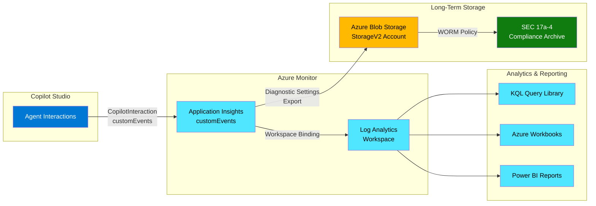

# Architecture

This document describes the data flow and component architecture of the Agent Observability Foundation solution.

## Data Flow Overview

The telemetry pipeline captures Copilot Studio agent interactions and routes them through Azure Monitor services for operational visibility and long-term compliance archival. The architecture establishes two distinct data paths: an operational path for real-time monitoring and a compliance path for immutable audit retention.

## Component Details

### Application Insights

**Type:** Workspace-based Application Insights
**Kind:** web
**Retention:** 730 days
**Data Captured:** CopilotInteraction customEvents with session metrics, message counts, completion status

Application Insights captures telemetry from Copilot Studio agents via the built-in Application Insights connector. Events flow to the customEvents table with schema fields including:

- `name`: Event type (e.g., "CopilotInteraction", "CopilotMessage")
- `customDimensions`: JSON payload with conversation context
- `timestamp`: Event occurrence time (UTC)
- `session_Id`: Conversation session identifier

**Framework Control Reference:** Primary evidence for Control 1.7 (Comprehensive Audit Logging) - captures the complete interaction audit trail required for FINRA 4511 and SEC 17a-3/4 compliance.

### Log Analytics Workspace

**SKU:** PerGB2018 (pay-as-you-go)
**Interactive Retention:** 730 days
**Total Retention:** 730 days
**Query Capability:** Real-time KQL queries across all ingested data

The Log Analytics workspace serves as the unified query surface for telemetry data. Application Insights binds to this workspace, enabling cross-resource correlation and centralized monitoring.

**Configuration Notes:**
- Set BOTH `retentionInDays=730` AND `totalRetentionInDays=730` for full 2-year interactive access
- Archive retention beyond 730 days requires Azure Blob Storage (StorageV2) export (configured via Diagnostic Settings)

**Framework Control Reference:** Supports Control 3.2 (Usage Analytics and Activity Monitoring) by providing real-time query capability for session metrics, message volumes, and interaction patterns.

### Azure Blob Storage (StorageV2) Account

**Type:** StorageV2 (general-purpose v2)
**Hierarchical Namespace:** DISABLED (required for Diagnostic Settings export)
**Replication:** Standard_GRS (geo-redundant storage)
**Export Method:** Diagnostic Settings with AppTraces and AppEvents log categories

The storage account receives telemetry exports via Azure Monitor Diagnostic Settings. Data is stored in JSON format organized by date hierarchy.

**Critical Configuration:**
- Do NOT enable hierarchical namespace - Diagnostic Settings export does not support StorageV2 with hierarchical namespace enabled
- WORM policy configuration is manual (see [docs/worm-configuration.md](docs/worm-configuration.md)) to prevent accidental immutable lockdown

**Framework Control Reference:** Helps meet SEC 17a-4 long-term retention requirements when configured with WORM policy for immutable storage.

### Diagnostic Settings

**Export Categories:**
- `AppTraces`: Application trace logs
- `AppEvents`: Custom events including CopilotInteraction

**Retention Policy:** Configured at storage account level (separate from Log Analytics retention)

Diagnostic Settings establish the export pipeline from Application Insights to Azure Blob Storage (StorageV2). This enables retention periods beyond the 730-day Log Analytics maximum.

### RBAC Separation

The architecture establishes two distinct access paths to support separation of duties:

| Data Path | Role | Scope | Access | Purpose |
|-----------|------|-------|--------|---------|
| Operational | Monitoring Reader | Resource Group | Log Analytics queries | Real-time monitoring, troubleshooting |
| Compliance | Storage Blob Data Reader | Storage Account | Azure Blob Storage access | Audit evidence retrieval, regulatory examination |

**Framework Control Reference:** Supports Control 1.6 (DSPM for AI) separation of duties by isolating operational monitoring from compliance audit access. Also supports Control 2.8 (Access Control and Segregation of Duties) by enforcing distinct roles for different data access patterns.

## Separation of Duties

| Data Path | Role Assignment | Resource Access | Primary Use Case |
|-----------|-----------------|-----------------|------------------|
| Operational Monitoring | Monitoring Reader | Log Analytics Workspace | SOC analysts - real-time queries, alerts, incident response |
| Compliance Audit | Storage Blob Data Reader | Azure Blob Storage (StorageV2) Account | Compliance officers - audit evidence, regulatory examination |
| Infrastructure Admin | Contributor | Resource Group | Platform operations - deployment, configuration changes |

This separation ensures that:
1. SOC analysts can query telemetry without accessing compliance archives
2. Compliance officers can retrieve audit evidence without modifying operational settings
3. Changes to telemetry infrastructure require elevated permissions with audit trail

## Data Retention Tiers

| Tier | Storage Location | Retention Period | Query Access | Primary Use Case |
|------|------------------|------------------|--------------|------------------|
| Hot | Log Analytics interactive | 730 days | Real-time KQL | Daily operations, incident response, performance monitoring |
| Archive | Azure Blob Storage (StorageV2) export | 6+ years (with WORM) | Search jobs / blob access | SEC 17a-4 audit, regulatory examination, legal hold |

**Retention Configuration Notes:**
- Log Analytics 730-day retention satisfies SEC 17a-4(b)(4) 2-year requirement for interactive access
- Azure Blob Storage (StorageV2) with WORM policy satisfies SEC 17a-4(a) 6-year requirement for immutable archival
- Cohasset has validated Azure Blob Storage immutable storage for SEC 17a-4(f) compliance

## Analytics & Reporting Components

### KQL Query Library

A library of 14 pre-built KQL queries for common telemetry analysis patterns:
- Session analytics (volume, duration, completion rates)
- Performance metrics (latency distribution P50/P95/P99)
- Error analysis (failure rates, exception patterns)
- Governance evidence collection (audit trail extraction)

### Azure Monitor Workbooks

Three interactive workbooks for operational dashboards:
- Operational Health (4 tabs): Overview, Availability, Error Rates, Latency
- Error Diagnostics (5 tabs): Summary, Drill-Down, Root Cause, Event Detail
- Usage Overview (5 tabs): Adoption, Engagement, Channel Distribution, GenAI Quality

### Alert Rules

Proactive alerting with dynamic thresholds:
- ALRT-01: High failure rate detection
- ALRT-02: Latency regression detection
- ALRT-03: Abnormal usage (bidirectional)

### Power BI Integration

Executive reporting via Power BI:
- Cross-agent comparison dashboards
- Business outcome correlation
- ROI and adoption metrics
- Regulatory compliance summaries

## Regulatory References

| Regulation | Requirement | How This Architecture Supports |
|------------|-------------|-------------------------------|
| **SEC 17a-4** | 2-year accessibility (b)(4), 6-year retention (a), immutable storage (f) | 730-day Log Analytics + Azure Blob Storage (StorageV2) export with WORM policy capability |
| **FINRA 4511** | Books and records retention, audit trail | Application Insights customEvents with full interaction capture |
| **SOX 302/404** | Internal controls documentation, evidence preservation | Immutable ProvisioningLog, quarterly evidence export |
| **SR 11-7** | Model risk management, ongoing monitoring | Telemetry foundation for performance monitoring and model validation |

---

*Architecture version: 0.1.0*
*Last updated: February 2026*
