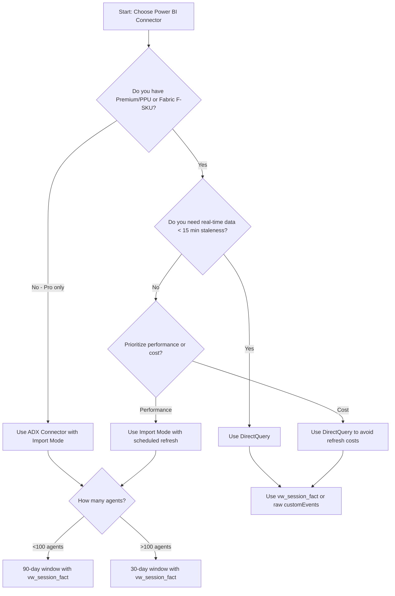

# Connector Decision Matrix: ADX Connector vs DirectQuery

## Overview

Two paths to connect Power BI to your agent observability telemetry. Choose based on licensing, performance, and data freshness requirements.

This document helps administrators select the appropriate connector method for integrating Power BI with Application Insights / Log Analytics telemetry. Both approaches are fully supported and documented equally.

## Decision Matrix

| Criteria | ADX Connector (Import) | DirectQuery |
|----------|----------------------|-------------|
| **License Required** | Power BI Pro ($10/user/month) | Premium/PPU ($20/user/month) or Fabric F-SKU |
| **Data Freshness** | Scheduled refresh (1-8x/day Pro, 1-48x/day Premium) | Real-time (live queries) |
| **Dataset Size Limit** | 1 GB (Pro), 10 GB (Premium) | No dataset limit (queries on-demand) |
| **Query Performance** | Fast (data cached locally) | Depends on Log Analytics query speed |
| **Recommended For** | Daily/weekly executive review, small-medium deployments (<100 agents) | Real-time monitoring, large deployments (>100 agents), event-level drill-down |
| **Pre-Aggregation** | Required (use vw_session_fact KQL function) | Optional (can query raw events) |
| **Offline Access** | Yes (cached data) | No (requires network) |
| **RLS Overhead** | Minimal (filtered at import) | Per-query evaluation |
| **Cost Impact** | KQL query cost at refresh time only | KQL query cost per visual interaction |
| **Best Use Case** | Compliance reporting, board presentations, historical trend analysis | Operations monitoring, incident investigation, real-time alerting |

## Decision Flowchart



**Quick Decision Guide:**

1. **Do you have Premium/PPU or Fabric F-SKU?**
   - **NO (Pro only)** → Use ADX Connector with Import mode
   - **YES** → Continue to next question

2. **Do you need real-time data (< 15 min staleness)?**
   - **YES** → Use DirectQuery (requires Premium/PPU/Fabric)
   - **NO** → Import mode offers better performance

3. **How many agents are you monitoring?**
   - **< 100 agents** → 90-day window recommended
   - **> 100 agents** → 30-day window or use pre-aggregation

4. **Will you drill down to event-level detail?**
   - **YES** → DirectQuery recommended (high volume)
   - **NO** → Import mode with session-level aggregation

## ADX Connector Setup (Import Mode)

The Azure Data Explorer (ADX) connector supports Import mode with scheduled refresh.

### Prerequisites

- Power BI Desktop (June 2022 or later)
- Power BI Pro license (minimum)
- Read access to Log Analytics workspace
- KQL functions deployed to workspace ([see deployment guide](../README.md))

### Step-by-Step Configuration

**1. Open Power BI Desktop**

Launch Power BI Desktop and start a new report.

**2. Get Data → Azure Data Explorer (Kusto)**

- Click **Get Data** from Home ribbon
- Search for "Azure Data Explorer"
- Select **Azure Data Explorer (Kusto)**
- Click **Connect**

**3. Enter Workspace Connection Details**

In the connection dialog:

- **Cluster:** Enter your Log Analytics workspace URL
  - Format: `https://api.loganalytics.io/v1/workspaces/{workspace-id}`
  - Find workspace ID in Azure Portal → Log Analytics workspace → Properties
- **Database:** Leave blank (Log Analytics uses workspace as database)
- Click **OK**

**4. Authenticate**

- Select **Organizational account**
- Click **Sign in**
- Authenticate with Microsoft Entra ID account that has read access to the workspace
- Click **Connect**

**5. Call KQL Function**

In the query editor, paste the KQL function call:

```kql
vw_session_fact(datetime(2026-01-01), datetime(2026-03-31))
```

Adjust date range based on your Pro license 1GB limit:
- **Pro license:** 90-day max for <100 agents, 30-day for >100 agents
- **Premium license:** 10GB limit allows larger date ranges

**6. Select Import Mode**

- In the connection dialog, select **Import**
- Click **Load**

Power BI will import the data into local storage.

**7. Configure Scheduled Refresh**

After publishing to Power BI Service:

- Navigate to workspace → Datasets
- Click on your dataset → Settings
- Expand **Scheduled refresh**
- Configure refresh frequency:
  - **Pro:** Up to 8 refreshes/day
  - **Premium:** Up to 48 refreshes/day
- Enter credentials for data source
- Click **Apply**

### Import Mode Best Practices

**Date Range Sizing:**

- Monitor dataset size in Power BI Desktop → View → Data view → File size
- Reduce date range if approaching 1GB (Pro) or 10GB (Premium)
- Use pre-aggregated functions (vw_session_fact) instead of raw events (vw_event_fact)

**Refresh Scheduling:**

- Daily refresh at 6 AM UTC for morning executive review
- Multiple daily refreshes for operational reports (Premium only)
- Avoid refresh during peak query hours to minimize Log Analytics cost

**Performance Optimization:**

- Remove unused columns in Power Query
- Disable auto-date/time tables (File → Options → Data Load)
- Use column filters in KQL function (not Power Query)

## DirectQuery Setup

DirectQuery mode queries Application Insights / Log Analytics in real-time without importing data.

### Prerequisites

- Power BI Desktop (June 2022 or later)
- **Power BI Premium, Premium Per User (PPU), or Fabric F-SKU** (DirectQuery not supported in Pro)
- Read access to Log Analytics workspace
- KQL functions deployed to workspace

### Step-by-Step Configuration

**1. Open Power BI Desktop**

Launch Power BI Desktop and start a new report.

**2. Get Data → Azure Data Explorer (Kusto)**

- Click **Get Data** from Home ribbon
- Search for "Azure Data Explorer"
- Select **Azure Data Explorer (Kusto)**
- Click **Connect**

**3. Enter Workspace Connection Details**

In the connection dialog:

- **Cluster:** Enter your Log Analytics workspace URL
  - Format: `https://api.loganalytics.io/v1/workspaces/{workspace-id}`
- **Database:** Leave blank
- Click **OK**

**4. Authenticate**

- Select **Organizational account**
- Click **Sign in**
- Authenticate with Microsoft Entra ID account
- Click **Connect**

**5. Enter KQL Query**

You have two options:

**Option A: Session-level aggregation (recommended for dashboards)**

```kql
vw_session_fact(datetime(2026-01-01), datetime(2026-03-31))
```

**Option B: Event-level detail (for drill-through pages)**

```kql
vw_event_fact(datetime(2026-02-01), datetime(2026-02-07))
```

**Option C: Raw customEvents table**

```kql
customEvents
| where timestamp > ago(7d)
| where name in ("BotMessageReceived", "BotMessageSend")
| where tostring(customDimensions['DesignMode']) == "False"
```

**6. Select DirectQuery Mode**

- In the connection dialog, select **DirectQuery**
- Click **Load**

Power BI will create a live connection to the workspace.

**7. Publish to Premium Workspace**

- Click **Publish** from Home ribbon
- Select a workspace with **Premium/PPU/Fabric** capacity
- Click **Select**

**DirectQuery reports will not work in Pro workspaces.**

### DirectQuery Best Practices

**Query Optimization:**

- Use pre-aggregated KQL functions (vw_session_fact) to reduce query execution time
- Limit visual count per page (each visual = separate query)
- Use page-level filters instead of visual-level filters
- Avoid Top N filters on large datasets

**Cost Management:**

- Each visual refresh triggers a billable KQL query
- Use automatic page refresh sparingly (increases query cost)
- Consider scheduled refresh Import mode for static executive reports
- Reserve DirectQuery for real-time operational dashboards

**Performance Monitoring:**

- Use Performance Analyzer (View → Performance Analyzer) to identify slow visuals
- Optimize KQL queries based on execution time
- Add indexes to Log Analytics workspace if query patterns are stable

## .pbit Template Deployment (Planned)

> **Status:** The `.pbit` template is planned for a future release. Until then, use the TMDL import path described in the [Power BI Integration Guide](power-bi-integration.md). All TMDL source files, DAX measures, and KQL functions are available today.

The `.pbit` (Power BI Template) file will provide parameterized quick-start deployment when available.

### Planned Parameters

When the template is released, it will prompt for:

| Parameter | Example Value | Description |
|-----------|---------------|-------------|
| **Workspace URL** | `https://api.loganalytics.io/v1/workspaces/abc123...` | Log Analytics workspace URL |
| **Start Date** | `2026-01-01` | Reporting period start (YYYY-MM-DD) |
| **End Date** | `2026-03-31` | Reporting period end (YYYY-MM-DD) |
| **Connection Mode** | `Import` or `DirectQuery` | Choose based on decision matrix above |

### Current Deployment Path (TMDL Import)

Until the `.pbit` template is available, deploy using TMDL:

1. Open Power BI Desktop → File → Open → Browse to `semantic-model/` directory
2. Power BI imports the TMDL files (database, tables, relationships, measures, RLS)
3. Configure data source connection to your Log Analytics workspace
4. Publish to Power BI Service

See [Power BI Integration Guide](power-bi-integration.md) for detailed steps.

**6. Validate Measures (IMPORTANT)**

**Known .pbit note:** DAX measures may not persist when opening .pbit files in some Power BI Desktop versions.

To validate:

- Click on **Model** view (left sidebar)
- Select `FactAgentSessions` table
- Verify measures exist in Fields pane:
  - `Total Sessions`
  - `Total Messages`
  - `Avg Latency`
  - `Completion Rate %`
  - `Session Trend`

**If measures are missing:**

- Import measures from `measures/session-metrics.dax`
- Copy/paste DAX code into new measures
- See [Troubleshooting](#known-limitations-and-troubleshooting) below

**7. Publish to Power BI Service**

- Click **Publish** from Home ribbon
- Select workspace (must be Premium/PPU/Fabric for DirectQuery)
- Click **Select**

**8. Configure Refresh (Import Mode Only)**

After publishing:

- Navigate to Power BI Service → Workspace → Datasets
- Click dataset → Settings → Scheduled refresh
- Configure frequency and credentials
- Click **Apply**

## Mixed Mode (Import + DirectQuery)

Power BI Premium, PPU, and Fabric support **composite models** combining Import and DirectQuery.

### When to Use Mixed Mode

| Scenario | Import Tables | DirectQuery Tables |
|----------|---------------|-------------------|
| **Historical + Real-time** | Session facts (past 12 months) | Recent sessions (past 7 days) |
| **Small dimensions + Large facts** | Agent, Zone, Regulation dimensions | Event-level fact |
| **Static + Dynamic** | Control catalog, regulation mapping | Live telemetry |

### Configuration

**1. Import Static Dimensions**

- Load `vw_dim_agent()`, `vw_dim_regulation_control()` in Import mode
- These tables change infrequently, no need for real-time

**2. DirectQuery Dynamic Facts**

- Load `vw_event_fact()` in DirectQuery mode
- Real-time drill-down for incident investigation

**3. Configure Composite Model**

- Power BI automatically detects mixed mode
- Relationships work across Import and DirectQuery tables
- RLS applies to both modes

**Limitations:**

- Mixed mode requires Premium/PPU/Fabric (not available in Pro)
- Some DAX functions restricted in composite models
- Aggregations may be needed for performance

## Known Limitations and Troubleshooting

### ADX Connector Limitations

| Issue | Cause | Resolution |
|-------|-------|------------|
| 1GB dataset limit (Pro) | Too many rows or wide schema | Reduce date range, use pre-aggregation (vw_session_fact), remove unused columns |
| Refresh fails with timeout | KQL query exceeds 10-minute limit | Optimize KQL function, reduce date range, add summarize operations |
| Slow refresh | Large dataset transfer | Use Basic Logs tier for export, enable parallel query in KQL |

### DirectQuery Limitations

| Issue | Cause | Resolution |
|-------|-------|------------|
| Visuals load slowly | Complex KQL query or large result set | Use pre-aggregated functions, limit visual count per page |
| "DirectQuery not supported" error | Published to Pro workspace | Publish to Premium/PPU/Fabric workspace |
| High query cost | Frequent automatic page refresh | Reduce refresh frequency, use scheduled refresh Import mode for static reports |

### .pbit Template Issues (When Available)

| Issue | Cause | Resolution |
|-------|-------|------------|
| Measures missing after opening | Known Power BI Desktop bug (versions 2.125-2.130) | Manually import measures from `measures/*.dax` files, or update to latest Power BI Desktop |
| Parameters not prompting | Template opened in Edit mode | Close and reopen file — parameters prompt on first open only |
| Relationships broken | Schema mismatch between template and KQL functions | Verify KQL function output columns match TMDL table definitions |

> **Note:** The `.pbit` template is planned for a future release. Use TMDL import path until then.

### Authentication Issues

| Issue | Cause | Resolution |
|-------|-------|------------|
| "Unauthorized" error | User lacks read access to workspace | Grant Monitoring Reader role in Azure Portal → Log Analytics workspace → Access control (IAM) |
| Refresh fails in Service | Dataset credentials not configured | Power BI Service → Dataset → Settings → Data source credentials → Edit → Sign in |
| MFA prompts repeatedly | Cached credentials expired | Clear credentials: Power BI Desktop → File → Options → Security → Clear all credentials |

### Performance Optimization

**If Import refresh takes > 5 minutes:**

1. Check KQL function execution time in Log Analytics portal
2. Add indexes to Log Analytics workspace (requires Premium tier)
3. Reduce date range or use coarser aggregation (weekly instead of daily)
4. Enable parallel queries in KQL function

**If DirectQuery visuals take > 10 seconds:**

1. Use Performance Analyzer to identify slow queries
2. Simplify visual filters (page-level instead of visual-level)
3. Pre-aggregate data in KQL function
4. Reduce cardinality of dimensions (zone instead of agent)

### Getting Help

**For Power BI issues:**
- [Power BI Community Forums](https://community.powerbi.com/)
- [Power BI Documentation](https://learn.microsoft.com/power-bi/)

**For KQL query optimization:**
- [Kusto Query Language Reference](https://learn.microsoft.com/azure/data-explorer/kusto/query/)
- [Log Analytics Query Best Practices](https://learn.microsoft.com/azure/azure-monitor/logs/query-optimization)

**For FSI-AgentGov framework:**
- [Control Catalog](https://github.com/judeper/FSI-AgentGov/blob/main/docs/controls/CONTROL-INDEX.md)
- [Governance Mapping](../../governance-mapping.md)

## Related Documentation

- [Power BI Integration Guide](power-bi-integration.md) - Full deployment and customization guide
- [Power BI Solution README](../README.md) - Quick-start overview
- [Viva Insights Scope](viva-insights-scope.md) - Copilot Studio adoption metrics
- [Agent Observability Foundation](../../README.md) - Parent solution architecture

---

*Last Updated: February 2026*
*Version: 1.2.0*
