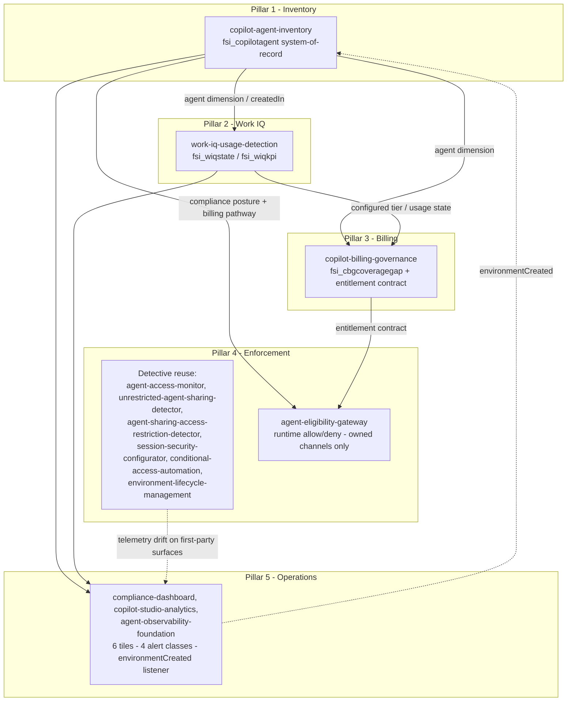

# Governance Platform Composition — Copilot Agent Governance

> **Cloud scope.** This content targets **US commercial Microsoft 365 /
> Power Platform** only. Other Microsoft cloud environments are out of scope;
> verify applicability independently with Microsoft.

This is a **composition (wiring) guide**, not a flow export. It maps the five
pillars of the Copilot agent governance platform to the four net-new solutions
in the `feat/copilot-agent-governance` wave and to the solutions that already
ship in this repository, so the new work *composes with* what exists rather than
duplicating it. No Power Automate flow JSON is included here; build flows from
each solution's own `docs/flow-configuration.md`.

The design follows two principles:

- **Read, don't re-scan.** `copilot-agent-inventory` is the single
  system-of-record for the agent dimension. Downstream solutions join against it
  instead of independently enumerating the platform.
- **Native-first, then close the gap.** Reuse the platform's native sharing,
  DLP, Managed Environment, and Conditional Access controls — plus this
  repository's existing detective solutions — before adding net-new runtime
  middleware. New code targets only what is genuinely missing.

## The five pillars at a glance

| Pillar | Capability | Primary solution(s) | New or reuse |
|--------|-----------|---------------------|--------------|
| 1 | Inventory (system-of-record) | `copilot-agent-inventory` | New (foundation) |
| 2 | Work IQ usage detection | `work-iq-usage-detection` | New (reads Pillar 1) |
| 3 | Consumption billing governance | `copilot-billing-governance` | New (reads Pillars 1–2) |
| 4 | Enforcement (`compose-enforcement`) | existing detective solutions + `agent-eligibility-gateway` | Reuse + new runtime gateway |
| 5 | Operations (`compose-operations`) | `compliance-dashboard`, `copilot-studio-analytics`, `agent-observability-foundation` | Reuse + net-new signals |

## Pillar 1 — Inventory (`copilot-agent-inventory`)

`copilot-agent-inventory` (CAI) is the **tier-1 foundation and system-of-record**.
It runs a three-layer discovery (Azure Resource Graph → per-environment Dataverse
`bot` / `botcomponent` → PPAC reconciliation) and normalizes the result into the
canonical eight-entity store keyed on `fsi_copilotagent`. The Azure Resource Graph
`createdIn` field disambiguates Copilot Studio agents from Agent Builder agents.

A current, reconciled inventory is **required for** agent-registry control 1.2 and
**supports compliance with** the record-keeping expectations of FINRA Rule 4511
and SEC Rule 17a-3 / 17a-4 — a documented inventory is a prerequisite for the
records those rules describe. It does not, on its own, satisfy any regulation;
organizations should verify their configuration meets their specific obligations.

Every other pillar consumes the `fsi_copilotagent` agent dimension from CAI:

- Pillar 2 keys its configuration read on the CAI `createdIn` value.
- Pillar 3 reads the agent dimension rather than re-discovering it.
- Pillar 4's runtime gateway reads each agent's compliance posture and billing
  pathway from the CAI store via managed identity.

> **Boundary note.** CAI owns the canonical *discovery* store `fsi_copilotagent`.
> `agent-registry-automation` continues to operate its registration and approval
> workflow over the legacy `fsi_agentinventory` table; the two are complementary,
> and the CAI ↔ ARA boundary is flagged for ratification in the CAI README.

## Pillar 2 — Work IQ usage detection (`work-iq-usage-detection`)

`work-iq-usage-detection` (WIQ) is a tier-2 collector that **reads the inventory
store** and adds a two-tier (configuration + telemetry) view of Microsoft 365
Work IQ usage:

- **Tier-A (configuration)** — *can* the agent use Work IQ — from Dataverse
  metadata (`botcomponent` component types 18 / 15 / 16, `aipluginoperation`,
  `bot.configuration`), keyed on the CAI `createdIn` value.
- **Tier-B (telemetry)** — *did* the agent invoke Work IQ, and by whom — from
  Microsoft Defender XDR `CloudAppEvents`, Application Insights `customEvents`,
  and Purview audit (`CopilotInteraction`, `AIPluginOperation`).

The controlled join produces one `fsi_wiqstate` row per agent in a canonical
**four-state** observed-usage model (*Not configured*, *Configured-not-observed*,
*Observed-invoking*, *Exception-unknown*) plus an `fsi_wiqkpi` rollup. This data
**supports** per-zone generative-AI feature-enablement governance (control 2.24)
and feeds Pillar 5 analytics (controls 3.2, 2.9).

> **GA gating.** Work IQ GA is 2026-06-16; the `use-work-iq` capability is preview
> at scaffold time. WIQ is built GA-ready behind the short-lived
> `WorkIqGa20260616` feature flag, removed after GA.

## Pillar 3 — Consumption billing governance (`copilot-billing-governance`)

`copilot-billing-governance` (CBG) is a tier-2 solution that **reads — rather than
re-discovers — the agent dimension from `copilot-agent-inventory` and the usage
tier from `work-iq-usage-detection`**. It governs Copilot consumption billing:

- The two policy objects — pay-as-you-go (PAYG) and prepaid credits.
- A switch-on-pathway entitlement engine evaluating per-(agent, user) eligibility.
- Per-agent caps.
- A pre-enforcement **coverage-gap** analysis written to `fsi_cbgcoveragegap`,
  run in monitor-only mode before any spend control is turned on.

CBG **supports compliance with** control 3.5 (Cost Allocation and Budget Tracking)
and **contributes to** controls 1.18 (Application-Level Authorization and RBAC)
and 1.14 (Data Minimization and Agent Scope Control). The entitlement contract it
produces is the same contract Pillar 4's gateway applies at runtime.

> **Upstream dependency.** Copilot Credits consumption billing applies from
> 2026-06-16; credit policies are Chat-only today. CBG is built to read both
> policy objects as they reach general availability.

## Pillar 4 — Enforcement (`compose-enforcement`)

Enforcement is **native-first and detection-strong today**; the net-new piece is a
runtime gateway for owned channels. The composition reuses existing detective
solutions and adds one new solution.

### Reuse: native controls + existing detective solutions

| Solution | Controls | Role in enforcement |
|----------|----------|---------------------|
| `agent-access-monitor` | 3.8 | Detects overly permissive environment agent-access settings against zone requirements |
| `unrestricted-agent-sharing-detector` | 1.1, 3.8 | Continuous detection of overly permissive agent sharing |
| `agent-sharing-access-restriction-detector` | 1.18, 2.8 | Zone-based agent-sharing policy with approval workflow |
| `session-security-configurator` | 1.23, 1.11 | Session-security validation per zone with drift detection |
| `conditional-access-automation` | 1.11, 1.23, 1.18 | Conditional Access policy deployment, compliance monitoring, drift detection |
| `environment-lifecycle-management` | 2.1, 2.2, 2.8, 1.7 | Managed Environment provisioning and zone-based governance |

Together these provide detection over native sharing, DLP, and Managed
Environment controls. Detection is strong across all surfaces; the gap they do
**not** close is a hard allow/deny at request time.

### New: runtime gateway, owned channels only (`agent-eligibility-gateway`)

`agent-eligibility-gateway` (AEG) is an **optional** Azure API Management gateway
that performs a runtime allow/deny decision in front of an agent endpoint. It
validates the caller's Microsoft Entra ID token (`validate-jwt`: audience,
issuer, `tid` claim), checks audience / Viewers membership, reads compliance
posture and billing pathway from the CAI store, applies the corrected billing
entitlement contract from Pillar 3, and writes one decision record per request to
`fsi_aegdecisionlog`. It **supports compliance with** controls 1.1, 1.18, and 3.8.

The scope boundary is deliberate:

| Channel | Gateway applies? | How governed |
|---------|------------------|--------------|
| Owned custom web chat (Direct Line / Web Chat) | **Yes** | Runtime allow/deny at the APIM gateway |
| Direct Line API (owned client/app) | **Yes** | Runtime allow/deny at the APIM gateway |
| Microsoft Teams | No | Native Managed Environment sharing + telemetry-drift detection |
| Microsoft 365 Copilot | No | Native controls + telemetry-drift detection |
| SharePoint | No | Native controls + telemetry-drift detection |

**First-party surfaces (Teams, Microsoft 365 Copilot, SharePoint) cannot host
custom middleware**, so the gateway cannot sit in front of them. Those surfaces
rely on native sharing/audience controls (which apply with roughly an hour of
enforcement latency) plus the detective telemetry-drift solutions above. Runtime
enforcement via AEG and detective drift on first-party channels are
complementary layers, not interchangeable substitutes.

## Pillar 5 — Operations (`compose-operations`)

Operations **reuses** the repository's existing dashboards, telemetry, and runbook
pattern, and lights up net-new signals from the two new collectors.

### Reuse: existing operations solutions

| Solution | Controls | Role in operations |
|----------|----------|--------------------|
| `compliance-dashboard` | 3.3, 3.1, 3.2, 3.4 | Aggregated compliance reporting and zone-based filtering; hosts the net-new tiles |
| `copilot-studio-analytics` | 3.2 | Business-impact analytics for Copilot Studio agents |
| `agent-observability-foundation` | 1.7, 2.8, 2.9, 3.2 | Telemetry infrastructure, operational workbooks, and proactive alerting; hosts the net-new alert classes and the reactive listener |

### Net-new signals from the two new collectors

The two new collectors — `copilot-agent-inventory` (Pillar 1) and
`work-iq-usage-detection` (Pillar 2) — light up **six net-new dashboard tiles**,
**four alert classes**, and a **reactive `environmentCreated` listener**. These
are wired into the existing operations solutions above rather than shipped as a
separate dashboard.

**Six net-new dashboard tiles** (rendered in `compliance-dashboard`, with
business-impact context in `copilot-studio-analytics`):

1. **Inventory coverage** — discovered vs. PPAC-reconciled agents (CAI).
2. **Inventory freshness** — age of the most recent reconciled scan (CAI).
3. **Work IQ observed-usage distribution** — the four-state breakdown across the
   estate (WIQ `fsi_wiqstate`).
4. **Work IQ configured-not-observed exceptions** — agents able to use Work IQ
   that show no runtime invocation (WIQ `fsi_wiqkpi`).
5. **Work IQ exception-unknown** — natively configured agents missing expected
   telemetry, surfaced for follow-up (WIQ).
6. **Per-zone feature-enablement posture** — Work IQ enablement vs. zone policy,
   the join Pillars 2 and 5 share (WIQ + zone classification).

**Four alert classes** (raised through `agent-observability-foundation` proactive
alerting):

1. **Inventory reconciliation gap** — an agent present in Azure Resource Graph but
   absent from the Dataverse scan (or vice versa).
2. **Stale inventory** — reconciled scan age beyond the zone threshold.
3. **Work IQ exception-unknown** — a natively configured agent whose runtime
   telemetry is missing.
4. **Out-of-policy Work IQ usage** — *Observed-invoking* in a zone where the
   feature is not approved.

**Reactive `environmentCreated` listener:** an event-driven trigger on the Power
Platform / Managed Environment `environmentCreated` signal kicks off an
incremental `copilot-agent-inventory` scan, so a newly created environment is
brought into the system-of-record between nightly batch runs. This composes with
`environment-lifecycle-management`, which provisions environments under zone-based
governance: when a new environment appears, the listener keeps the inventory
current without waiting for the next scheduled discovery.

## FNF People-capability sweep — composition lens

> **Context and scope.** This section documents a specialized composition lens built on
> Pillars 1–3 for a financial services organization running approximately 2,000 Microsoft
> 365 Copilot declarative agents. The governance question is: *which agents expose the
> declarative `People` capability to users who lack a paid M365 Copilot license and are
> not covered by PAYG, and how many such users are shared with that agent?* The lens
> **supports compliance with** control 1.18 (Application-Level Authorization and RBAC)
> and **contributes to** control 3.5 (Cost Allocation and Budget Tracking). It does not
> perform real-time enforcement; it is a detection and reporting composition.
>
> **Cloud scope.** US commercial Microsoft 365 only; verify applicability for other
> cloud environments independently.

### What this lens governs

| Dimension | In scope | Out of scope |
|-----------|----------|--------------|
| Capability | Declarative `People` (org chart + profile) | Work IQ; other manifest capabilities |
| Entitlement | Paid M365 Copilot service-plan; PAYG / Copilot Credits | Guest users; non-M365 workloads |
| Audience | Sharing groups → expanded UPN list | In-agent AAD group membership at prompt time |
| Output | Blocked-user count + `coverageStatus` per People-capable agent | Real-time enforcement; auto-remediation |

### The chain: CAI → CBG → engine → FNF report

The sweep composes four existing solutions in a fixed pipeline.

#### Step 1 — Capability detection (`copilot-agent-inventory`)

CAI reads each agent's `declarativeAgent.json` manifest and records an
`fsi_caiagentfeature` row when `capabilities[].name == "People"` with
`fsi_isenabled = true`. The detection requires the manifest file to be readable; Work IQ
telemetry cannot substitute for it (see Architecture facts below).

For agents built with Microsoft 365 Agents Toolkit the manifest is read from
source-controlled `appPackage/declarativeAgent.json`. For other provenance paths the
manifest must be supplied via `--source local-package` or a resolved id-map. Agents
without a readable manifest are not silently dropped; they are flagged as provisional
coverage gaps (see Coverage model below).

#### Step 2 — Audience expansion (`copilot-agent-inventory`)

For each People-capable agent, `expand_audience_upns.py` resolves the agent's sharing
groups from `fsi_caiauthshare` and expands them to a UPN list written to the
`audience-upn-list` artifact. Agents shared with the whole organization
(`wholeTenant = true`) emit an empty `intendedUsers[]`; the lens handles them as a
separate `coverageStatus = "Partial"` row — they are not silently assigned "0 blocked"
(see Integration caveats below).

#### Step 3 — Entitlement scoring (`copilot-billing-governance`)

The CBG resolver (`Get-CopilotEntitlement.ps1`) evaluates each UPN against:

1. A **paid M365 Copilot service-plan allowlist** — checked via
   `GET /v1.0/users/{id}/licenseDetails` with `provisioningStatus == "Success"`.
2. **PAYG / Copilot Credits eligibility** — whether the user is in an "All Users" scope
   or in a security group linked to a connected billing policy.

The resolver is **fail-closed on uncertainty**: users whose license state cannot be
determined are routed to `needsManualReview`, not silently counted as "allowed."

The entitlement engine (`Invoke-EntitlementEvaluation.ps1`) then classifies each
(agent, user) pair as `Block`, `Allow`, `Fail-open-Anomaly`, or
`Fail-closed-ZeroRatingUnresolved` and writes results to
`fsi_cbgentitlementmaterialized`.

#### Step 4 — FNF report

The lens joins `fsi_caiagentfeature` (People filter), the audience artifact, and the
engine decisions to produce one report row per People-capable agent:

| Report field | Source |
|---|---|
| `agentId`, `agentName` | `fsi_copilotagent` |
| `audienceMode` | `audience-upn-list.agents[].wholeTenant` → `WholeTenant \| GroupScoped` |
| `coverageStatus` | Rolled-up from audience `resolutionStatus`, CBG `unresolvedCount`, engine anomalies |
| `coverageGaps[]` | Named gaps: `manifest-id-unreconciled`, `audience-truncated`, `audience-resolution-errors`, `audience-wholetenant-not-enumerated`, `entitlement-unresolved-users`, `payg-policy-needs-manual-review`, `pathway-unmapped-fail-open` |
| `blockedUserCount`, `blockedUsers[]` | `fsi_cbgentitlementmaterialized` where `fsi_decision = Block` |
| `totalAudience` | `audience-upn-list.agents[].audienceSize` (0 / null for whole-tenant) |

`coverageStatus = "Partial"` is emitted whenever any of the named gaps is present.
A `coverageStatus = "Complete"` row represents a fully scored agent with no audience
or entitlement gaps — it does not imply the agent's sharing or licensing posture is
acceptable; it means the data for that agent is complete enough to produce a reliable
blocked-user count.

---

### Corrected architecture facts

The following facts were adversarially verified (GATE0a, GATE0b, R6) and differ from
common assumptions that should not be carried into implementations.

#### `People` is a declarative-agent manifest capability — not Work IQ

`People` is expressed as `{ "name": "People" }` inside `declarativeAgent.json`
(manifest schema v1.5+) and enables grounding on org-chart and profile data for that
specific agent. It is a per-agent manifest declaration — **distinct from Work IQ** in
layer, detection surface, and admin governance:

| Attribute | `People` capability | Work IQ |
|---|---|---|
| Layer | Per-agent declarative manifest | Tenant-level Copilot intelligence layer |
| Where defined | `declarativeAgent.json` → `capabilities[].name` | M365 admin center; Copilot and Dataverse settings |
| How detected | Manifest parse (CAI) | `fsi_wiqstate` four-state model (Pillar 2) |
| Runtime telemetry signal | **None documented (R6)** | Purview `AISystemPlugin[]` (documented Ids: `BingWebSearch`, `EnterpriseSearch`) |

**Work IQ telemetry does not detect the declarative `People` capability.** Across all
tested surfaces as of 2026-06-11 — Purview Audit `CopilotInteraction.AISystemPlugin[]`,
Defender XDR `CloudAppEvents`, Application Insights, and Microsoft Graph `aiInteraction`
— no documented, distinct, queryable signal fires when People grounding is invoked
(R6 adversarial research). Build no automated detection on an inferred
`AISystemPlugin[].Id == "People"` until validated live in a tenant post-GA.

#### License detection is service-plan–based; display names are not contracts

The CBG resolver checks paid entitlement against **service-plan GUIDs** read from
`GET /v1.0/users/{id}/licenseDetails`. The **eight** service plans that constitute a paid
M365 Copilot entitlement — the six `M365_COPILOT_*` plans plus two sibling plans bundled in
the same paid SKU (GATE0b 8-GUID allowlist; Microsoft licensing-service-plan reference):

| `servicePlanName` | `servicePlanId` |
|---|---|
| `M365_COPILOT_BUSINESS_CHAT` | `3f30311c-6b1e-48a4-ab79-725b469da960` |
| `M365_COPILOT_APPS` | `a62f8878-de10-42f3-b68f-6149a25ceb97` |
| `M365_COPILOT_TEAMS` | `b95945de-b3bd-46db-8437-f2beb6ea2347` |
| `M365_COPILOT_SHAREPOINT` | `0aedf20c-091d-420b-aadf-30c042609612` |
| `M365_COPILOT_INTELLIGENT_SEARCH` | `931e4a88-a67f-48b5-814f-16a5f1e6028d` |
| `M365_COPILOT_CONNECTORS` | `89f1c4c8-0878-40f7-804d-869c9128ab5d` |
| `GRAPH_CONNECTORS_COPILOT` | `82d30987-df9b-4486-b146-198b21d164c7` |
| `COPILOT_STUDIO_IN_COPILOT_FOR_M365` | `fe6c28b3-d468-44ea-bbd0-a10a5167435c` |

`Bing_Chat_Enterprise` (`0d0c0d31-fae7-41f2-b909-eaf4d7f26dba`) — present in M365 E3
and E5 SKUs — is **explicitly excluded**: its friendly name in Microsoft's reference is
"RETIRED - Commercial data protection for Microsoft Copilot" and it does not constitute
a paid M365 Copilot entitlement (GATE0b C2).

Tenant-local labels such as "Microsoft 365 E7" and "Copilot Premium" are not published
Microsoft SKU names (neither appears in the Microsoft licensing-service-plan reference
as of 2026-06-11; GATE0b C3). The resolver MUST reconcile against live tenant
`subscribedSkus` by GUID — never by display name.

---

### Coverage model and honest limits

Automated capability detection is bounded by manifest access. The entitlement and
sharing join is **fully automated for every agent that is identified**, regardless of
how the agent was built.

| Tier | Population | Capability detection | Entitlement + sharing join |
|---|---|---|---|
| **A — source-controlled** | ~5–20% (Toolkit-built; `declarativeAgent.json` in version control or CI artifact) | ✅ Automated | ✅ Automated |
| **B — org-catalog, no source** | Published agents without checked-in manifest | ❌ No supported API today | ✅ Automated once identified |
| **C — Shared by creator (long tail)** | ~60–85% (Agent-Builder self-service agents) | ❌ No supported API today | ✅ Automated once identified |

**No supported, scalable API returns `capabilities[]` for deployed declarative agents
as of 2026-06-11.** The following surfaces were tested and return metadata only — no
manifest body or parsed `capabilities[]` array: Microsoft Graph
`/appCatalogs/teamsApps` (`AppCatalog.Read.All`), the M365 admin-center Agent Registry
CSV export, Teams Admin Center PowerShell (`Get-TeamsApp`), Purview Audit, Defender XDR
`CloudAppEvents`, and Microsoft Graph `aiInteraction` (SPIKE adversarial research +
GATE0a enumeration across all documented surfaces).

For Tier B and C agents, **manual owner attestation is the primary recommended path**:
the owning team confirms whether the "Reference org chart and profile info" toggle is
enabled in Agent Builder. The entitlement and sharing join then runs automatically once
the agent is included in the sweep.

**Future static-API candidates — validate live, do not promise customers today:**

- **M365 Agent Registry Graph API (preview)** — if it returns a parsed
  `declarativeAgent.json`, Tier B and C agents could be resolved programmatically.
  Whether `capabilities[]` is exposed is undocumented; must be validated against a live
  tenant and not relied upon until confirmed.
- **Defender XDR `AgentsInfo` (preview; rename from `AIAgentsInfo` completes
  2026-07-01)** — carries a `Capabilities` dynamic column reflecting declared posture.
  Whether it ingests M365 Copilot declarative agents (vs. Copilot Studio / Foundry
  agents only) and whether `capabilities[].name = "People"` is captured is unverified
  as of 2026-06-11. This is a posture (inventory) table, not a runtime invocation
  signal; even if it resolves the capability-detection gap for some agents, it does not
  produce a telemetry trace of when People grounding fires.

---

### Integration caveats (GATE-1 seams)

Three seams between CAI and CBG were identified as blocking in the cross-branch
contract review. Implementations MUST address all three.

1. **SEAM 1 — Agent-id reconciliation.** CAI stamps `fsi_agentrefprovisional = true`
   on `fsi_caiagentfeature` rows where the manifest was read without a resolved
   Dataverse bot GUID. Joining these rows to the audience artifact or CBG on
   `fsi_agentid` without prior reconciliation either joins onto nothing (provisional id
   ≠ any real GUID) or collapses multiple distinct provisional manifests onto the same
   stem. The People-capability filter MUST gate on `fsi_agentrefprovisional = false`
   (or supply `--id-map` and re-query). Unreconciled rows MUST surface as
   `coverageStatus = "Partial"` with `coverageGap = "manifest-id-unreconciled"` — never
   silently dropped.

2. **SEAM 2a — Audience artifact shape mismatch.** CAI emits
   `agents[].intendedUsers[{ "upn": "..." }]` (array of objects). The CBG resolver
   expects `agents[].intendedUpns: ["..."]` (flat array of strings). Passing the CAI
   audience artifact directly as the CBG resolver `-InputPath` produces a silent
   zero-user run: `intendedUpns` is `$null`, the per-user loop iterates nothing, and the
   report reads "0 blocked." A normalization step is required before invoking the
   resolver.

3. **SEAM 2c — Whole-tenant audience.** Agents shared with the entire organization emit
   `wholeTenant = true` with `intendedUsers = []`. The lens MUST NOT report "0 blocked"
   for these agents; it MUST emit `audienceMode = "WholeTenant"`,
   `coverageStatus = "Partial"`, and `blockedUsersComputed = false`. Org-wide-shared
   People-capable agents represent the highest-risk profile in the sweep and must remain
   visible in the output.

> **Pathway fallback note.** The engine falls back to the `createdIn` field when
> `configuredTier` (WIQ) is out of scope. Agents with `fsi_createdin ∈ {Unknown, null}`
> produce `pathway = unmapped → FAIL-OPEN` and under-report blocked users. The lens MUST
> treat such agents as `coverageStatus = "Partial"` with
> `coverageGap = "pathway-unmapped-fail-open"`.

## Composition map

## Control coverage of the four new solutions

| Solution | Tier | Controls |
|----------|------|----------|
| `copilot-agent-inventory` | 1 | 1.2, 1.7, 2.1, 2.13 |
| `work-iq-usage-detection` | 2 | 2.24, 3.2, 2.9 |
| `copilot-billing-governance` | 2 | 3.5, 1.18, 1.14 |
| `agent-eligibility-gateway` | 3 | 1.1, 1.18, 3.8 |

The canonical machine-readable control coverage is published in `solutions.json`
(`solutions.<id>.controls`) and each solution's `controls-covered.json`; the table
above is a human-readable projection only.

## Caveats

- These solutions **support** and **contribute to** the controls and regulations
  named above; no single solution satisfies a regulation in isolation.
  Organizations should verify their configuration meets their specific obligations
  under FINRA Rule 4511, SEC Rule 17a-3 / 17a-4, and any other applicable rules.
- The four solutions are `v0.1.0-preview`. `agent-eligibility-gateway` deployment
  is optional and conditional on an organization operating owned agent channels.
- Work IQ and Copilot Credits dependencies reach general availability on
  2026-06-16; preview-gated behavior is flagged in each solution's README.

## References

- Copilot Agent Inventory — <https://judeper.github.io/FSI-AgentGov-Solutions/solutions/copilot-agent-inventory/>
- Work IQ Usage Detection — <https://judeper.github.io/FSI-AgentGov-Solutions/solutions/work-iq-usage-detection/>
- Copilot Billing Governance — <https://judeper.github.io/FSI-AgentGov-Solutions/solutions/copilot-billing-governance/>
- Agent Eligibility Gateway — <https://judeper.github.io/FSI-AgentGov-Solutions/solutions/agent-eligibility-gateway/>
- Control mapping (all 78 framework controls) — <https://judeper.github.io/FSI-AgentGov-Solutions/reference/control-mapping/>
