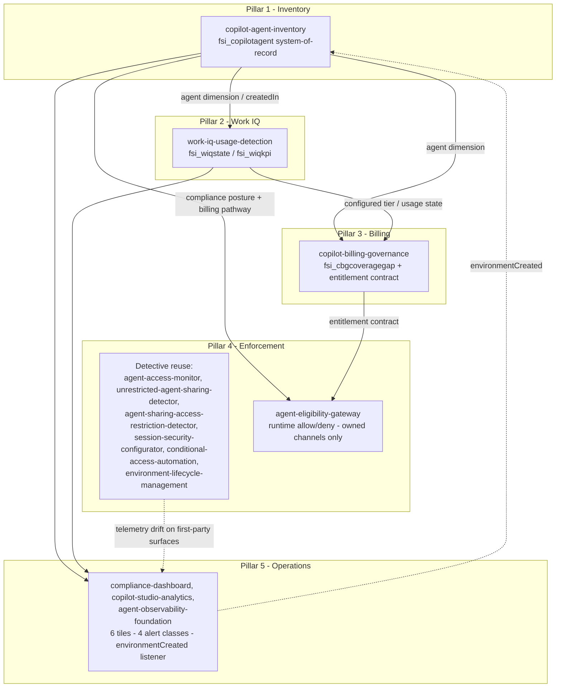

# Governance Platform Composition — Copilot Agent Governance

> **Cloud scope.** This content targets **US commercial-cloud Microsoft 365 /
> Power Platform**. Government and sovereign clouds are out of scope; verify
> applicability independently with Microsoft.

This is a **composition (wiring) guide**, not a flow export. It maps the five
pillars of the Copilot agent governance platform to the four net-new solutions
in the `feat/copilot-agent-governance` wave and to the solutions that already
ship in this repository, so the new work *composes with* what exists rather than
duplicating it. No Power Automate flow JSON is included here; build flows from
each solution's own `docs/flow-configuration.md`.

The design follows two principles:

- **Read, don't re-scan.** `copilot-agent-inventory` is the single
  system-of-record for the agent dimension. Downstream solutions join against it
  instead of independently enumerating the platform.
- **Native-first, then close the gap.** Reuse the platform's native sharing,
  DLP, Managed Environment, and Conditional Access controls — plus this
  repository's existing detective solutions — before adding net-new runtime
  middleware. New code targets only what is genuinely missing.

## The five pillars at a glance

| Pillar | Capability | Primary solution(s) | New or reuse |
|--------|-----------|---------------------|--------------|
| 1 | Inventory (system-of-record) | `copilot-agent-inventory` | New (foundation) |
| 2 | Work IQ usage detection | `work-iq-usage-detection` | New (reads Pillar 1) |
| 3 | Consumption billing governance | `copilot-billing-governance` | New (reads Pillars 1–2) |
| 4 | Enforcement (`compose-enforcement`) | existing detective solutions + `agent-eligibility-gateway` | Reuse + new runtime gateway |
| 5 | Operations (`compose-operations`) | `compliance-dashboard`, `copilot-studio-analytics`, `agent-observability-foundation` | Reuse + net-new signals |

## Pillar 1 — Inventory (`copilot-agent-inventory`)

`copilot-agent-inventory` (CAI) is the **tier-1 foundation and system-of-record**.
It runs a three-layer discovery (Azure Resource Graph → per-environment Dataverse
`bot` / `botcomponent` → PPAC reconciliation) and normalizes the result into the
canonical eight-entity store keyed on `fsi_copilotagent`. The Azure Resource Graph
`createdIn` field disambiguates Copilot Studio agents from Agent Builder agents.

A current, reconciled inventory is **required for** agent-registry control 1.2 and
**supports compliance with** the record-keeping expectations of FINRA Rule 4511
and SEC Rule 17a-3 / 17a-4 — a documented inventory is a prerequisite for the
records those rules describe. It does not, on its own, satisfy any regulation;
organizations should verify their configuration meets their specific obligations.

Every other pillar consumes the `fsi_copilotagent` agent dimension from CAI:

- Pillar 2 keys its configuration read on the CAI `createdIn` value.
- Pillar 3 reads the agent dimension rather than re-discovering it.
- Pillar 4's runtime gateway reads each agent's compliance posture and billing
  pathway from the CAI store via managed identity.

> **Boundary note.** CAI owns the canonical *discovery* store `fsi_copilotagent`.
> `agent-registry-automation` continues to operate its registration and approval
> workflow over the legacy `fsi_agentinventory` table; the two are complementary,
> and the CAI ↔ ARA boundary is flagged for ratification in the CAI README.

## Pillar 2 — Work IQ usage detection (`work-iq-usage-detection`)

`work-iq-usage-detection` (WIQ) is a tier-2 collector that **reads the inventory
store** and adds a two-tier (configuration + telemetry) view of Microsoft 365
Work IQ usage:

- **Tier-A (configuration)** — *can* the agent use Work IQ — from Dataverse
  metadata (`botcomponent` component types 18 / 15 / 16, `aipluginoperation`,
  `bot.configuration`), keyed on the CAI `createdIn` value.
- **Tier-B (telemetry)** — *did* the agent invoke Work IQ, and by whom — from
  Microsoft Defender XDR `CloudAppEvents`, Application Insights `customEvents`,
  and Purview audit (`CopilotInteraction`, `AIPluginOperation`).

The controlled join produces one `fsi_wiqstate` row per agent in a canonical
**four-state** observed-usage model (*Not configured*, *Configured-not-observed*,
*Observed-invoking*, *Exception-unknown*) plus an `fsi_wiqkpi` rollup. This data
**supports** per-zone generative-AI feature-enablement governance (control 2.24)
and feeds Pillar 5 analytics (controls 3.2, 2.9).

> **GA gating.** Work IQ GA is 2026-06-16; the `use-work-iq` capability is preview
> at scaffold time. WIQ is built GA-ready behind the short-lived
> `WorkIqGa20260616` feature flag, removed after GA.

## Pillar 3 — Consumption billing governance (`copilot-billing-governance`)

`copilot-billing-governance` (CBG) is a tier-2 solution that **reads — rather than
re-discovers — the agent dimension from `copilot-agent-inventory` and the usage
tier from `work-iq-usage-detection`**. It governs Copilot consumption billing:

- The two policy objects — pay-as-you-go (PAYG) and prepaid credits.
- A switch-on-pathway entitlement engine evaluating per-(agent, user) eligibility.
- Per-agent caps.
- A pre-enforcement **coverage-gap** analysis written to `fsi_cbgcoveragegap`,
  run in monitor-only mode before any spend control is turned on.

CBG **supports compliance with** control 3.5 (Cost Allocation and Budget Tracking)
and **contributes to** controls 1.18 (Application-Level Authorization and RBAC)
and 1.14 (Data Minimization and Agent Scope Control). The entitlement contract it
produces is the same contract Pillar 4's gateway applies at runtime.

> **Upstream dependency.** Copilot Credits consumption billing applies from
> 2026-06-16; credit policies are Chat-only today. CBG is built to read both
> policy objects as they reach general availability.

## Pillar 4 — Enforcement (`compose-enforcement`)

Enforcement is **native-first and detection-strong today**; the net-new piece is a
runtime gateway for owned channels. The composition reuses existing detective
solutions and adds one new solution.

### Reuse: native controls + existing detective solutions

| Solution | Controls | Role in enforcement |
|----------|----------|---------------------|
| `agent-access-monitor` | 3.8 | Detects overly permissive environment agent-access settings against zone requirements |
| `unrestricted-agent-sharing-detector` | 1.1, 3.8 | Continuous detection of overly permissive agent sharing |
| `agent-sharing-access-restriction-detector` | 1.18, 2.8 | Zone-based agent-sharing policy with approval workflow |
| `session-security-configurator` | 1.23, 1.11 | Session-security validation per zone with drift detection |
| `conditional-access-automation` | 1.11, 1.23, 1.18 | Conditional Access policy deployment, compliance monitoring, drift detection |
| `environment-lifecycle-management` | 2.1, 2.2, 2.8, 1.7 | Managed Environment provisioning and zone-based governance |

Together these provide detection over native sharing, DLP, and Managed
Environment controls. Detection is strong across all surfaces; the gap they do
**not** close is a hard allow/deny at request time.

### New: runtime gateway, owned channels only (`agent-eligibility-gateway`)

`agent-eligibility-gateway` (AEG) is an **optional** Azure API Management gateway
that performs a runtime allow/deny decision in front of an agent endpoint. It
validates the caller's Microsoft Entra ID token (`validate-jwt`: audience,
issuer, `tid` claim), checks audience / Viewers membership, reads compliance
posture and billing pathway from the CAI store, applies the corrected billing
entitlement contract from Pillar 3, and writes one decision record per request to
`fsi_aegdecisionlog`. It **supports compliance with** controls 1.1, 1.18, and 3.8.

The scope boundary is deliberate:

| Channel | Gateway applies? | How governed |
|---------|------------------|--------------|
| Owned custom web chat (Direct Line / Web Chat) | **Yes** | Runtime allow/deny at the APIM gateway |
| Direct Line API (owned client/app) | **Yes** | Runtime allow/deny at the APIM gateway |
| Microsoft Teams | No | Native Managed Environment sharing + telemetry-drift detection |
| Microsoft 365 Copilot | No | Native controls + telemetry-drift detection |
| SharePoint | No | Native controls + telemetry-drift detection |

**First-party surfaces (Teams, Microsoft 365 Copilot, SharePoint) cannot host
custom middleware**, so the gateway cannot sit in front of them. Those surfaces
rely on native sharing/audience controls (which apply with roughly an hour of
enforcement latency) plus the detective telemetry-drift solutions above. Runtime
enforcement via AEG and detective drift on first-party channels are
complementary layers, not interchangeable substitutes.

## Pillar 5 — Operations (`compose-operations`)

Operations **reuses** the repository's existing dashboards, telemetry, and runbook
pattern, and lights up net-new signals from the two new collectors.

### Reuse: existing operations solutions

| Solution | Controls | Role in operations |
|----------|----------|--------------------|
| `compliance-dashboard` | 3.3, 3.1, 3.2, 3.4 | Aggregated compliance reporting and zone-based filtering; hosts the net-new tiles |
| `copilot-studio-analytics` | 3.2 | Business-impact analytics for Copilot Studio agents |
| `agent-observability-foundation` | 1.7, 2.8, 2.9, 3.2 | Telemetry infrastructure, operational workbooks, and proactive alerting; hosts the net-new alert classes and the reactive listener |

### Net-new signals from the two new collectors

The two new collectors — `copilot-agent-inventory` (Pillar 1) and
`work-iq-usage-detection` (Pillar 2) — light up **six net-new dashboard tiles**,
**four alert classes**, and a **reactive `environmentCreated` listener**. These
are wired into the existing operations solutions above rather than shipped as a
separate dashboard.

**Six net-new dashboard tiles** (rendered in `compliance-dashboard`, with
business-impact context in `copilot-studio-analytics`):

1. **Inventory coverage** — discovered vs. PPAC-reconciled agents (CAI).
2. **Inventory freshness** — age of the most recent reconciled scan (CAI).
3. **Work IQ observed-usage distribution** — the four-state breakdown across the
   estate (WIQ `fsi_wiqstate`).
4. **Work IQ configured-not-observed exceptions** — agents able to use Work IQ
   that show no runtime invocation (WIQ `fsi_wiqkpi`).
5. **Work IQ exception-unknown** — natively configured agents missing expected
   telemetry, surfaced for follow-up (WIQ).
6. **Per-zone feature-enablement posture** — Work IQ enablement vs. zone policy,
   the join Pillars 2 and 5 share (WIQ + zone classification).

**Four alert classes** (raised through `agent-observability-foundation` proactive
alerting):

1. **Inventory reconciliation gap** — an agent present in Azure Resource Graph but
   absent from the Dataverse scan (or vice versa).
2. **Stale inventory** — reconciled scan age beyond the zone threshold.
3. **Work IQ exception-unknown** — a natively configured agent whose runtime
   telemetry is missing.
4. **Out-of-policy Work IQ usage** — *Observed-invoking* in a zone where the
   feature is not approved.

**Reactive `environmentCreated` listener:** an event-driven trigger on the Power
Platform / Managed Environment `environmentCreated` signal kicks off an
incremental `copilot-agent-inventory` scan, so a newly created environment is
brought into the system-of-record between nightly batch runs. This composes with
`environment-lifecycle-management`, which provisions environments under zone-based
governance: when a new environment appears, the listener keeps the inventory
current without waiting for the next scheduled discovery.

## Composition map

## Control coverage of the four new solutions

| Solution | Tier | Controls |
|----------|------|----------|
| `copilot-agent-inventory` | 1 | 1.2, 1.7, 2.1, 2.13 |
| `work-iq-usage-detection` | 2 | 2.24, 3.2, 2.9 |
| `copilot-billing-governance` | 2 | 3.5, 1.18, 1.14 |
| `agent-eligibility-gateway` | 3 | 1.1, 1.18, 3.8 |

The canonical machine-readable control coverage is published in `solutions.json`
(`solutions.<id>.controls`) and each solution's `controls-covered.json`; the table
above is a human-readable projection only.

## Caveats

- These solutions **support** and **contribute to** the controls and regulations
  named above; no single solution satisfies a regulation in isolation.
  Organizations should verify their configuration meets their specific obligations
  under FINRA Rule 4511, SEC Rule 17a-3 / 17a-4, and any other applicable rules.
- The four solutions are `v0.1.0-preview`. `agent-eligibility-gateway` deployment
  is optional and conditional on an organization operating owned agent channels.
- Work IQ and Copilot Credits dependencies reach general availability on
  2026-06-16; preview-gated behavior is flagged in each solution's README.

## References

- Copilot Agent Inventory — <https://judeper.github.io/FSI-AgentGov-Solutions/solutions/copilot-agent-inventory/>
- Work IQ Usage Detection — <https://judeper.github.io/FSI-AgentGov-Solutions/solutions/work-iq-usage-detection/>
- Copilot Billing Governance — <https://judeper.github.io/FSI-AgentGov-Solutions/solutions/copilot-billing-governance/>
- Agent Eligibility Gateway — <https://judeper.github.io/FSI-AgentGov-Solutions/solutions/agent-eligibility-gateway/>
- Control mapping (all 78 framework controls) — <https://judeper.github.io/FSI-AgentGov-Solutions/reference/control-mapping/>
