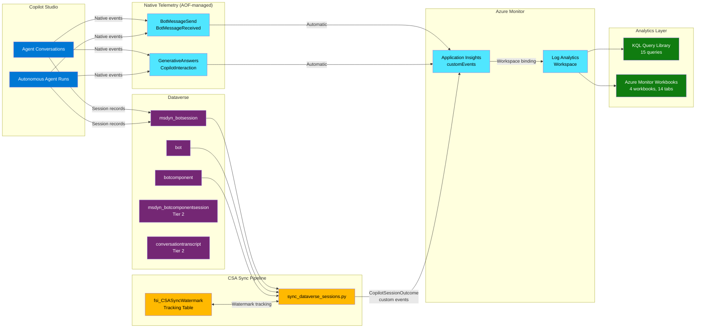

# Architecture

This document describes the data flow and component architecture of the Copilot Studio Analytics solution.

## Data Flow Overview

CSA combines two telemetry streams into a unified analytics layer. Native Copilot Studio events (managed by AOF) provide operational signals, while Dataverse session records (synced by CSA) provide business outcome data. Both streams land in the same Application Insights workspace, enabling cross-correlation via KQL queries and Azure Monitor Workbooks.

## Tiered Data Strategy

CSA uses a two-tier approach to balance data availability, API complexity, and cost.

### Tier 1 -- Core Session Data

**Source tables:** msdyn_botsession, bot, botcomponent
**Sync method:** Dataverse Web API with OData queries
**Refresh frequency:** Configurable (daily to 4-6 hours)

Tier 1 provides session-level outcome data sufficient for most analytics:

| Data Point | Source | Notes |
|-----------|--------|-------|
| Session outcome | msdyn_botsession.msdyn_sessionoutcome | Resolved, Escalated, Abandoned, Unengaged |
| CSAT score | msdyn_botsession.msdyn_csatscore | 1-5 scale when survey enabled |
| Session duration | msdyn_botsession timestamps | Start and end time |
| Agent ID | msdyn_botsession.msdyn_botid | Joined with bot table for name |
| Agent type | botcomponent.componenttypename | 17 = External Trigger (autonomous) |
| Knowledge source proxy | GenerativeAnswers events (App Insights) | Result = "Success" indicates KS citation |

### Tier 2 -- Detailed Behavior Data

**Source tables:** msdyn_botcomponentsession, conversationtranscript
**Sync method:** Additional Dataverse queries with content JSON parsing
**Refresh frequency:** Daily batch (higher API cost)

Tier 2 provides granular topic and action data for deeper analysis:

| Data Point | Source | Notes |
|-----------|--------|-------|
| Topic-level sessions | msdyn_botcomponentsession | Per-topic outcome within a session |
| Action execution | conversationtranscript content JSON | Requires JSON path parsing |
| Knowledge source count | conversationtranscript content JSON | Precise count vs Tier 1 proxy |
| Conversation turns | conversationtranscript | Message-level detail |

> **Important:** Tier 2 data depends on conversationtranscript records, which are subject to a default 30-day bulk delete job in Dataverse. See [prerequisites.md](prerequisites.md) for retention extension instructions.

## Watermark Sync Mechanism

The sync pipeline uses a Dataverse tracking table (`fsi_csawatermark`) to implement incremental synchronization.

### Sync Flow

1. **Read watermark:** Query fsi_csawatermark for the last successful sync timestamp per environment
2. **Fetch new records:** Query msdyn_botsession where `modifiedon > watermark` with `$orderby=modifiedon asc`
3. **Enrich records:** Join with bot (agent name, schema name) and botcomponent (agent type classification)
4. **Emit events:** Send CopilotSessionOutcome custom events to Application Insights via Track API
5. **Update watermark:** Write new watermark timestamp after successful batch commit

### Failure Handling

- **Partial batch failure:** Watermark only advances to the last successfully committed record
- **Full batch failure:** Watermark unchanged; next run retries the same window
- **Duplicate protection:** App Insights deduplication via operation_Id based on session ID + sync timestamp

### CopilotSessionOutcome Event Schema

Each synced session produces a custom event with these properties:

| Property | Type | Description |
|----------|------|-------------|
| name | string | `CopilotSessionOutcome` (fixed) |
| customDimensions.recipientId | string | Agent ID (matches AOF `recipientId` format) |
| customDimensions.sessionId | string | Unique session ID from `msdyn_sessionid` |
| customDimensions.sessionOutcome | string | Conversational: Resolved, Escalated, Abandoned; Autonomous: Success, Failure |
| customDimensions.sessionOutcomeReason | string | Sub-type from `msdyn_outcomereason` |
| customDimensions.isEngaged | boolean | Engaged session flag from `msdyn_isengaged` |
| customDimensions.csatScore | number | 1-5 for conversational, empty for autonomous |
| customDimensions.sessionDurationSeconds | number | Duration from startedon/endedon |
| customDimensions.hasKnowledgeSource | boolean | Knowledge source proxy (Tier 1: GenerativeAnswers) |
| customDimensions.topicName | string | Primary topic from `msdyn_topicname` |
| customDimensions.agentMode | string | `Conversational` or `Autonomous` |
| customDimensions.channelId | string | Channel identifier |
| customDimensions.Zone | string | Governance zone from environment metadata |
| customDimensions.syncSource | string | `DataverseSync` (distinguishes from native events) |
| customDimensions.syncTier | string | `Tier1` or `Tier2` |
| timestamp | datetime | Session end time from msdyn_botsession |

## Agent Type Classification

CSA classifies agents as either **conversational** or **autonomous** based on Dataverse metadata.

### Classification Logic

1. Query `botcomponent` table for records associated with the agent's bot ID
2. Check `componenttypename` values:
   - If any component has `componenttypename = 17` (External Trigger), the agent is classified as **autonomous**
   - Otherwise, the agent is classified as **conversational**
3. Classification is cached per agent and refreshed daily

### Why Classification Matters

Conversational and autonomous agents have fundamentally different interaction models, requiring separate AAH calculations:

- **Conversational agents** interact with users via chat, handling questions and providing answers
- **Autonomous agents** execute tasks independently, triggered by events rather than user messages

See [docs/agent-assisted-hours-methodology.md](docs/agent-assisted-hours-methodology.md) for the separate calculation formulas.

## AOF Integration Points

| Integration Point | Direction | Description |
|-------------------|-----------|-------------|
| Application Insights workspace | CSA writes to AOF infrastructure | CopilotSessionOutcome events land in the same App Insights |
| Log Analytics workspace | CSA reads from AOF infrastructure | KQL queries correlate session outcomes with native events |
| GenerativeAnswers events | CSA reads AOF data | Used as Tier 1 proxy for knowledge source citations |
| BotMessageSend events | CSA reads AOF data | Used for session volume cross-validation |

---

*Architecture version: 1.0.0*
*Last updated: February 2026*
