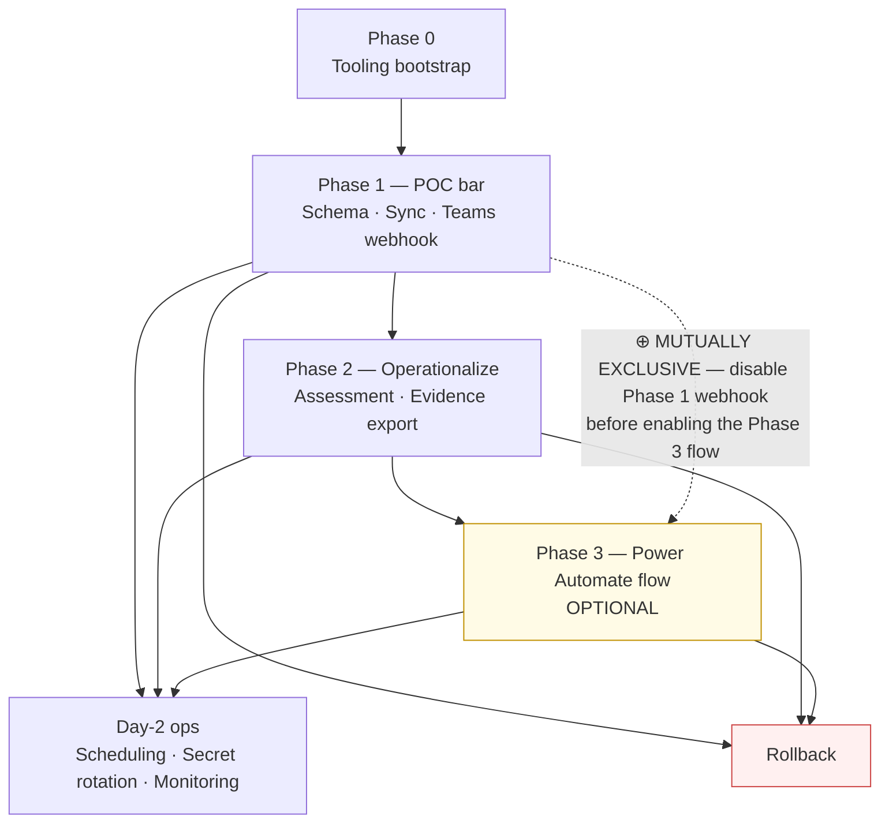

# message-center-monitor — POC Quickstart

> **For Financial Services customers:** This runbook walks an M365 Entra Global Admin + Power Platform
> Admin through deploying the message-center-monitor solution (v2.5.1) across three deployment phases.
> Phase 1 is the minimal "POC bar" — schema deployed, sync running, and one Teams alert delivered.
> Phases 2 and 3 are optional expansions you can layer on after the POC bar is confirmed.

## At a glance



## Per-step role matrix

| Step | Role required (any of) | Why |
|------|------------------------|-----|
| 0 | Workstation user | Install local tooling |
| 1.1 | Entra Application Administrator + admin-consent rights | Create app registration; grant `ServiceMessage.Read.All` admin consent |
| 1.2 | Azure Key Vault Secrets Officer on the target Key Vault | Store the client secret |
| 1.3 | Power Platform System Customizer in the target environment | Run Python schema-creation script |
| 1.4 | Member of the target Teams team with Workflows creation rights | Create the incoming webhook; copy the URL |
| 1.5 | Workstation user | Set `$env:MCM_TEAMS_WEBHOOK_URL` |
| 1.6 | App-user identity (service principal registered in Dataverse) | Run preflight checks |
| 1.7 | App-user identity | Run first sync |
| 2.* | Entra Application Administrator + App-user identity | Run assessment status and evidence scripts |
| 3.* | Power Platform Admin + Maker | Build Power Automate flow |

---

## Step 0 — Tooling bootstrap (one-time)

Install the following on the workstation (or build agent) where you will run the scripts:

| Tool | Minimum version | Install command |
|------|----------------|-----------------|
| PowerShell | 7.2 | `winget install Microsoft.PowerShell` (Windows) · `brew install --cask powershell` (macOS) |
| Python | 3.10 | `winget install Python.Python.3.11` or equivalent |
| MSAL.PS | 4.37.0 | `Install-Module MSAL.PS -MinimumVersion 4.37.0 -Scope CurrentUser -Force` |
| Az.KeyVault | latest | `Install-Module Az.KeyVault -Scope CurrentUser -Force` |

Install Python dependencies from the repo root:

```bash
pip install -r message-center-monitor/scripts/requirements.txt
```

**Verify all tooling is in place:**

```powershell
pwsh -Command '$PSVersionTable.PSVersion; python --version; Get-Module MSAL.PS, Az.KeyVault -ListAvailable | Select-Object Name, Version'
```

Expected output: PowerShell `7.2.x` or later, Python `3.10.x` or later, both modules listed with versions.

---

## Prerequisites checklist

Your tenant must have:

- [ ] A Power Platform environment with Dataverse provisioned, in a region consistent with your data residency policy
- [ ] An Azure subscription with permission to create or use an Azure Key Vault
- [ ] A Microsoft Teams team and channel where you can create a Workflows incoming webhook
- [ ] Sign-in credentials for an Entra Global Admin or Application Administrator account (required for the app-registration and admin-consent steps)
- [ ] This repository cloned to the workstation or build agent

---

## Phase 1 — POC bar (schema + sync + Teams alert)

### Step 1.1 — Create the app registration

Sign in to the [Microsoft Entra admin center](https://entra.microsoft.com) as an Entra Global Admin or
Application Administrator.

1. Navigate to **Identity → Applications → App registrations → New registration**.
2. **Name:** choose a descriptive name, for example `mcm-message-center-monitor`.
3. **Supported account types:** Single tenant.
4. Click **Register**.
5. From the app's **Overview** blade, copy and save:
   - **Application (client) ID** — used as `<client-id>` in all script parameters below.
   - **Directory (tenant) ID** — used as `<tenant>` in all script parameters below.
6. Navigate to **Certificates & secrets → Client secrets → New client secret**.
   - **Description:** `MCM POC`
   - **Expires:** choose a period consistent with your organization's secret rotation policy (90 days is a reasonable POC baseline).
   - Click **Add**. **Copy the Value immediately** — it is not retrievable after you navigate away.

> **Auth note:** `-AuthMode ClientSecret` is the recommended starting point for a POC where managed
> identity is not yet available. Plan to migrate to `-AuthMode Certificate` or workload identity
> federation before moving to a production schedule.

7. Navigate to **API permissions → Add a permission → Microsoft APIs → Microsoft Graph →
   Application permissions**.
   - Search for `ServiceMessage.Read.All` and add it.
8. Click **Grant admin consent for \<your-tenant\>**. Confirm when prompted.

**Verification:** The `ServiceMessage.Read.All` row shows **Granted for \<tenant\>** with a green
checkmark in the **Status** column of the API permissions blade.

**Rollback:** Delete the app registration from **Identity → Applications → App registrations** in the
Entra admin center. This revokes all issued tokens and removes the permission grant.

---

### Step 1.2 — Store the client secret in Azure Key Vault

```powershell
# Sign in to Azure (interactive; use a service principal in CI environments)
Connect-AzAccount -TenantId '<tenant>'

# Store the secret value copied in Step 1.1
Set-AzKeyVaultSecret `
    -VaultName   '<kv>'             `
    -Name        'mcm-client-secret' `
    -SecretValue (ConvertTo-SecureString '<secret-value>' -AsPlainText -Force)
```

Recommended naming convention: Key Vault name `kv-<environment>-mcm`, secret name `mcm-client-secret`.

**Verification:**

```powershell
Get-AzKeyVaultSecret -VaultName '<kv>' -Name 'mcm-client-secret' -AsPlainText | Out-Null
if ($?) { 'OK — secret is readable' } else { 'FAILED — check Key Vault access policy or RBAC assignment' }
```

**Rollback:**

```powershell
Remove-AzKeyVaultSecret -VaultName '<kv>' -Name 'mcm-client-secret'
```

---

### Step 1.3 — Deploy the Dataverse schema

The schema script creates the `fsi_MessageCenterLog` table, all columns, the option sets
(severity, category, assessment status), and the alternate key `fsi_MessageCenterIdKey` on
`fsi_messagecenterid`.

First, pull the client secret from Key Vault into an environment variable:

```powershell
Connect-AzAccount -TenantId '<tenant>'   # skip if already signed in from Step 1.2
$env:MCM_CLIENT_SECRET = Get-AzKeyVaultSecret -VaultName '<kv>' -Name 'mcm-client-secret' -AsPlainText
```

Run the schema script:

```powershell
python message-center-monitor/scripts/create_mcm_dataverse_schema.py `
    --tenant-id       '<tenant>'                       `
    --client-id       '<client-id>'                    `
    --environment-url 'https://<org>.crm.dynamics.com' `
    --output-docs
```

The `--output-docs` flag regenerates `message-center-monitor/docs/dataverse-schema.md` with the
current column reference. Review it if you need the full logical-name list.

#### ⚠ WAIT GATE — alternate key activation (critical first-deploy step)

`fsi_MessageCenterIdKey` on `fsi_messagecenterid` is activated **asynchronously** by Dataverse after
the schema script completes. Activation typically takes 30–60 seconds but can take longer under load.

**The first sync will return 404 if the alternate key is not yet Active.** Run the poll snippet below
and wait for `Active` before moving to Step 1.4:

```powershell
# Replace <tenant>, <client-id>, and <org> with your values.
# $env:MCM_CLIENT_SECRET must already be set (done above).

Import-Module MSAL.PS

$secStr   = ConvertTo-SecureString $env:MCM_CLIENT_SECRET -AsPlainText -Force
$tok      = Get-MsalToken `
    -ClientId     '<client-id>' `
    -ClientSecret $secStr       `
    -TenantId     '<tenant>'    `
    -Scopes       'https://<org>.crm.dynamics.com/.default'

$hdr      = @{ Authorization = "Bearer $($tok.AccessToken)"; Accept = 'application/json' }
$url      = "https://<org>.crm.dynamics.com/api/data/v9.2/EntityDefinitions(LogicalName='fsi_messagecenterlog')/Keys"
$deadline = (Get-Date).AddMinutes(15)

do {
    $resp   = Invoke-RestMethod -Uri $url -Headers $hdr
    $key    = $resp.value |
              Where-Object { $_.SchemaName -eq 'fsi_MessageCenterIdKey' } |
              Select-Object -First 1
    $status = switch ($key.EntityKeyIndexStatus) {
        0       { 'Pending'    }
        1       { 'InProgress' }
        2       { 'Active'     }
        3       { 'Failed'     }
        default { 'Unknown'    }
    }
    Write-Host "$(Get-Date -Format 'HH:mm:ss')  alt-key status: $status"

    if ($status -eq 'Active') {
        Write-Host 'Alt-key is Active — safe to proceed to Step 1.4.' -ForegroundColor Green
        break
    }
    if ($status -eq 'Failed') {
        throw 'Alt-key activation FAILED. Re-run the schema script, or inspect the table in the ' +
              'Power Apps maker portal: Tables → Message Center Log → Keys.'
    }
    Start-Sleep -Seconds 10

} while ((Get-Date) -lt $deadline)

if ((Get-Date) -ge $deadline) {
    Write-Warning 'Timed out waiting for Active status (15 min). Check the maker portal before running the sync.'
}
```

**Verification:**

```powershell
python message-center-monitor/scripts/create_mcm_dataverse_schema.py `
    --tenant-id       '<tenant>'                       `
    --client-id       '<client-id>'                    `
    --environment-url 'https://<org>.crm.dynamics.com' `
    --validate-only
```

Alternatively, open the [Power Apps maker portal](https://make.powerapps.com), select your
environment, navigate to **Tables**, and confirm `fsi_MessageCenterLog` appears.

**Rollback:** Power Apps maker portal → **Tables → Message Center Log → Delete**. This removes the
table, all data, all columns, and the alternate key in one operation.

---

### Step 1.4 — Create the Teams Workflows incoming webhook

The solution uses the **Workflows** app (Teams' replacement for the retired Office 365 connector).
Workflows accepts an Adaptive Card payload via an HTTPS POST to a per-channel webhook URL.

1. In Microsoft Teams, open the team and channel where you want alerts to appear.
2. Click **+** in the app bar (or search "Workflows") and open the **Workflows** app.
3. Select the template **"Post to a channel when a webhook request is received"**.
4. Choose:
   - **Team:** the target team
   - **Channel:** the target channel
5. Click **Next**, then **Add workflow**.
6. On the confirmation screen, **copy the webhook URL** shown. It resembles:
   ```
   https://prod-XX.westus.logic.azure.com:443/workflows/…/triggers/manual/run?api-version=…
   ```
   Store this URL securely — it is not retrievable from the Workflows UI after you close the dialog.

**Verification:** Workflows app → **My flows** shows the new workflow with status **On**. The URL is HTTPS.

**Rollback:** Workflows app → **My flows** → select the workflow → **Edit → Delete**.

---

### Step 1.5 — Set the webhook URL environment variable

```powershell
$env:MCM_TEAMS_WEBHOOK_URL = '<paste-the-webhook-URL-from-Step-1.4>'
```

For a persistent setup, store the URL in your CI runner's secrets store or as a per-user environment
variable rather than a session variable.

**Verification:**

```powershell
if ($env:MCM_TEAMS_WEBHOOK_URL) { 'OK — variable is set' } else { 'NOT SET — re-run the line above' }
```

---

### Step 1.6 — Run the preflight

`Test-McmPrerequisites.ps1` runs 11 checks before the first sync:

| # | Check |
|---|-------|
| 1 | PowerShell 7.2 or later |
| 2 | MSAL.PS module present |
| 3 | Az.KeyVault module present |
| 4 | Key Vault is reachable |
| 5 | Client secret is present in Key Vault |
| 6 | Graph token can be acquired |
| 7 | `ServiceMessage.Read.All` application permission is consented |
| 8 | Dataverse environment is reachable |
| 9 | `fsi_messagecenterlogs` table is accessible |
| 10 | Alternate key `fsi_MessageCenterIdKey` is Active |
| 11 | Mutual-exclusion: Phase 1 webhook and Phase 3 flow are not both active simultaneously |

Retrieve the client secret as a `SecureString`:

```powershell
Connect-AzAccount -TenantId '<tenant>'   # skip if already signed in
$secStr = ConvertTo-SecureString `
    (Get-AzKeyVaultSecret -VaultName '<kv>' -Name 'mcm-client-secret' -AsPlainText) `
    -AsPlainText -Force
```

Run the preflight:

```powershell
pwsh message-center-monitor/scripts/governance/Test-McmPrerequisites.ps1 `
    -TenantId     '<tenant>'                       `
    -ClientId     '<client-id>'                    `
    -ClientSecret  $secStr                          `
    -DataverseUrl 'https://<org>.crm.dynamics.com' `
    -AuthMode      ClientSecret
```

**All 11 checks must report PASS before proceeding.** Any FAIL stops the runbook; address the
indicated issue and re-run.

To also validate the Teams webhook end-to-end before the real sync, add `-PostTestMessage`:

```powershell
pwsh message-center-monitor/scripts/governance/Test-McmPrerequisites.ps1 `
    -TenantId     '<tenant>'                       `
    -ClientId     '<client-id>'                    `
    -ClientSecret  $secStr                          `
    -DataverseUrl 'https://<org>.crm.dynamics.com' `
    -AuthMode      ClientSecret                     `
    -PostTestMessage
```

`-PostTestMessage` posts a labeled **[PREFLIGHT TEST]** Adaptive Card to the configured Teams
channel. Confirm the card appears in the channel before running the real sync.

**Verification:** All 11 checks show `PASS`. If `-PostTestMessage` was used, the test card is visible
in Teams.

---

### Step 1.7 — Run the first sync

If `$secStr` is no longer in scope from Step 1.6, retrieve it again:

```powershell
$secStr = ConvertTo-SecureString `
    (Get-AzKeyVaultSecret -VaultName '<kv>' -Name 'mcm-client-secret' -AsPlainText) `
    -AsPlainText -Force
```

Run the sync:

```powershell
pwsh message-center-monitor/scripts/governance/Invoke-MessageCenterSync.ps1 `
    -TenantId     '<tenant>'                       `
    -ClientId     '<client-id>'                    `
    -ClientSecret  $secStr                          `
    -DataverseUrl 'https://<org>.crm.dynamics.com' `
    -AuthMode      ClientSecret                     `
    -DaysBack      30
```

`-DaysBack 30` retrieves Message Center posts from the last 30 days. Adjust to suit your POC window.

The sync sends Teams notifications for messages with severity **High** or **Critical**
(default `NotifySeverities = @('high', 'critical')`). After a successful notification, the script
writes a timestamp to `fsi_notifiedon` via a direct PATCH call on that row.

> **Teams card template:** The Adaptive Card layout is at `templates/teams-notification-card.json`
> (Adaptive Card 1.5). Token substitution — severity, title, category, services, dates, record ID,
> and other fields — is performed automatically by the sync script. **Do not edit
> `templates/teams-notification-card.json`**: the template is shared across all environments that
> use this solution, and changes affect every deployment.

**POC success criteria — confirm all four before marking Phase 1 complete:**

1. The sync output shows a non-zero `TotalSynced` value.
2. At least one row exists in `fsi_messagecenterlogs` — confirm in the
   [Power Apps maker portal](https://make.powerapps.com) → **Tables → Message Center Log → Data**.
3. At least one row with severity **High** (`100000000`) or **Critical** (`100000002`) has a
   populated `fsi_notifiedon` timestamp.
4. At least one Teams Adaptive Card has appeared in the configured channel.

**✅ Phase 1 success checkpoint — stop here if all you need is the POC bar.**

---

## Phase 2 — Operationalize (assessment + evidence)

Phase 2 layers assessment and evidence workflows on top of the synced data. No additional
infrastructure is required.

### Step 2.1 — Review assessment status

```powershell
pwsh message-center-monitor/scripts/governance/Get-MessageCenterAssessmentStatus.ps1 `
    -TenantId     '<tenant>'                       `
    -ClientId     '<client-id>'                    `
    -ClientSecret  $secStr                          `
    -DataverseUrl 'https://<org>.crm.dynamics.com' `
    -AuthMode      ClientSecret
```

The script outputs a count summary grouped by `fsi_assessmentstatus`:

| Status | Option set value | Meaning |
|--------|-----------------|---------|
| NotAssessed | `100000000` | Synced but not yet reviewed |
| Reviewed | `100000001` | Reviewed; agent impact not yet determined |
| ImpactsAgents | `100000002` | Confirmed impact on Copilot Studio or Agent Builder agents |
| NoImpact | `100000003` | Reviewed; no agent impact identified |

Work down the **NotAssessed** rows with the highest severity first.

### Step 2.2 — Assess messages (manual, in maker portal)

For each message that warrants review:

1. Open the [Power Apps maker portal](https://make.powerapps.com) → select your environment →
   **Tables → Message Center Log → Data**.
2. Open the row you want to assess.
3. Update the following fields and save:

| Field (logical name) | SchemaName | What to enter |
|---------------------|-----------|---------------|
| `fsi_assessmentstatus` | `fsi_AssessmentStatus` | Set to `Reviewed` (`100000001`), `ImpactsAgents` (`100000002`), or `NoImpact` (`100000003`) |
| `fsi_assessment` | `fsi_Assessment` | Free-text notes from your review |
| `fsi_impactsagents` | `fsi_ImpactsAgents` | True if the message affects agent behavior; False otherwise |
| `fsi_actionstaken` | `fsi_ActionsTaken` | Description of any remediation or follow-up actions taken |
| `fsi_assessedby` | `fsi_AssessedBy` | Reviewer name or UPN |

### Step 2.3 — Export evidence for audit

```powershell
pwsh message-center-monitor/scripts/governance/Export-MessageCenterEvidence.ps1 `
    -TenantId     '<tenant>'                       `
    -ClientId     '<client-id>'                    `
    -ClientSecret  $secStr                          `
    -DataverseUrl 'https://<org>.crm.dynamics.com' `
    -AuthMode      ClientSecret                     `
    -OutputPath   './evidence'
```

The script produces one NDJSON file per run plus a `.sha256` companion file for chain-of-custody
verification. Store both files in your audit archive; the `.sha256` file allows downstream systems
to verify file integrity.

---

## Phase 3 — Power Automate flow (OPTIONAL — mutually exclusive with Phase 1 webhook)

> **⛔ STOP before continuing.**
>
> The Phase 1 webhook (`$env:MCM_TEAMS_WEBHOOK_URL` / `-TeamsWebhookUrl`) and the Phase 3 Power
> Automate flow operate as separate notification paths. Both write to `fsi_notifiedon` for per-row
> idempotency, but that deduplication works within one path only — not across both paths at once.
> Running both simultaneously results in duplicate Teams alerts.
>
> **Before enabling the Phase 3 flow:**
>
> 1. Clear `$env:MCM_TEAMS_WEBHOOK_URL` on every host that runs `Invoke-MessageCenterSync.ps1`:
>    ```powershell
>    Remove-Item Env:\MCM_TEAMS_WEBHOOK_URL -ErrorAction SilentlyContinue
>    ```
> 2. Re-run `Test-McmPrerequisites.ps1` — check 11 (mutual-exclusion) must report **PASS** before
>    you proceed to build the flow.

Phase 3 replaces the PowerShell-hosted webhook with a Power Automate cloud flow that triggers on
`fsi_messagecenterlogs` row creation. This path is preferred when:

- You do not have a persistent host for running PowerShell on a schedule.
- A central operations team manages cloud flows rather than script runners.
- You want native Power Platform scheduling, monitoring, and connection governance.

The full build instructions for the Power Automate flow — including trigger configuration, action
sequence, and connection setup — are in **[docs/flow-configuration.md](flow-configuration.md)**.

---

## Day-2 operations

### Secret rotation

Refer to [docs/secrets-management.md](secrets-management.md) for the full rotation cadence and
governance checklist. Quick steps to rotate and validate:

```powershell
# 1. Generate a new secret in the Entra admin center:
#    App registrations → <app> → Certificates & secrets → + New client secret
#    Copy the new Value before navigating away.

# 2. Update Key Vault with the new value:
Set-AzKeyVaultSecret `
    -VaultName   '<kv>'             `
    -Name        'mcm-client-secret' `
    -SecretValue (ConvertTo-SecureString '<new-secret-value>' -AsPlainText -Force)

# 3. Validate with the new secret before retiring the old one:
$newSecStr = ConvertTo-SecureString `
    (Get-AzKeyVaultSecret -VaultName '<kv>' -Name 'mcm-client-secret' -AsPlainText) `
    -AsPlainText -Force

pwsh message-center-monitor/scripts/governance/Test-McmPrerequisites.ps1 `
    -TenantId     '<tenant>'                       `
    -ClientId     '<client-id>'                    `
    -ClientSecret  $newSecStr                       `
    -DataverseUrl 'https://<org>.crm.dynamics.com' `
    -AuthMode      ClientSecret
```

All 11 checks must PASS with the new secret before you delete the old one from the Entra admin center.

### Troubleshooting decision tree

```
Sync prints "401 Unauthorized"
  ↓
Can a Graph token be acquired?
  → Re-run preflight check 6 (Graph token) and check 7 (ServiceMessage.Read.All consent).
  If token acquisition fails: a Conditional Access policy may be blocking the service principal.
    Check Microsoft Entra ID sign-in logs for the app registration
    (Entra admin center → Identity → Monitoring & health → Sign-in logs, filter by app name).
  If token is acquired but 401 persists: admin consent may have been revoked.
    Re-grant ServiceMessage.Read.All in the Entra admin center API permissions blade.

Sync prints "403 Forbidden"
  ↓
Is the app user registered and assigned a role in Dataverse?
  In Power Platform admin center → Environments → <env> → Settings →
  Users + permissions → Application users, confirm the app registration is listed
  and assigned a role with read/write on fsi_MessageCenterLog.
  (System Administrator is sufficient for a POC environment.)

Sync prints "400 Bad Request" with a column name in the message body
  ↓
Was the schema deployed with the correct fsi_ prefix?
  Re-run create_mcm_dataverse_schema.py with the same --client-id and --environment-url.
  If the error persists, open an issue at github.com/judeper/FSI-AgentGov-Solutions.

Sync prints "404 Not Found" on the first run after schema deploy
  ↓
The alternate key fsi_MessageCenterIdKey is still activating asynchronously.
  Wait 60 seconds and re-run Invoke-MessageCenterSync.ps1.
  Or re-run the wait-gate poll snippet from Step 1.3 to confirm the key reaches Active status.

Teams notification did not appear in the channel
  ↓
Did preflight check 11 (mutual-exclusion) PASS?
  No  → Either disable the Phase 3 Power Automate flow, OR clear $env:MCM_TEAMS_WEBHOOK_URL.
        Re-run Test-McmPrerequisites.ps1 until check 11 reports PASS. (Phase 1 webhook and
        Phase 3 flow are mutually exclusive — running both causes duplicate alerts and breaks
        per-row deduplication via fsi_notifiedon.)
  Yes → Check the row's fsi_notifiedon column in the maker portal.
        fsi_notifiedon is populated: the Teams POST was attempted.
          Check the Workflows app run history (Workflows → My flows → select workflow →
          Run history) for the delivery status of that specific invocation.
        fsi_notifiedon is empty: the sync ran but did not attempt notification.
          Confirm the message severity is High (100000000) or Critical (100000002).
          To retry: clear fsi_notifiedon on the row in the maker portal, then re-run the sync.
```

### Log locations

| Log source | Where to find it |
|-----------|-----------------|
| PowerShell transcript | Customer-defined; wrap sync calls in `Start-Transcript -Path ./mcm-sync-$(Get-Date -Format yyyyMMdd).log` |
| Az.KeyVault audit | Key Vault → Diagnostic settings (enable to a Log Analytics workspace if not already configured) |
| Dataverse audit | Power Platform admin center → Environments → \<env\> → Settings → Audit & logs |
| Microsoft Entra ID sign-in logs | Entra admin center → Identity → Monitoring & health → Sign-in logs (filter by app display name) |
| Teams Workflow run history | Workflows app → **My flows** → select workflow → **Run history** |

---

## Rollback (complete teardown)

Perform in reverse order of Phase 1 deployment:

1. **Delete the Teams Workflow** (Step 1.4): Workflows app → My flows → select workflow → Delete.
2. **Clear the webhook URL** (Step 1.5):
   ```powershell
   Remove-Item Env:\MCM_TEAMS_WEBHOOK_URL -ErrorAction SilentlyContinue
   ```
3. **Delete the `fsi_MessageCenterLog` table** (Step 1.3): Power Apps maker portal → **Tables →
   Message Center Log → Delete**. This removes all data, columns, and the alternate key in one
   operation. Data cannot be recovered after this step.
4. **Remove the Dataverse Application User** (Step 1.3): Power Platform admin center →
   Environments → \<env\> → Settings → Users + permissions → **Application users** → select the
   app user → Delete.
5. **Delete the Key Vault secret** (Step 1.2):
   ```powershell
   Remove-AzKeyVaultSecret -VaultName '<kv>' -Name 'mcm-client-secret'
   ```
6. **Delete the app registration** (Step 1.1): Entra admin center → **App registrations** →
   select the app → Delete. This revokes all outstanding tokens and removes the `ServiceMessage.Read.All`
   permission grant.

---

## Related documentation

| Document | When to read |
|----------|-------------|
| [README.md](../README.md) | Solution overview, audience, and prerequisites |
| [docs/flow-configuration.md](flow-configuration.md) | Phase 3 — full Power Automate flow build instructions |
| [docs/teams-integration.md](teams-integration.md) | Adaptive Card layout, channel setup, and Workflows configuration notes |
| [docs/secrets-management.md](secrets-management.md) | Production-grade secret rotation cadence and governance checklist |
| [docs/setup-checklist.md](setup-checklist.md) | End-to-end deployment checklist (~12 steps) |
| [docs/dataverse-schema.md](dataverse-schema.md) | Auto-generated column reference (logical names, SchemaNames, option set values) |
| [docs/lab-dry-run.md](lab-dry-run.md) | Internal lab/06 + lab/07 smoke-test runbook (for solution authors) |
