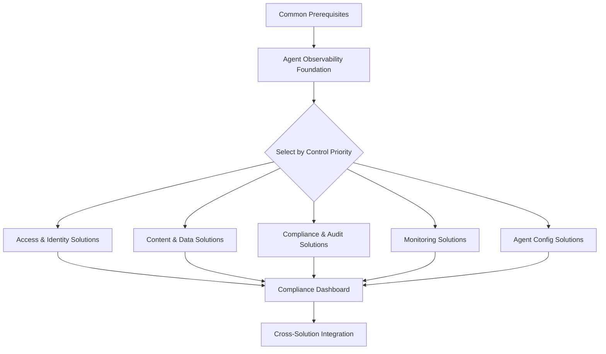

# Getting Started

This section covers everything you need to deploy FSI Agent Governance Solutions in your environment.

## Before You Begin

1. **Review prerequisites** — Each solution has specific requirements, but [Common Prerequisites](prerequisites.md) covers the shared foundations
2. **Plan your deployment** — Use the [Deployment Guide](deployment-guide.md) to determine which solutions to deploy and in what order
3. **Start with observability** — The [Agent Observability Foundation](../solutions/agent-observability-foundation/index.md) provides shared infrastructure used by other solutions

## Deployment Sequence

## Pages in This Section

| Page | Description |
|------|-------------|
| [Common Prerequisites](prerequisites.md) | Shared requirements across all solutions |
| [Deployment Guide](deployment-guide.md) | Use-case mapping and deployment sequencing |
