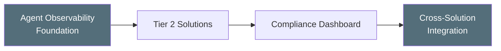

# FSI Agent Governance Solutions

Reference implementations for the [FSI Agent Governance Framework](https://judeper.github.io/FSI-AgentGov/). These solutions help Financial Services organizations implement operational controls and monitoring for AI agents built with Microsoft Copilot Studio and Power Platform.

---

## Quick Start by Role

=== "First Deployment"

    1. Review [Common Prerequisites](getting-started/prerequisites.md)
    2. Deploy the [Agent Observability Foundation](solutions/agent-observability-foundation/index.md) (foundational layer)
    3. Follow the [Deployment Guide](getting-started/deployment-guide.md) for sequencing
    4. Pick your first Tier 2 solution from the [Solutions Catalog](solutions/index.md)

=== "Implementing a Control"

    1. Find your control number in the [Control Mapping](reference/control-mapping.md)
    2. Navigate to the corresponding solution
    3. Follow the solution's prerequisites and deployment steps
    4. Validate using the solution's test scenarios

=== "Auditing Existing Deployment"

    1. Review the [Compliance Dashboard](solutions/compliance-dashboard/index.md) for aggregate status
    2. Use [Cross-Solution Integration](solutions/cross-solution-integration/index.md) for evidence export
    3. Check the [Control Mapping](reference/control-mapping.md) for coverage gaps

## Solution Domains

| Domain | Solutions | Description |
|--------|-----------|-------------|
| [Access & Identity](solutions/index.md#access-identity) | 5 | Agent access controls, conditional access, sharing restrictions |
| [Content & Data Protection](solutions/index.md#content-data-protection) | 4 | Content moderation, file security, MIME types, RAG validation |
| [Compliance & Audit](solutions/index.md#compliance-audit) | 5 | Audit management, compliance dashboards, FINRA supervision |
| [Monitoring & Analytics](solutions/index.md#monitoring-analytics) | 5 | Observability, analytics, deny events, scope drift, hallucinations |
| [Agent Configuration](solutions/index.md#agent-configuration) | 4 | GenAI config, session security, communication, confirmations |
| [Lifecycle & Operations](solutions/index.md#lifecycle-operations) | 5 | Environment management, pipelines, DR, message center, COI |

## Deployment Layers

Solutions are designed to be deployed in sequence:

1. **Foundation** — Deploy [Agent Observability Foundation](solutions/agent-observability-foundation/index.md) first for shared logging and alerting
2. **Tier 2** — Deploy individual solutions based on your control priorities
3. **Integration** — Wire solutions into the [Compliance Dashboard](solutions/compliance-dashboard/index.md) via [Cross-Solution Integration](solutions/cross-solution-integration/index.md)

## Companion Sites

| Site | Description |
|------|-------------|
| [FSI Agent Governance Framework](https://judeper.github.io/FSI-AgentGov/) | Governance principles, 71 control specifications, playbooks |
| [FSI Agent Governance Solutions](https://judeper.github.io/FSI-AgentGov-Solutions/) | This site — deployable reference implementations |

!!! warning "Disclaimer"
    These solutions are reference implementations provided for educational and informational purposes. They do not constitute legal, regulatory, or compliance advice. Organizations are responsible for validating implementations against their specific regulatory requirements. See the full [Disclaimer](disclaimer.md).
