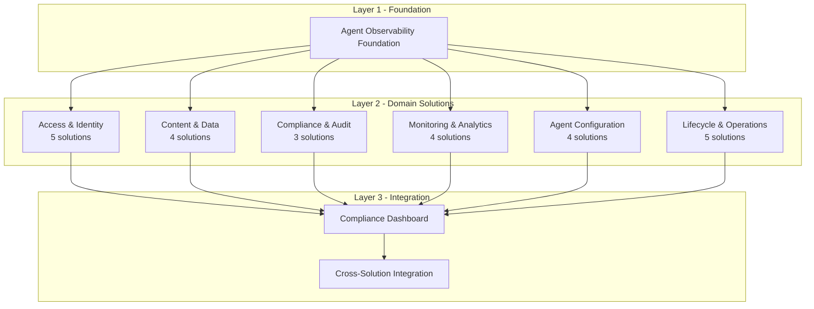
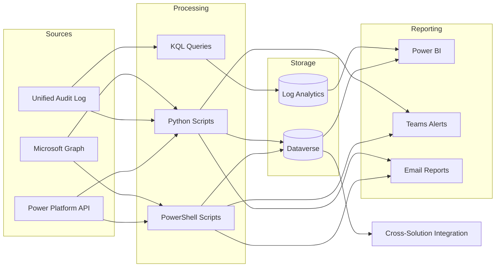
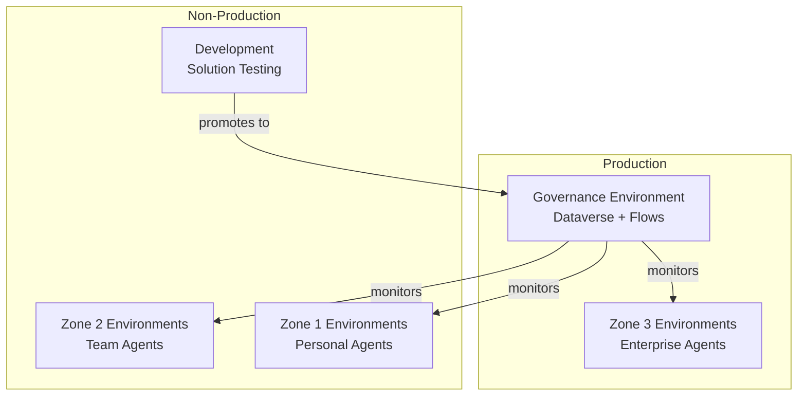

# Architecture

## Deployment Layers

Solutions are organized into layers that build on each other:



## Data Flow

All solutions follow a consistent data flow pattern:



## Integration Patterns

### Solution → Dataverse

Each solution writes to its own Dataverse tables using the `fsi_` publisher prefix. Tables follow a consistent naming convention:

```
fsi_{solutionprefix}{entityname}
```

Examples: `fsi_agentaccessvalidation`, `fsi_scopedriftviolation`, `fsi_contentmoderationresult`

### Solution → Compliance Dashboard

Solutions integrate with the Compliance Dashboard through the [Cross-Solution Integration](../solutions/cross-solution-integration/index.md) solution, which:

1. Reads validation results from each solution's Dataverse tables
2. Normalizes status values to a common schema (Compliant / Non-Compliant / Partial / Unknown)
3. Writes aggregated results to the Compliance Dashboard tables
4. Exports evidence packages for regulatory examinations

### Alert Patterns

Solutions use two alert channels:

| Channel | Use Case | Latency |
|---------|----------|---------|
| **Teams Adaptive Cards** | Real-time violation alerts for governance teams | Near real-time |
| **Email Reports** | Scheduled compliance summaries for management | Scheduled (daily/weekly) |

## Authentication

All solutions authenticate using one of two patterns:

| Pattern | Use Case | Configuration |
|---------|----------|---------------|
| **Interactive** | Local development and testing | `Add-PowerAppsAccount` / browser-based |
| **Service Principal** | Production automation | App registration with certificate or secret |

Service principals are configured per-solution with least-privilege permissions. See individual solution prerequisites for required Graph and Dataverse permissions.

## Environment Topology



The recommended topology is a dedicated **Governance Environment** that runs all monitoring solutions and stores compliance data. This environment monitors agent configurations across all Zone 1/2/3 environments.
